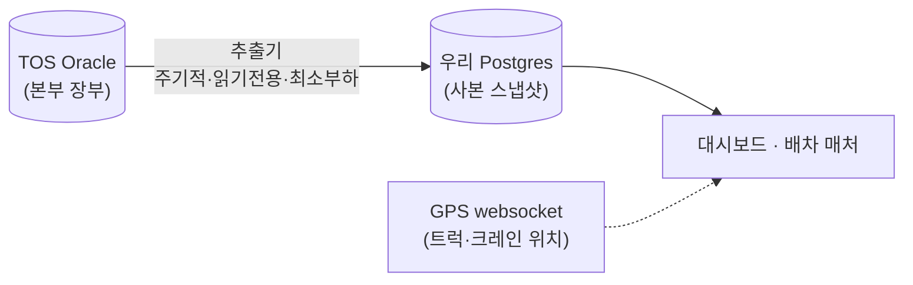

:::tip[이 문서 한 줄 요약]
우리 시스템이 **터미널 본부 시스템(TOS)** 에서 긁어오는 **모든 데이터**를 — *어느 테이블의 어느 값을 · 어떤 쿼리로 · 얼마나 자주 · 얼마의 부하로 · 어떻게 가공해 · 무슨 의미로 쓰는지* — 처음 보는 신입도 이해하도록 한 곳에 정리한 **살아있는 참조 문서**입니다.
:::

## 1. 먼저 큰 그림 (비유로)

**TOS**(Terminal Operating System)는 터미널의 **"본부 장부"** 입니다. Oracle 데이터베이스에 — 어느 배가 언제 들어오고, 어느 컨테이너를 어느 크레인이 언제 작업하며, 어느 트럭이 어디에 배정됐는지 — 터미널의 **모든 공식 기록**이 들어 있습니다.

문제는, 우리가 그 본부 장부를 **실시간으로 직접 들여다보며** 일하면 본부 컴퓨터에 부담을 준다는 점입니다. 그래서 우리는 **"추출기(extractor)"** 라는 작은 일꾼을 둡니다.

- **추출기**가 일정 주기로, **필요한 부분만** 본부에서 읽어 **우리 쪽 사본(Postgres)** 에 복사합니다.
- **대시보드와 배차 매처는 우리 사본(Postgres)만** 봅니다. **본부(Oracle)를 실시간으로 직접 건드리지 않습니다.**
- 즉, 본부에 닿는 건 **오직 추출기**뿐이고, 그것도 **가볍게·주기적으로·읽기만** 합니다.

> 비유: 본부 장부를 모두가 수시로 들춰보면 장부가 닳습니다. 그래서 **한 사람(추출기)이 정해진 시각에 필요한 쪽만 사진 찍어(스냅샷)** 사무실 게시판(우리 사본)에 붙이고, 나머지 사람들은 **게시판만** 봅니다.

---

## 2. 본부(TOS)에 어떻게 접속하고, 어떻게 보호하나

본부에 부담을 주지 않으려고 다음 안전장치를 둡니다.

- **단일 통로** — Oracle 접근은 `remote-toolbox-sql` **한 경로로만** 갑니다(`runner.rs`). 코드 어디서도 Oracle에 막 붙지 못합니다.
- **직렬화(한 번에 하나)** — 프로세스 전역 잠금으로 **동시에 두 쿼리가 본부를 때리지 않습니다.** 항상 한 쿼리씩 순서대로.
- **읽기 전용** — 본부 데이터를 **읽기만** 합니다. 절대 쓰지 않습니다.
- **시간창 제한** — 대부분 **최근 1~2일치만**, **완료된 건 제외**하고 가져옵니다 → 전체 훑기(풀스캔)를 피합니다.
- **타임아웃 90초** — 한 쿼리가 너무 오래 걸리면 끊습니다.
- **병렬 억제** — 무거운 지표 쿼리엔 `NO_PARALLEL` 힌트로 본부의 대규모 병렬 실행을 막습니다.

> 한마디로 — **가볍게 · 한 번에 하나씩 · 최근 것만 · 읽기만.**

---

## 3. 헷갈리지 말 것 — TOS가 *아닌* 데이터

우리가 쓰는 데이터 중에는 **TOS DB가 아닌** 것도 있습니다. 이 문서는 **TOS에서 긁는 것만** 다루니, 아래는 범위 밖입니다.

| 데이터 | 출처 | TOS인가 |
|---|---|---|
| 트럭·크레인 **GPS 위치** | 실시간 **websocket** 피드 | ❌ (별도 실시간 피드) |
| 크레인 **PLC 센서**(하중·잠금 등) | 같은 websocket | ❌ |
| **날씨**(기온·강수 등) | **Open-Meteo** 외부 API(무료) | ❌ |

> 라이브맵의 트럭이 움직이는 것, 크레인이 물리적으로 작업 중인지, 비가 오는지 — 이건 **TOS가 아니라** 위 실시간 피드/외부 API에서 옵니다.

---

## 4. 주기·작업 한눈에 (어떤 일꾼이 언제 도나)

추출기는 작업별로 **타이머**가 따로 돕니다.

| 타이머 | 주기 | 무엇을 |
|---|---|---|
| `wp-workpool` | **~90초** | 라이브 작업 풀 — 작업큐·작업·배정 트럭·선박 일정 (아래 ①~④) |
| `wp-handover` | **~60초** | 작업 완료(핸드오버) 신호 |
| `wp-rtg-moves` | **~5분** | 야드 크레인(RTG) 이동 이벤트 |
| `wp-shift-t1` | **~3분** | 운영 지표 — 가벼운 묶음 |
| `wp-shift-t2` | **~15분** | 운영 지표 — 무거운 묶음 |
| `wp-nightly` | **매일 01:30** | 하루치 지표 전체 재계산 |
| ~~`wp-weather`~~ | ~~1시간~~ | (외부 날씨 API — TOS 아님) |

이제 각 추출 지점을 **하나씩 상세히** 봅니다. 각 카드는 *어느 테이블·어느 값을 · 어떤 쿼리로 · 얼마의 부하로 · 어떻게 가공해 · 어디에 저장하고 · 무슨 의미로 쓰는지* 를 담습니다.

## 라이브 배차 데이터 (약 90초마다)

#### 1. workqueue 추출기 — QC 작업큐 계획과 진척률

**⏱ 주기** · T1 90초 (OnUnitActiveSec=90s)

**📂 TOS 원천 테이블**
- `TOSADM.JOB_QUEUE_SCHEDULE` — QC별 작업큐 계획 마스터 — 어느 QC가 어느 선박/큐를 언제 작업할지, 각 큐별 진척률(완료/계획 수량)
- `TOSADM.JOB_QUEUE_SCHEDULE (DELT_FLG)` — 삭제 플래그로 비활성화 행 제외

**🔑 긁어오는 값**
- `qc (JOB_QUE_CRANENO)` — QC ID — 이 작업큐를 담당하는 크레인
- `vessel (JOB_QUE_VESSEL)` — 선박명
- `voyage (JOB_QUE_VOYAGE)` — 항차번호
- `queuename (JOB_QUE_QUEUENAME)` — 작업큐 이름 (예: '34H-D', '02D-L') — 크레인이 작업하는 베이/해치 묶음
- `disload (JOB_QUE_DISLOAD)` — 'D'(양하) 또는 'L'(적하)
- `seq (JOB_QUE_SEQ)` — 이 QC가 이 선박에서 작업할 순번 — 1, 2, 3...
- `total_qty (JOB_QUE_TOTALQTY)` — 이 큐의 전체 컨테이너 수(계획)
- `comp_qty (JOB_QUE_COMPQTY)` — 이 큐에서 이미 완료한 컨테이너 수
- `plan_qty (JOB_QUE_PLANQTY)` — 이 큐에 배정한 예정 컨테이너 수

**🔎 쿼리가 하는 일** · 선박별·QC별 작업큐 계획과 각 큐의 진척률(완료 대 총 수량)을 조회. 삭제 표시되지 않았고, QC가 지정되었으며, 지난 ~1일 이내에 수정되었고, 미완료 상태 또는 지난 ~6시간 내 완료한 큐만 포함(UI에서 최근 완료 베이 표시용). 정렬은 QC→작업순번 순.

**📏 범위** · 시간창: 약 ±1일(UPD_DT >= TRUNC(SYSDATE) - 1). 행 수: 수십~수백(작은 결과세트). 활성 선박당 QC 수 × 작업큐 개수; 완료 큐는 6시간만 유지되므로 적음.

**⚖️ TOS 부하** · 가벼움 — JOB_QUEUE_SCHEDULE는 비교적 작은 테이블(~수백 행), 단순 WHERE 필터링(DELT_FLG, UPD_DT 범위), 조인 없음. 주기 90초는 빠르지만 스캔 범위 좁음(최근 1일). 인덱스 가정: DELT_FLG, UPD_DT, JOB_QUE_CRANENO 등.

**🛠 우리가 어떻게 가공하나** · src_workqueue() 함수(라인 194-221):
1. SQL_WORKQUEUE 실행 (Oracle 원격 쿼리)
2. 결과 행을 QueueRow 구조체로 파싱 (parse_rows)
3. live_workqueue 테이블 전체 삭제
4. 각 행을 upsert (ON CONFLICT: qc+vessel+queuename 키):
   - voyage, disload, seq, total_qty, comp_qty, plan_qty, as_of_ts 갱신
5. 트랜잭션 커밋

**💾 저장 위치(Postgres)** · live_workqueue (qc, vessel, voyage, queuename, disload, seq, total_qty, comp_qty, plan_qty, as_of_ts) — PK=(qc, vessel, queuename)

**💡 무슨 의미·어디에 쓰나** · UI 대시보드에서 각 QC의 현재 작업큐와 진척률(완료/총 수) 표시. 배차 로직에서는 큐의 seq로 우선순위 판단, 완료도로 작업 현황 파악. 배차 매처가 live_workpool 행에 QC를 붙일 때 이 테이블(vessel+queuename)을 조인해 oracle 팬아웃 회피.

**⚠️ 알아둘 점** · 주의점: (1) JOB_QUE_ACTIVEYN은 신뢰 불가(NULL 많음)이므로 필터링 미사용 — 대신 진척률(TOTALQTY > COMPQTY)와 수정시간으로 활성 상태 판단. (2) 큐이름(queuename)은 시간이 지나며 재사용됨 — live_workqueue는 현재 스냅샷만 유지하므로 같은 이름의 역사 데이터 노출 없음. (3) voyage, disload는 NULL 가능. (4) comp_qty가 total_qty와 일치하면 완료 상태. (5) 시간창 ~1일 + 완료 후 ~6시간 유지로 최근 작업 히스토리 짧게 표시.

---

#### 2. workpool 추출기 (TOS JOB_ORDER_LIST → live_workpool/live_candidate 스냅샷) — 배차 입력 + UI 작업 카드

**⏱ 주기** · ~90초 (OnUnitActiveSec=90s, wp-workpool.timer)

**📂 TOS 원천 테이블**
- `TOSADM.JOB_ORDER_LIST` — 라이브 작업 풀(컨테이너별 이동): 배정된 트럭(ETW+YTNO), 미배정 수요(Q상태), 상태(A/Q/P/B/C), 수거·반납 위치. 집계 기반(완료제외, 최근2일 필터)
- `TOSADM.JOB_QUEUE_SCHEDULE` — 크레인별 작업 큐 계획: (QC, vessel, queuename)별 SEQ 순서 + 진행률(COMPQTY/TOTALQTY). 별도쿼리(workqueue.sql)로 live_workqueue 채움
- `TOSADM.VSB_VOYAGE` — 선박 마스터: 목표 완료(ESTWKC), 출항(ESTDEP), 접안(ESTBER), 양하시간(CUTOFF). 별도쿼리(vessel_schedule.sql)로 live_vessel_schedule 채움

**🔑 긁어오는 값**
- `queuename` — 큐 ID (예: '02D-L'). SQL의 JOB_ODR_QUEUENAME. 시간이 지나도 재사용되므로 JOB_QUEUE_SCHEDULE 조인은 Oracle 측에서 하지 않음(팬아웃 방지).
- `vessel, voyage` — 선박 및 항차. 스냅샷 범위 정의
- `jobtype` — 작업종류: DS(양하) 또는 LD(적하). 필터(DS/LD만). WHERE절
- `jobstatus` — 작업상태: A(활성/배정·도중)·Q(큐/미배정)·P(계획)·B(막힘)·C(완료). 필터 A와 Q만, C 제외(WHERE JOB_ODR_COMPDATE IS NULL). 처리기가 상태별로 분리
- `ytno` — 배정된 트럭ID (예: TT945). A상태는 반드시 있음, Q상태는 NULL(미배정). live_workpool의 작업카드 구성
- `etw_dt` — 크레인 준비시각(YYYYMMDDHH24MISS[mmm], MYT). parse_etw()로 UTC 변환. 배차·UI 타이밍 기준
- `actv_dt` — 작업 활성화시각(주로 DS에서 핸드오버 시작). MYT → UTC 변환. soon-idle 로직에서 참조
- `upd_dt (TO_CHAR→문자열)` — TOS 행 마지막 업데이트(대략 배정 시각, D_tos). YYYYMMDDHH24MISS 형식, 이후 UTC 변환 후 upd_ts 저장
- `contno` — 컨테이너번호(11자 부분취출: SUBSTR 1-11). 쌍 이동은 같은 container 공유
- `msnseq, yt_topos` — 선적sequence(null=미배차)·수거위치(예: 08T-1011 또는 10Q-0405 블록). LD는 yt_topos에서 소스블록 추출(block_prefix)
- `from_pos, to_pos` — 수거·반납 위치번호 또는 베이번호
- `armgc` — 야드크레인(RTG) 표기. 후보 집계에서 대표 RTG로 선택
- `twintandem` — 쌍 이동 표식(null이면 단일)

**🔎 쿼리가 하는 일** · JOB_ORDER_LIST에서 완료되지 않은(COMPDATE null) DS·LD 작업(statusA/Q)을 최근 2일 범위(CRE_DT >= TRUNC-2)에서 한 번에 뽑음. Oracle 집계 최소화: queuename·vessel별 정렬만 함. 처리기가 Rust에서 상태 분리(A→live_workpool 즉시, Q→집계·candidate) + QC 첨부(live_workqueue 스냅샷과 조인).

**📏 범위** · 활성 작업(A): 수십~수백(배정된 컨테이너, ETW 범위~4시간). 미배정 수요(Q): 수십~수천(대기 풀). 시간창: 제한 없음(상태필터+CRE_DT ~2일만). 총 행 수: 보통 수백~천 단위

**⚖️ TOS 부하** · 보통(NORMAL). 근거: (1) JOB_ORDER_LIST는 중간 크기(십만+행 정도)·(2) CRE_DT >= TRUNC-2 범위(2일, 자정기준)로 풀스캔 후 필터 → 양호·(3) FROM/WHERE에 조인 없음(1회 테이블만) ·(4) ~90초 주기는 중간 정도. 인덱스(CRE_DT, JOBSTATUS 추정)가 있으면 더 가벼움

**🛠 우리가 어떻게 가공하나** · MoveRow 파싱 → Rust HashMap 처리 (3단계): (1) A상태(배정): 즉시 live_workpool INSERT (etw_ts·actv_ts·upd_ts 파싱) ·(2) Q상태(미배정)·ytno NULL: live_workpool INSERT (ytno=null로) + HashMap 집계((queuename,vessel,jobtype,src_block) 키 → 개수·대표rtg) ·(3) candidate 해시 순회 → live_candidate INSERT. (4) 사후: live_workqueue 스냅샷과 조인해 qc 필드 첨부(UPDATE live_workpool/candidate SET qc FROM live_workqueue)

**💾 저장 위치(Postgres)** · live_workpool(개별 작업카드, A·Q 상태) + live_candidate(Q 집계, 배차 수요 풀) + live_workqueue(크레인별 큐 진행, 별도쿼리) + live_vessel_schedule(선박 기한, 별도쿼리) + live_assigned_tt(트럭 이용률, 별도쿼리 assigned_tt.sql) + tos_etw_cntr(컨테이너 ETW 게이트웨이, 별도 curl 비동기)

**💡 무슨 의미·어디에 쓰나** · 라이브 작업 풀 스냅샷: (1) 배차 매처의 입력(미배정 수요 candidate, 배정된 move의 ETW/위치) ·(2) UI/대시보드의 작업카드 소스(QC별 큐, 컨테이너 ETW, 트럭 배정 상태) ·(3) 배정 시각(upd_ts)을 경유한 TOS-vs-자사 배치 비교 기준(migration 0059_truck_pos_hist 참조). 배정 상태(A/Q)로 실시간 활동성 파악. ETA/배차 비용 계산의 기초 데이터(시간창/위치/트럭)

**⚠️ 알아둘 점** · ⚠️ msnseq가 null이면 배차 후 미적재 선행 필요(미처리 상태 표현) ·⚠️ yt_topos는 LD에서만 소스블록(block_prefix로 추출), DS는 null ·⚠️ etw_dt 파싱 실패(short/비숫자) → null로 침묵(parse_etw(), tests 참조) ·⚠️ 쌍 이동(twin tandem) 같은 contno·다른 row ·⚠️ Q상태 ytno=null만 candidate 집계(ytno 있는 Q는 문제상태, 무시) ·⚠️ 사후 QC 첨부는 live_workqueue 스냅샷 고유성(vessel+queuename) 활용(Oracle fan-out 방지) ·⚠️ 완료 후 2시간 이상 미갱신 tos_etw_cntr 행 자동 삭제(stale 방지, 별도 task)

---

#### 3. assigned_tt extraction: TT assignment pool from TOS JOB_ORDER_LIST

**⏱ 주기** · ~90 seconds (per wp-workpool.timer tick)

**📂 TOS 원천 테이블**
- `TOSADM.JOB_ORDER_LIST` — 유일한 소스: 모든 트럭 작업 배정(배정된 ytno + 작업상태 jobstatus). 라이브 과제 행만 필터링(완료 제외, 상태 A/B/Q만)

**🔑 긁어오는 값**
- `JOB_ODR_YTNO (ytno)` — 트럭 번호 (YT 번호). PK. 선박+야드 모든 작업 종류의 배정된 트럭을 추적.
- `JOB_ODR_JOBSTATUS (jobstatus)` — 작업 상태 (3값): A=진행중(active), B=정지(blocked), Q=대기(queued). 대시보드가 분자(A만)·분모(A+B+Q)를 분리해 활용률 계산.

**🔎 쿼리가 하는 일** · JOB_ORDER_LIST에서 미완료(COMPDATE NULL) 작업 중 배정된 트럭(YTNO NOT NULL)과 상태(A/B/Q)만 뽑기. 범위=최근 2일(CRE_DT >= TRUNC(SYSDATE)-2)로 스캔 최소화. DISTINCT로 같은 트럭의 중복 상태 행 제거.

**📏 범위** · 시간창: NOW(배정된 모든 작업, 완료된 것 제외). 대략 행 수: ~500-2000행/스캔(선박 수·배차 세기 의존). 트럭당 한 행(DISTINCT).

**⚖️ TOS 부하** · 가벼움(LOW). 근거: (1) 단일 테이블 풀스캔 아님(2일 범위+상태 필터로 인덱스 활용 가능); (2) SELECT 2컬럼만; (3) DISTINCT 집계가 메모리만 씀; (4) 주기 짧음(90s)에도 작업 큐는 천천히 변함(예: 30분 cycle); (5) 쿼리 주석에서 명시 "Load: LOW".

**🛠 우리가 어떻게 가공하나** · Rust (workpool.rs::src_assigned): (1) SQL 실행 → raw JSON; (2) parse_rows()로 YtRow 구조체 배열; (3) 트랜잭션 시작 → live_assigned_tt 전체 DELETE; (4) 각 행에 INSERT (ytno, jobstatus, as_of_ts=NOW UTC); (5) COMMIT. Trimming 있음(ytno.trim(), jobstatus trim). 빈 ytno는 skip.

**💾 저장 위치(Postgres)** · live_assigned_tt (Postgres). 컬럼: ytno TEXT, jobstatus TEXT, as_of_ts TIMESTAMPTZ(기본 now()). 인덱스: live_assigned_tt_asof_idx (as_of_ts). PK 없음 — UPSERT 아님, 매 tick 전체 리셋.

**💡 무슨 의미·어디에 쓰나** · 대시보드·API가 사용하는 '배정된 트럭' 권위 소스. 모든 작업 종류(DS/LD 선박+MI/MO/LC 야드)를 포함. 분자(A=진행)·분모(A+B+Q=배차)로 실시간 트럭 활용률(Utilization, K_UTIL_TT) 계산. livemap.rs가 ~30s마다 live_assigned_tt JOIN live_workpool으로 트럭 배정 메타(jobtype, vessel, 컨테이너)를 캐시 갱신 → UI 'assigned' 배지·사이클기계 피드. 무직 트럭(유휴)은 이 표에 없음(TOS 가시성 한계).

**⚠️ 알아둘 점** · ⚠ 중요 특성: (1) **스냅샷 특성** — 매 tick(90s) 전체 리셋이므로 '가장 최근 상태' 반영(이력 없음). (2) **모든 작업 종류 포함** — workpool.sql은 DS/LD만 추출하는데 반해 assigned_tt.sql은 제한 없음(SQL 라인 10의 주석 'ANY job type'). 야드 이동(MI/MO/LC) 트럭도 여기 포함돼 활용률 분모에 정확. (3) **업무 정의 gap** — 예정(P) 작업은 제외(라인 6 주석, 시스템에서 자동). 미배차 용역트럭은 여기 없음. (4) **신뢰도** — TOS JOB_ORDER_LIST 직접 쿼리라 권위있음, 단 '현재 아직 작업 안 할당된 unassigned 컨테이너'는 다른 테이블(workpool Q행)에 있음(성격이 다름).

---

#### 4. vessel_schedule 추출기 — TOS VSB_VOYAGE 스냅샷

**⏱ 주기** · ~90초

**📂 TOS 원천 테이블**
- `TOSADM.VSB_VOYAGE` — 선박 항차(voyage) 일정 마스터 — 입항예정(ESTBER), 작업완료예정(ESTWKC), 출항예정(ESTDEP), 화물 컷오프(CUTOFF), 실제 입항(ACTBER), 실제 출항(ACTDEP), 계획 양하/적하 수량의 유일한 원천

**🔑 긁어오는 값**
- `vessel` — VSB_VOY_VESSEL — 선박명(호출부호)
- `voyage` — VSB_VOY_VOYAGE — 항차번호
- `status` — VSB_VOY_STATUS — 항차 상태(예: 입항예정, 입항, 양하중, 출항, 완료 등)
- `berthno` — VSB_VOY_BERTHNO — 안벽번호(접안 위치)
- `estber` — VSB_VOY_ESTBER_DATE + _TIME(YYYYMMDD + HHMMSS) → UTC 변환 후 저장 — 입항예정시각
- `estwkc` — VSB_VOY_ESTWKC_DATE + _TIME → UTC — 모든 크레인 작업 완료 예정시각(배차 primary deadline)
- `estdep` — VSB_VOY_ESTDEP_DATE + _TIME → UTC — 출항 예정시각. 필터링 기준: ESTDEP_DATE >= SYSDATE-2 AND <= SYSDATE+10(12일 윈도우)
- `cutoff` — VSB_VOY_CUTOFF_DATE + _TIME → UTC — 화물 탑재 차단시각
- `actber` — VSB_VOY_ACTBER_DATE + _TIME → UTC — 실제 입항시각(null until berthed)
- `actdep` — VSB_VOY_ACTDEP_DATE + _TIME → UTC — 실제 출항시각(null until departed)
- `disvan` — VSB_VOY_DISVAN (TO_NUMBER 변환) — 계획 양하 컨테이너 수(van 단위)
- `loadvan` — VSB_VOY_LOADVAN (TO_NUMBER 변환) — 계획 적하 컨테이너 수

**🔎 쿼리가 하는 일** · 현재 관련 항차만 골라내기: 취소되지 않은(NVL VSB_VOY_CANCEL='N') + 출항예정이 지난 2일~향후 10일 범위(VSB_VOY_ESTDEP_DATE YYYYMMDD 문자열 비교). 결과: ~수십 행(small result). 각 행에서 DATE+TIME 컬럼을 문자 연결(||)로 YYYYMMDDHHMMSS 만들기."

**📏 범위** · 시간창: SYSDATE ± 12일(입항예정·완료·출항 모두 커버). 행 수: 터미널 하루 ~20~50개 항차, 윈도우 내 활성은 ~10~50행(부산항 규모·일정에 따라 변동, 일반적 수십 행).

**⚖️ TOS 부하** · 가벼움(light). 근거: ① VSB_VOYAGE 테이블이 선박/항차 마스터라 데이터 작음(수천 행 정도). ② 필터 술어가 강함(취소 플래그 + ESTDEP_DATE 문자 범위 = 큰 시간창이지만 인덱스안전). ③ 조인 없음(단일 테이블 스캔). ④ 주기가 ~90초로 중간 정도이지만 결과가 극소수라 부하 미미. ⑤ 시간창 12일은 크지만 스냅샷 특성(점진적 갱신)으로 Oracle에 부담 적음.

**🛠 우리가 어떻게 가공하나** · Rust 파서(parse_etw)가 각 DATE||TIME 컬럼(YYYYMMDDHHMMSS, 터미널시간 MYT=UTC+8)을 UTC instant로 변환(wp_core::shift::terminal_to_utc). Postgres로 upsert: DELETE live_vessel_schedule 후 INSERT … ON CONFLICT (vessel, voyage) DO UPDATE — 양하/적하 수량은 i32로 cast. timestamp 컬럼은 모두 UTC timestamptz로 저장.

**💾 저장 위치(Postgres)** · live_vessel_schedule (Postgres, 마이그 0043)

**💡 무슨 의미·어디에 쓰나** · 선박/항차별 스케줄 마스터 — 배차 시스템이 작업 데드라인(ESTWKC, ESTDEP) 및 계획 물량(disvan, loadvan)을 읽어 우선순위·리소스할당 결정. 대시보드엔 'Vessel Schedule' 카드로 진행상황(status) + 남은시간(ESTWKC까지) 표시. 배차 매처가 이 데드라인을 제1 제약으로 삼음(work-complete 시간 내에 완료 필수).

**⚠️ 알아둘 점** · ① DATE 컬럼이 VARCHAR YYYYMMDD(텍스트) 형식이라 날짜 산술 불가 — 문자열 범위 비교만 가능(BETWEEN/>=/<= 직접 적용 가능하지만 숫자가 아님). ② TIME 컬럼(HHMMSS 텍스트)도 마찬가지. ③ 양하/적하 수량이 스냅샷 특성(배를 한 번 띄울 때 계획된 총 컨테이너 수)으로 운항 중에는 거의 변경 안 됨. ④ ACTBER/ACTDEP는 실제 일어나기 전까진 null이므로 미래 예정과 혼동 금지. ⑤ 주의: 이 테이블은 선박 마스터이지 TT/작업 카드가 아님 — work pool(live_workpool)은 별도 추출(JOB_ORDER_LIST)에서 옴.

---

## 거의 실시간 (작업 완료·RTG 이동)

#### 5. handover 추출기 — TOS JOB_ORDER_HISTORY 완료 이벤트 → tos_handover_label (권위 라벨)

**⏱ 주기** · ~60초 (OnUnitActiveSec=60s, wp-handover.timer)

**📂 TOS 원천 테이블**
- `JOB_ORDER_HISTORY` — 완료된 핸드오버 이벤트 원천. 쿼리는 JOBSTATUS='C'(완료)인 DS/LD 작업의 중요 타임스탬프·트럭ID·담당크레인을 읽음. IDX_JOBHIST_DATETIME(JOB_HIST_DATE||JOB_HIST_TIME, JOBSTATUS) 인덱스로 워터마크 레인지스캔 지원.

**🔑 긁어오는 값**
- `JOB_HIST_YTNO` — 대상 트럭ID (TT####). DS/LD 이력 중 DS가 87% 채움. 웹소켓 GPS device id와 동일.
- `JOB_HIST_ARMGC` — 담당 크레인(RTG/ES/QC). 야드측(RTG/ES)만 이 추출의 관심사(C## QC 제외).
- `JOB_HIST_JOBTYPE` — 작업 종류(DS/LD). 배차 로직이 드롭사이드에 따라 처리.
- `JOB_HIST_CONTNO` — 컨테이너 번호. 주문의 자연키 일부(contno+point+seqno).
- `JOB_HIST_POINT` — Port 번호. 주문 자연키.
- `JOB_HIST_SEQNO` — 시퀀스 번호. 주문 자연키.
- `JOB_HIST_DATE||JOB_HIST_TIME` — 완료 이벤트 타임스탬프(MYT). 워터마크 비교키(YYYYMMDDHH24MISS 형식)로 증분 추출.
- `JOB_HIST_ACTV_DT` — 크레인 활성화 시각. DS의 경우 QC 양하 완료(트럭 적재) 시점. RTG는 물리 집기가 ACTV 이후 약 11분.
- `YT_DIS_DT` — 트럭 하차(도착) 시각 at 블록/QC. 조회하지 않지만 라벨 연구에서 중요(DIS→ACTV=블록대기, 중앙 7.7분).
- `JOB_HIST_YT_TOPOS` — 야드 작업지점(POW). 처음 40자만 추출(SUBSTR(...,1,40)).
- `JOBSTATUS` — 작업 상태. 이 추출은 C(완료)만 필터(A=활성, Q=대기, P=계획, B=차단)

**🔎 쿼리가 하는 일** · JOB_ORDER_HISTORY에서 마지막 워터마크 이후 새로 완료된(JOBSTATUS='C') DS/LD 핸드오버를 증분으로 폴링하고, 각 행을 권위 라벨로 적재. 쿼리는 인덱스 레인지 스캔(IDX_JOBHIST_DATETIME)으로 시간 범위를 좁혀 결과셋을 수십~수백 행으로 제한. 완료 시각(evt)이 워터마크 역할하며 etl_watermark 테이블을 통해 증분 추적.

**📏 범위** · ~60초 윈도우 × (DS+LD 완료율). 운영 실측: 폴링당 수~수십 행(첫 폴 211건, 이후 폴 ~수십). FETCH FIRST 3000 ROWS ONLY 하드캡 설정(일반적으로 미달).

**⚖️ TOS 부하** · 가벼움(light). 근거: (1) 증분 폴링 — 60초 윈도우만 스캔, (2) 인덱스 안전 술어 — IDX_JOBHIST_DATETIME을 통한 레인지 스캔(풀스캔 없음), (3) 결과셋 제한 — FETCH FIRST 3000 ROWS ONLY, (4) 주기 비교 — 현 워크풀(90초, ~1.2s·1048행)보다 가벼운 결과(수십 행), (5) prod 직접조회 허용 결과 2차 검증 통과. 단 워터마크 경계 중복 배제 위해 '>=' 술어+ON CONFLICT 사용.

**🛠 우리가 어떻게 가공하나** · 추출 결과의 각 행(HistRow)에 대해 contno·point·seqno·evt(완료시각)가 모두 NOT NULL인 행만 처리. parse_etw()로 evt 시각을 UTC TIMESTAMPTZ로 변환하고, dis_ts(하차)·actv_ts(활성화)도 동일 변환. 이후 PRIMARY KEY(contno, point, seqno)로 upsert — ON CONFLICT DO NOTHING으로 워터마크 경계 중복 제외. 마지막으로 etl_watermark의 last_completed_at을 새 최대 이벤트 시각으로 갱신(GREATEST로 경쟁조건 보호). 트랜잭션으로 원자성 보장.

**💾 저장 위치(Postgres)** · tos_handover_label (Postgres). 스키마: contno·point·seqno(주키), ytno·armgc·jobtype·topos·dis_ts·actv_ts·comp_ts(컬럼). 인덱스: tos_handover_label_comp_idx(comp_ts), tos_handover_label_ytno_idx(ytno, comp_ts).

**💡 무슨 의미·어디에 쓰나** · 차량이 "정확히 언제 비었나"에 대한 권위 라벨. DS의 경우 웹소켓 GPS/RTG-PLC 신호가 구조적으로 약해 TOS 기반 정답이 필수. comp_ts(완료시각)가 실제 유휴 순간으로, 배차 매처와 학습 라벨 루프가 정확도를 검증·보정하는 데 사용. 라이브 곧유휴 예측(live_workpool.actv_ts 기반)과 대비해 사후 평가함수 역할.

**⚠️ 알아둘 점** · ⚠️ ACTV_DT는 "RTG가 물리적으로 집은 순간"이 아니라 "QC 양하 완료(트럭 적재) 시점" — RTG 들어올림은 ACTV 이후 약 11분. DS의 경우 블록도착(DIS)→활성화(ACTV)까지 중앙 7.7분으로 변동 크므로 라이브 "곧유휴" 판정과 차이 발생. 워터마크 경계에서 '>=' + ON CONFLICT 중복배제로 밀리초 경쟁조건 처리. 처음 실행 시 watermark 미설정하면 10분 전부터 시작(장기 백필 방지). 보존 한계: JOB_ORDER_HISTORY는 약 15일만 보존되므로 깊은 백필 불가."

---

#### 6. RTG Move Stream (rtg_moves) — MCH_OPERATION → rtg_move_log

**⏱ 주기** · ~5분 (OnUnitActiveSec=300s, wp-rtg-moves.timer)

**📂 TOS 원천 테이블**
- `TOSADM.MCH_OPERATION` — 유일 원천. 모든 장비(RTG/ES/QC/트럭)의 작업 이력. ST_DT(시작)·MCH_OPER_COMPDATE||MCH_OPER_COMPTIME(완료)·MACHNO·CONTNO·SEQNO·JOBTYPE·TRK_ID 포함.

**🔑 긁어오는 값**
- `machno (MCH_OPER_MACHNO)` — 장비 ID (RTG###, ES## — regex '^(RTG|ES)'로 필터, QC/트럭 제외)
- `contno (SUBSTR(MCH_OPER_CONTNO,1,11))` — 컨테이너 번호 (처음 11자만 추출)
- `seqno (MCH_OPER_SEQNO)` — 작업 시퀀스 번호 — (machno, contno, seqno) 조합이 MCH_OPERATION 자연키
- `jobtype (MCH_OPER_JOBTYPE)` — 작업 유형 (DS/LD/RH/AH/GI/GO/MI/MO 등 전체 야드 작업 분류법)
- `trk_id (TRK_ID)` — 트럭 ID (AH/RH 같은 보유작업은 NULL)
- `st_dt (ST_DT)` — 작업 시작 시각 (MYT 'YYYYMMDDHH24MISS[mmm]' → UTC로 변환)
- `comp_dt (MCH_OPER_COMPDATE || MCH_OPER_COMPTIME)` — 작업 완료 시각 (14자 연결: YYYYMMDDHHMMSS, UTC로 변환)
- `dur_s (계산: comp_ts - st_ts)` — 실제 작업 시간(초) — 0~3600초 범위만 유효 (중앙값 ~60초)
- `business_date (comp_dt에서 추출 또는 run_date)` — 작업 완료 날짜 (DATE)

**🔎 쿼리가 하는 일** · 오늘 완료된 RTG/ES 장비의 모든 작업을 지난 워터마크 이후로 증분 수집. IDX_MCH_OPERATION_COMPDATE 인덱스 활용하여 스캔 최소화. 오늘 MCH_OPER_COMPDATE를 필터(고정) → 완료시각 > 워터마크 필터 → RTG|ES 정규식 필터 → ORDER BY 완료시각 ASC → 최대 5000행. 매 폴링마다 워터마크 갱신으로 중복 방지.

**📏 범위** · 하루 윈도우(MCH_OPER_COMPDATE='today'). 폴 당 최대 5000행(FETCH_CAP). 실제는 5분마다 폴링하므로 폴 당 수십~수백 행(RTG/ES만 필터). 터미널 24/7 운영 가정 시 일일 ~수만 행 예상.

**⚖️ TOS 부하** · 가벼움. 근거: (1) IDX_MCH_OPERATION_COMPDATE로 오늘 데이터만 스캔(파티션 효과); (2) 워터마크 증분 기법으로 매번 신규 행만 추출; (3) 정규식 필터 RTG|ES로 QC/트럭 제외(데이터셋 ~20%로 축소); (4) 5분 주기는 충분히 느림; (5) JOIN 없음(단순 테이블 스캔). MCH_OPERATION은 거대 테이블이나, 인덱스+필터 조합으로 부하 최소.

**🛠 우리가 어떻게 가공하나** · Postgres 트랜잭션 내: (1) MoveRow 구조로 파싱; (2) machno/contno/seqno/comp_dt 필수필드 검증, 결측 행 스킵; (3) comp_dt를 parse_etw()로 UTC 타임스탬프로 변환(MYT 'YYYYMMDDHH24MISS' 형식); (4) st_dt도 동일 파싱(선택사항); (5) dur_s = comp_ts - st_ts(초), 0~3600s 범위만 저장(이상값 필터); (6) business_date = comp_dt 앞 8자(YYYYMMDD) 또는 run_date; (7) rtg_move_log에 INSERT...ON CONFLICT DO NOTHING (자연키 machno+contno+seqno로 중복 방지); (8) 문자열 trim() 적용; (9) trk_id 빈 문자열 제외(NULL 저장); (10) max(comp_dt) 추적하여 워터마크 갱신(etl_watermark에 INSERT...ON CONFLICT DO UPDATE로 GREATEST 적용).

**💾 저장 위치(Postgres)** · rtg_move_log (Postgres) — PK(machno, contno, seqno), 인덱스: rtg_move_log_machno_idx (machno, comp_ts), rtg_move_log_comp_idx (comp_ts)

**💡 무슨 의미·어디에 쓰나** · RTG(야드 크레인, Reach Truck Gantry) 및 ES(Empty Spreader) 모든 작업 이력. DS 핸드오버(~20%)만이 아닌 전체 작업(DS/LD/RH/AH/GI/GO/MI/MO 등) 포함. 핵심: DS 트럭이 기다리는 시간의 ~80%는 RTG가 다른 작업(재배치, 게이트, 정리)을 하기 때문. 이 데이터는 RTG의 실제 백로그(대기큐)를 계산하여 DS 트럭 대기 시간을 예측하는 피처로 사용(wait-prediction feature). 대시보드/배차 매처에서 RTG 부하 및 우선순위 판단에 활용.

**⚠️ 알아둘 점** · 1) 데이터 신뢰도: ST_DT(시작)는 선택사항(NULL 가능), 단 LENGTH(MCH_OPER_COMPTIME)>=6 필터로 완료시각은 검증됨. 2) dur_s는 0~3600초 범위만 저장(1시간 초과는 이상값으로 필터—데이터 정제). 3) trk_id는 핸드오버가 없는 보유작업(AH/RH)에서 NULL. 4) 워터마크 메커니즘: FETCH_CAP=5000이므로 적재 량 > 5000인 폴 시 여러 폴링에 걸쳐 따라잡음(ORDER BY comp_dt ASC로 순차 처리). 5) 스냅샷 특성: 증분(etl_watermark)이므로 과거 데이터 재추출 불가(watermark 리셋 필요). 6) contno는 MCH_OPER_CONTNO의 첫 11자만(SUBSTR(MCH_OPER_CONTNO,1,11)), 전체 길이는 더 길 수 있음(확인 필요 시 RAW 테이블 참조). 7) 주기 5분은 시간창보다 훨씬 짧으므로(하루 288폴), 증분 기법으로 효율적—watermark 없으면 일일 폴마다 전체 스캔 필요.

---

#### 7. voyage_plan 추출 지점 정밀 문서화

**⏱ 주기** · 3분 (wp-shift-t1 타이머 매 3분)

**📂 TOS 원천 테이블**
- `TOSADM.VSS_STATISTICS` — 선박-항차별 계획 컨테이너 수 원천. VSS_STT_VAN(계획수량), VSS_STT_VESSEL(선박명), VSS_STT_VOYAGE(항차), VSS_STT_UP_DT(업데이트 타임스탬프) 제공

**🔑 긁어오는 값**
- `VSS_STT_VESSEL` — 선박 식별자 (e.g. 선박명)
- `VSS_STT_VOYAGE` — 항차 번호
- `VSS_STT_VAN` — 계획 컨테이너 수 (planned_moves로 매핑). TO_NUMBER 변환으로 문자열→수치화
- `VSS_STT_UP_DT` — VSS_STATISTICS 행의 마지막 업데이트 시점 (GROUP BY 후 MAX로 최신 취득)

**🔎 쿼리가 하는 일** · 지난 3일 내 VSS_STATISTICS에서 vessel/voyage별 계획 컨테이너 최댓값(MAX VAN)을 추출. VSS_STT_VAN이 NULL이 아닌 행만 필터링해 in-progress 항차의 계획수량 확보. 상위 120행만 fetch하는 FETCH FIRST로 결과 크기 제한(무거운 테이블 방지). GROUP BY로 vessel/voyage별 집계, ORDER BY MAX(업데이트일시) DESC로 최근 순 정렬"

**📏 범위** · 과거 3일(UTC 기준 {{START_TS}} = date-3d 00:00:00 이상)의 VSS_STATISTICS 중 VAN이 NOT NULL인 행 → GROUP BY로 vessel/voyage 조합별 1행씩 → 상위 120행만. 예상 ~20~50행 (진행 중인 항차 수에 따라) — 매우 작음"

**⚖️ TOS 부하** · 가벼움(LOW). 근거: (1) VSS_STATISTICS는 ~41K행 소규모 테이블(SQL 주석), (2) 3일 시간창 + VAN NOT NULL 필터로 전체의 작은 부분만 스캔, (3) 조인 없음 (단일 테이블), (4) GROUP BY는 인덱스 가능성 높음(vessel/voyage 조합), (5) FETCH FIRST 120으로 결과 상한선 고정. 주기도 3분으로 빠르지만 각 쿼리 자체는 trivial"

**🛠 우리가 어떻게 가공하나** · extract_voyage_plan 함수: (1) SQL을 params::render_window로 렌더링(START_TS = date-3d 00:00:00), (2) Toolbox::run_sql로 Oracle 쿼리 실행, (3) 결과를 Vec&lt;PlanRow&gt; 역직렬화 (serde UPPERCASE 필드 매핑), (4) 각 행에 대해upsert: INSERT INTO raw_voyage_plan(vessel, voyage, planned_moves, source='VSS_STT_VAN', run_id) ON CONFLICT(vessel, voyage) DO UPDATE planned_moves, run_id, extracted_at=now(). 즉, vessel/voyage 조합이 같으면 덮어쓰기(최신값 유지). run_id는 etl_run_log 외래키로 추출 배치 추적"

**💾 저장 위치(Postgres)** · raw_voyage_plan (Postgres). 스키마: vessel(PK), voyage(PK), planned_moves(INTEGER), source(TEXT='VSS_STT_VAN'), run_id(BIGINT→etl_run_log), extracted_at(TIMESTAMPTZ DEFAULT now())"

**💡 무슨 의미·어디에 쓰나** · 선박별 항차별 계획 컨테이너 총수. 대시보드 LIVE 탭의 vessel_shift 카드에서 진행률 프로그레스바(실적 moves / 계획 planned_moves)의 분모로 사용. 진행 중인 항차(in-progress)의 경우 VSS_STT_MOVES가 NULL이므로 계획수량 VAN이 분모의 유일한 신뢰 출처. 배차 시스템에서는 미사용(voyage_plan은 vessel panel 전용)"

**⚠️ 알아둘 점** · 1. VSS_STT_MOVES vs VSS_STT_VAN: 댓글(SQL line2-3)에서 명시 — 진행 중 항차는 MOVES NULL→VAN 사용. 완료 항차면 MOVES 사용 가능. 2. 3일 시간창: 느린 변화 데이터(voyage plan은 사전 공지 후 거의 변하지 않음) → 3일마다 확인해도 충분, 주기 3분은 shift tick 통합 주기 따름. 4. FETCH FIRST 120: 실제 필요 행 수 추정 불명 → 상한선 safety. 5. NULL on CONVERSION ERROR: VAN이 문자열이므로 수치화 실패 시 NULL 처리 → 진행 중인 항차 판별 보조 역할 가능. 6. raw_voyage_plan 유지보수: vessel_shift와 LEFT JOIN 필요(vessel_shift.planned_moves = raw_voyage_plan.planned_moves 채우기) — 이는 모듈 코드 시점(vessel.rs line76 주석)에서 이루어지지 않음(별도 쿼리 필요하거나 upstream 처리)"

---

## 운영 지표 — 빠른 묶음 (T1, 약 3분마다)

#### 8. K_MPH_REALTIME 추출기 — QC 처리량(move/hr) 실시간 지표

**⏱ 주기** · T1 3분 + 야간(일배치)

**📂 TOS 원천 테이블**
- `TOSADM.MCH_OPERATION` — 크레인 move 기록 원천. 항차/QC별 일일 move 수·작업 유형(LD/DS)·완료 시각 제공

**🔑 긁어오는 값**
- `MCH_OPER_VESSEL` — 선박명(VESSEL) — 분류키
- `MCH_OPER_VOYAGE` — 항차(VOYAGE) — 분류키
- `MCH_OPER_MACHNO` — QC 기계번호(MACHNO, C##형식) — 분류키. REGEXP_LIKE로 C[0-9]+ 필터
- `MCH_OPER_COMPDATE` — 작업완료 날짜(YYYYMMDD) — WHERE 필터({{DAY_STR}}) + TIME_PREDICATE와 함께 시간창 구성
- `MCH_OPER_COMPTIME` — 작업완료 시각(HHMMSS, 6자리) — 시간창 필터 + active_hours 계산용(첫2자 시간추출)
- `MCH_OPER_JOBTYPE` — 작업유형(LD=하역, DS=양화) — IN(LD,DS) 필터. 이 둘만 카운트
- `TRK_ID` — truck ID — DISTINCT 카운트 반환(distinct_trucks)
- `MCH_OPER_CONTNO` — 컨테이너번호 — DISTINCT 카운트 반환(distinct_containers)

**🔎 쿼리가 하는 일** · MCH_OPERATION에서 단일 DAY에 LD/DS 작업만 필터, QC(C##)별로 GROUP BY. 각 QC마다 ① 총 move 수 ② load/discharge 분해 ③ 가동시간(COMPTIME 첫 2자 기준 DISTINCT 시간 수) ④ K_MPH=총이동÷가동시간 ⑤ 차량·컨테이너 다양성 통계. TOP 30 선별. 일배치는 TIME_PREDICATE 공백(전일 24시간), 실시간은 현재 shift 시간창 동적 대입.

**📏 범위** · 일 1개({{DAY_STR}})의 LD/DS move만. 행 수는 활성 QC 수만큼(보통 10~30). FETCH FIRST 30 ROWS ONLY로 상위 30개 QC만 반환. 하루 전체/shift 시간창 내 모든 move 포함.

**⚖️ TOS 부하** · 가볍음(LOW). 근거: (1) MCH_OPERATION은 원천 중 경량(≥35일 보존, JOB_ORDER_HISTORY보다 가벼움) (2) WHERE 절이 단일 인덱스-세이프 DATE + JOBTYPE + MACHNO로 필터링 최소화 (3) 비용 연산만 COUNT/DISTINCT/SUBSTR—집계 경량 (4) 주기 T1 3분(shift)이지만 시간창이 shift 1.5~3시간으로 제한되므로 스캔량 적음 (5) 야간 일배치도 단일 DAY 풀스캔인데 ≥35일 보존정책으로 Oracle 자동 정리.

**🛠 우리가 어떻게 가공하나** · 1. Toolbox::run_sql()로 Oracle에서 CSV(JSON 래핑) 반환 2. parse_rows()로 역직렬화→Vec&lt;Row&gt; 3. PgPool 트랜잭션 시작 4. 각 Row마다 raw_k_mph_realtime에 INSERT (snapshot_date=date, vessel/voyage/qc_machno/moves/load_moves/discharge_moves/active_hours/k_mph_per_active_hour/distinct_trucks/distinct_containers/first_move/last_move 바인드) 5. ON CONFLICT (snapshot_date,vessel,voyage,qc_machno) DO UPDATE로 upsert(기존행 덮어쓰기 + run_id·extracted_at 갱신) 6. tx.commit() — atomicity 보장

**💾 저장 위치(Postgres)** · raw_k_mph_realtime (Postgres 스냅샷 테이블. PK: snapshot_date+vessel+voyage+qc_machno. 기타: moves·load_moves·discharge_moves·active_hours·k_mph_per_active_hour·distinct_trucks·distinct_containers·first_move·last_move·run_id·extracted_at)

**💡 무슨 의미·어디에 쓰나** · QC별 시간당 처리량(move/hr) 실시간 지표. 배차 매처/대시보드의 생산성 트렌드 표시. 각 QC의 가동 시간만 분모로 쓰므로 유휴 갭 제외된 진정한 처리 효율. 항차별로 다양한 QC 성과를 추적 가능. 대시보드의 "K_MPH — QC 처리량(move/시간)" 카드 & 상단 실시간 요약·shift 눈판이 이 raw 행들을 active_hours로 가중 평균해 표시. 배차 시스템도 과거 K_MPH 등급을 참고해 QC 선택성 인자로 사용 가능(현재는 미사용, 미래 확장).

**⚠️ 알아둘 점** · ① first_move/last_move는 YYYYMMDDHH24MISS 연결 텍스트(시간당/shift당 실제 move 시작/종료 시각 파악용, 스냅샷만으로는 정확 시간 추적 불가). ② active_hours는 SUBSTR(COMPTIME,1,2)로 추출한 시간(HH) 기준 DISTINCT 값이므로 '08:15·08:59' 같은 같은 시간 내 다중 move는 1시간 카운트(보수적). 정확히는 'move가 있던 시간의 개수' ≠ '경과 분' — 예 08:01~08:59 한 시간 내 작업하면 active_hours=1 (정확히는 58분이지만 시간 단위로 집계). ③ K_MPH_PER_ACTIVE_HOUR는 COUNT(*)÷active_hours 계산이므로, active_hours=0인 경우 NULLIF로 null 반환 가능(드문 케이스이나 어플 null 처리 필요). ④ 모든 데이터는 MCH_OPERATION만 원천이라 TT-외 정보(YT 완료/RTG 하차 등)는 포함 불가. ⑤ TOP 30 FETCH로 인해 move 수 상위 30개 QC만 저장되므로, 극히 저조한 QC는 누락될 수 있음(대시보드 분해 차트에서 "기타" 처리). ⑥ shift 실시간 tick은 k_mph_shift (누적) 별도 테이블에도 기록되어 LIVE 탭 시계열 표시용(raw_k_mph_realtime은 스냅샷만 저장).

---

#### 9. K_CRANE_Q 야드 핸드오버 대기 추출 (work_date × jobtype 일일)

**⏱ 주기** · T1 3분 + 야간

**📂 TOS 원천 테이블**
- `TOSADM.JOB_ORDER_HISTORY` — SOURCE: 완료 작업 이력. FROM 절의 주테이블. JOB_HIST_DATE로 인덱스 범위스캔, JOB_HIST_JOBTYPE/ARMGC/YT_DIS_DT/JOB_HIST_ACTV_DT 네 컬럼만 사용(나머지 필터링).

**🔑 긁어오는 값**
- `JOB_HIST_DATE` — 인덱스 범위필터. `WHERE JOB_HIST_DATE = '{{DAY_STR}}'` (일자 PK 단계). 바인딩: params::render_day()로 YYYYMMDD 문자열 리터럴.
- `JOB_HIST_JOBTYPE` — 작업 유형(DS/LD/MTY/…). 그룹·출력 키. SELECT절 직접·GROUP BY.
- `JOB_HIST_ARMGC` — 작업 담당 야드 크레인 ID(RTG/ES/미배정 등). SELECT절에 그대로 수집(나중 필터 없음) — 문서: C##(안벽)은 없고 야드측만. 현재 SQL엔 ARMGC 필터 없음.
- `YT_DIS_DT` — TT(야드 트랙터) 하차 시각. YYYYMMDDHH24MISS 형식(14자). `WHERE YT_DIS_DT IS NOT NULL` + `LENGTH(…)>=14`. 계산분자 시작점.
- `JOB_HIST_ACTV_DT` — 야드 크레인(RTG) 활성 시각. YYYYMMDDHH24MISS 형식(14자). `WHERE JOB_HIST_ACTV_DT IS NOT NULL` + `LENGTH(…)>=14`. 계산분자 끝점.
- `crane_q_sec(계산)` — K_RTG_Q 원시값(초). `(TO_DATE(JOB_HIST_ACTV_DT,…) - TO_DATE(YT_DIS_DT,…)) * 86400`. CTE q에서 CASE 표현식으로 계산. NULL 가능(YT_DIS_DT/ACTV_DT 한쪽이 NULL 또는 길이<14면 NULL).
- `events_nn` — 해당 날짜·작업유형의 전체 이벤트 수. `COUNT(*)`(CTE q에서 나온 모든 행, NULL 포함). 이상(음수·30분초과) 카운팅 용도.
- `in_range` — 정상 범위(0~1800초) 이벤트 수. `SUM(CASE WHEN crane_q_sec BETWEEN 0 AND 1800 THEN 1 END)`. 이것이 K_RTG_Q의 진정한 분모(가중치).
- `k_crane_q_avg_sec` — 정상범위 대기시간 평균(초). `ROUND(AVG(crane_q_sec WHERE 0..1800), 1)`. K_RTG_Q 핵심 지표. NULL 가능(0~1800 범위 이벤트 0건면 NULL).
- `k_crane_q_med_sec` — 정상범위 중앙값(초). `ROUND(MEDIAN(…), 1)`. 분포 진단용.
- `k_crane_q_std_sec` — 정상범위 표준편차(초). `ROUND(STDDEV(…), 1)`. 분포 진단용.
- `min_sec / max_sec` — 정상범위 최소/최대값(초). 분포 범위 진단.
- `anomaly_negative` — 이상: 음수 대기시간(YT_DIS_DT > JOB_HIST_ACTV_DT 시각 역전). `SUM(CASE WHEN crane_q_sec < 0 THEN 1 END)`. NULL 가능.
- `anomaly_over_30m` — 이상: 30분(1800초) 초과 대기. `SUM(CASE WHEN crane_q_sec > 1800 THEN 1 END)`. NULL 가능. 핸드오버 공백/작업 종료로 해석.

**🔎 쿼리가 하는 일** · JOB_ORDER_HISTORY의 특정 일자(JOB_HIST_DATE) 행들 중 YT_DIS_DT·JOB_HIST_ACTV_DT 모두 NOT NULL인 작업을 선별·시간차 계산 후, 작업유형별로 집계. 결과: work_date × jobtype 당 1행으로 대기시간의 개수·평균·중앙값·표준편차·이상치를 산출. FETCH FIRST 20으로 in_range 내림차순 TOP 20만 반환.

**📏 범위** · 대략 일당 수백~수천 작업(전체 events_nn), in_range(0~1800s) 필터 후 ~60~95% 남음(연구: 97.1% DS). 작업유형별(DS/LD/MTY…) 그룹화 → 일반적으로 5~10개 jobtypes/일. FETCH FIRST 20이라 최대 20행 반환(in_range 많은 순).

**⚖️ TOS 부하** · 가벼움(경량). 근거: (1) PK 범위스캔 1일(`JOB_HIST_DATE=YYYYMMDD` 인덱스) → ~1~10만 행 스캔, (2) 문자길이/NOT NULL 필터 조기 제외 → 실제 처리 행 ~수천, (3) CTE q에서 단순 CASE로 시간차·NULL 처리(CPU 경량), (4) GROUP BY 2컬럼(jobtype)으로 간단한 집계, (5) `/*+ NO_PARALLEL */` + FETCH FIRST 20으로 Oracle 병렬 억제·초기 터미네이션. 주기 T1 3분이지만 SQL 자체는 DB 부하 극소.

**🛠 우리가 어떻게 가공하나** · parse(): `parse_rows()` 호출로 SQL 반환 JSON(`{"result":"[{…}]"}`)을 Row 구조체 배열로 파싱. 각 Row: work_date(YYYYMMDD 문자열) → NaiveDate로 파싱 검증 후, upsert()에서 ON CONFLICT (work_date, jobtype) DO UPDATE로 멱등 적재. 모든 컬럼을 매핑(NULL 허용). TX 래핑으로 원자성 보장. 파싱 실패·DB 실패 시 anyhow::Result로 전파.

**💾 저장 위치(Postgres)** · raw_k_crane_q_daily (Postgres). PK: (work_date, jobtype). 컬럼: events_nn~anomaly_over_30m, run_id(외래키), extracted_at(TIMESTAMP DEFAULT now()). 스키마: 0002_raw_tables.sql 참조. 카디널리티: 일당 수개~십개 행(jobtype 수만큼).

**💡 무슨 의미·어디에 쓰나** · K_RTG_Q(야드 핸드오버 대기) = "TT(야드 트랙터)가 야드에서 핸드오버(RTG 크레인 활성)를 기다린 시간" 측정. 단위: 초(0~1800s). 영향도: ① 배차 매처 의사결정 입력(TT 대기 예측), ② 대시보드 KPI(숨김)로 누적, ③ 기준선·유의성 산출. in_range(정상값 수)가 K_RTG_Q의 진정한 분모(가중치) — 기간 결합 시 `Σ(avg_sec·in_range)/Σin_range`로 정확 평균. 오래된 날엔 YT_DIS_DT/ACTV_DT 희소 → 0행 추출.

**⚠️ 알아둘 점** · ① 컬럼 신뢰도: YT_DIS_DT·JOB_HIST_ACTV_DT 모두 오래된 날(~5년 이전)에는 희소하거나 미기록 가능(연구 로그 "오래된 날 희소"). ② ARMGC 필터 없음: SQL에서 ARMGC 값 수집만 하고 WHERE 조건 없음 — 모든 크레인 포함. 문서에서 "ARMGC=RTG만"이라 했으나 SQL은 필터링 안 함(추정: 현재 대부분 RTG라 필터링 불필요 또는 의도적 포함). ③ 시간값 형식 검증: 14자 이상인지만 체크(`LENGTH(…)>=14`), 정확한 YYYYMMDDHH24MISS 형식은 미검증 → 잘못된 형식이면 TO_DATE() 오류 또는 NULL. ④ 스냅샷: daily이므로 과거 재추출 불가(권위 값 사후 확정 불가) — 야간 예정 시각에만 최종 확정. ⑤ TOP 20: FETCH FIRST 20은 임시 제약(개발/테스트용 추정) — 프로덕션 데이터 손실 가능성 검토 필요.

---

#### 10. K_CRANE_Q_HOUR 추출 — 야드(RTG) 핸드오버 대기 시간(시간별 분포)

**⏱ 주기** · T2/야간(매일 전일 data → 1회/밤)

**📂 TOS 원천 테이블**
- `TOSADM.JOB_ORDER_HISTORY` — 컨테이너 작업 이력 — K_RTG_Q 계산의 TT 하차(YT_DIS_DT)~야드 크레인 활성(JOB_HIST_ACTV_DT) 대기시간 원천

**🔑 긁어오는 값**
- `JOB_HIST_DATE` — 업무 날짜 — 인덱스 범위 스캔 술어(= '{{DAY_STR}}')
- `JOB_HIST_JOBTYPE` — 작업 종류(LD/DS/MO/MI 등) — 분석용(SELECT절에 미포함, WITH q 컬럼)
- `JOB_HIST_ARMGC` — 크레인 ID(C##/RTG/ES 등) — 개별 크레인별 대기 사건 추적
- `JOB_HIST_VESSEL || JOB_HIST_VOYAGE` — 선박/항차 — 컨테이너 추적용(Vessel/Voyage 라벨)
- `JOB_HIST_TIME` — 작업 이벤트 시각(HHmmss형) — SUBSTR(,1,2)로 0~23 시간대 추출
- `YT_DIS_DT` — TT 하차 시각(YYYYMMDDHH24MISS, ~14자) — 야드 핸드오버 시작점
- `JOB_HIST_ACTV_DT` — 야드 크레인 활성 시각(같은 형식) — 야드 핸드오버 종료점
- `crane_q_sec(계산)` — 대기 시간(초) = (JOB_HIST_ACTV_DT - YT_DIS_DT) * 86400 — 최종 KPI 값
- `hour(GROUP BY)` — 시간 코드 '00'~'23' — 일중 시간대별 분포

**🔎 쿼리가 하는 일** · 일 단위 JOB_ORDER_HISTORY에서 TT 하차(YT_DIS_DT)부터 야드 크레인 활성(JOB_HIST_ACTV_DT)까지의 대기 사건들을 추출해, 시간대별(0~23)로 집계. 각 시간의 사건 수, 평균/중앙/표준편차, 사분위수(p25/p75/p95), 경보 임계값(μ+2σ), 참여 크레인 수를 반환

**📏 범위** · 일 단위 240K+ 이벤트 중 필터됨(YT_DIS_DT·JOB_HIST_ACTV_DT NOT NULL, 길이≥14자) → 0~1800초 범위만(음수 제외, 30분 초과 제외) → 시간별 24행(hour='00'~'23')

**⚖️ TOS 부하** · 보통(MEDIUM) — JOB_ORDER_HISTORY는 큰 테이블(일 240K 행)이나 인덱스 안전(JOB_HIST_DATE='{{DAY_STR}}' PK 범위), 전체 풀스캔 없고 시간 필터 후 집계만. 주기가 야간 1회/일이므로 부하 집중도 낮음. 근거: PK 범위+필터(4개 조건)+집계 함수(거울상·무반복 크레인 카운트). NO_PARALLEL 힌트로 직렬화

**🛠 우리가 어떻게 가공하나** · Raw 행을 parse_rows()로 JSON 수신 → Row struct(hour 문자열, events/avg_sec/med_sec 등 f64 옵션) 역직렬화. 시간별 upsert: (1) transaction 시작 → (2) 각 Row마다 hour를 i16 파싱 → (3) INSERT ... ON CONFLICT (snapshot_date, hour) DO UPDATE로 동일 날짜·시간 기존 행을 덮어쓰기 → (4) snapshot_date/hour를 주키, extracted_at/run_id를 갱신 → (5) 모든 행 후 commit

**💾 저장 위치(Postgres)** · raw_k_crane_q_hour (Postgres) — (snapshot_date DATE, hour SMALLINT, events·avg_sec·med_sec·std_sec·p25·p75·p95·alert_threshold_sec·distinct_cranes, run_id·extracted_at)

**💡 무슨 의미·어디에 쓰나** · **대시보드용 KPI 그림자(L0 원자료).** K_RTG_Q(야드 핸드오버 대기)를 시간별로 분해해 "어느 시간에 RTG 대기가 길었나" 추세 파악. alert_threshold_sec(μ+2σ)는 이상치 감지용. 현재 대시보드에선 K_RTG_Q 자체가 숨김 상태(희소 데이터·오해)라 k_crane_q_hour도 전시되지 않으나, 24시간 패턴 분석·야간 편향 검증·유휴 크레인 진단 등 백엔드 분석에 사용.

**⚠️ 알아둘 점** · ⚠️ **컬럼명 유지(개명 미포함):** DB/쿼리의 'K_CRANE_Q'는 그대로 유지(기술 부채 회피) — 실명은 K_RTG_Q(KpiKey::KRtgQ)지만 raw 테이블·SQL 별칭·extractor const는 old name 유지(2026-06-18 commit b74a6ab). ⚠️ **희소 데이터:** 오래된 날엔 YT_DIS_DT/JOB_HIST_ACTV_DT가 기록 안 돼 0행 가능 (README 명시). ⚠️ **0~1800초 필터:** 음수(시각 역전) 제외, 1800초(30분) 초과도 제외(핸드오버 아닌 공백). ⚠️ **스냅샷 특성:** 일 단위 배치(밤 추출) → 진행 중인 "오늘"은 미포함(완성 후 추출). ⚠️ **distinct_cranes 주의:** 시간대별 참여 크레인 수지만, 크레인별 대기 패턴 추적은 별도 분석 필요(raw 행에 크레인ID 미보존).

---

#### 11. K_TT_CYCLE 추출기 — TOS Oracle MCH_OPERATION 당일 교대(shift)별 분석

**⏱ 주기** · ~T1 3분 + 야간(일 1회)

**📂 TOS 원천 테이블**
- `TOSADM.MCH_OPERATION` — 트럭별 QC 이동 기록 — MCH_OPER_COMPDATE(작업완료일, YYYYMMDD)·MCH_OPER_COMPTIME(HHMMSS)·TRK_ID(트럭ID)·MCH_OPER_JOBTYPE(LD/DS)·MCH_OPER_MACHNO(기계ID, C##). 같은 트럭의 연속 QC 이동 사이 시간 갭을 구함.

**🔑 긁어오는 값**
- `trucks` — 해당 날에 LD/DS 작업에 참여한 **고유 트럭 수** (샘플링 대상)
- `samples` — 120~1200초 범위의 **유효한 갭 샘플 수** (모든 truck별 연속 QC-move 갭 중 정상 범위 필터링)
- `avg_sec` — 모든 샘플의 **평균 갭** (초, 소수 첫째자리 반올림)
- `med_sec` — 모든 샘플의 **중앙값(중위수) 갭** (초) — **표시 K_CYCLE의 주요 값** (samples 가중)
- `p25_sec` — 하위 **25 백분위수** (q1 사분위수, 초)
- `p75_sec` — 상위 **75 백분위수** (q3 사분위수, 초)
- `ds_samples` — DS(discharge) 작업만 **유효한 갭 샘플 수**
- `ds_med_sec` — DS 작업 전용 **중앙값 갭** (초) — K_CYCLE_DS 계산에 사용
- `ld_samples` — LD(load) 작업만 **유효한 갭 샘플 수**
- `ld_med_sec` — LD 작업 전용 **중앙값 갭** (초) — K_CYCLE_LD 계산에 사용

**🔎 쿼리가 하는 일** · 당일({{DAY_STR}}) MCH_OPERATION의 LD/DS 작업만 추출 → 각 트럭별로 완료시각 순서로 정렬 → 동일 트럭의 연속 두 완료시각 간 갭(초) 계산 → 120~1200초(2분~20분) 범위 필터링(비정상 제외) → 전체/LD/DS별로 샘플 수·평균·중앙값·사분위수 집계. 유효 샘플이 0이면 저장 건너뜀.

**📏 범위** · **당일 기준** 대략 100~200 트럭, 160~600 유효 갭 샘플. MCH_OPER_COMPDATE='YYYYMMDD' 전체 풀스캔이나 TRK_ID·MCH_OPER_COMPDATE 복합 인덱스 활용 가능. 오후/야간 구간만 처리할 땐 {{TIME_PREDICATE}}로 COMPDATE||COMPTIME BETWEEN 제약.

**⚖️ TOS 부하** · **가벼움(LOW)**. 이유: (1) 당일 단 하루만 스캔(date 조건), (2) TRK_ID/MCH_OPER_COMPDATE 인덱스 기대, (3) aggregate 함수만(GROUP BY 없음), (4) 주기 T1 3분이지만 각 실행은 초단 쿼리(초 단위). 야간 일 1회는 더 가벼움. TOS 주석 "Type-A template: DAY_STR + TIME_PREDICATE on the completion timestamp (MchOper). **LOW**."

**🛠 우리가 어떻게 가공하나** · SQL 결과 **1행(aggregate row)** 반환 → Row 구조체 역직렬화(JSON) → samples > 0 검증(공 데이터 스킵) → Postgres `raw_k_tt_cycle`로 upsert (snapshot_date 유일키). ON CONFLICT 기존 행 덮어쓰기(trucks·samples·avg_sec·med_sec·p25_sec·p75_sec·ds/ld 컬럼 갱신). extracted_at 갱신 + run_id 기록.

**💾 저장 위치(Postgres)** · raw_k_tt_cycle (Postgres)

**💡 무슨 의미·어디에 쓰나** · **당일 트럭 사이클타임 통계** — 트럭이 QC에서 LD/DS 작업을 완료한 후 다음 작업을 위해 다시 QC에 도착할 때까지의 간격(픽업→운송→드롭→복귀 한 바퀴). 이는 **실제 배송 사이클**(물리 주행, GPS 기준)과는 다름(TOS 기록만 사용, GPS 없음). **대시보드 K_CYCLE 핵심 지표**: 샘플 가중 중앙값(med_sec)이 일/주/월 KPI 계산에 직접 사용 → `Σ(med_sec × samples) / Σ(samples)`. 또한 LD/DS 분리로 **K_CYCLE_DS**, **K_CYCLE_LD** 제공(배차·선박 스케줄 최적화 참고). 교대별(shift)로는 `kpi_shift.K_CYCLE`도 생성(shift.rs).

**⚠️ 알아둘 점** · **신뢰도 주의**: (1) **GPS 사이클과 다름** — TOS K_CYCLE은 배차 대기·재계획 등 **행정 시간 포함**, GPS는 물리 주행만. 교차검증 결과 TOS ≈ GPS의 233~303%(3~4배, 즉 TOS중앙 ~60분 ↔ GPS중앙 ~20분). (2) **120~1200초 캡** — 2분 미만(비정상/버스트) + 20분 초과(다음 날 갭) 제외. 이상치 제거 목표이나 일부 정상 데이터도 손실. (3) **스냅샷 특성** — 당일이 끝나지 않으면 야간 전 누적 데이터만(오후 분은 교대 tick마다 갱신). (4) **NULL 처리** — LENGTH(MCH_OPER_COMPTIME) = 6 + HH≤23·MM≤59 검증(형식 에러 제외). (5) **정규식 필터** — REGEXP_LIKE(MCH_OPER_MACHNO, '^C[0-9]+$') = QC만(C## 형식). (6) **분류 정확도** — LD vs DS는 MCH_OPER_JOBTYPE 값에만 의존, 선박/컨 종류 무관.

---

#### 12. K_EMPTY 추출기 — 공차거리/공차비율 분해 (jobtype x shift)

**⏱ 주기** · T1 3분(교대 틱) + 야간(01:30 MYT)

**📂 TOS 원천 테이블**
- `TOSADM.JOB_ORDER_HISTORY` — 컨테이너 작업 이력 원천. 한 작업(CONTNO·POINT·SEQNO)의 모든 이벤트 기록. 이동거리(LNDN_TRV_RNG=적재, UN_LNDN_TRV_RNG=공차) 추출. JOB_HIST_DATE가 인덱스 술어로 일 단위 스캔.

**🔑 긁어오는 값**
- `JOB_HIST_DATE` — 이벤트 날짜(YYYYMMDD). WHERE 술어로 사용되어 PK 범위 스캔 가능(인덱스 안전).
- `JOB_HIST_TIME` — 이벤트 시각(HH24MISS). SUBSTR(…,1,2)로 시간 부분 추출 → 교대 판정(00-07=야간, 08-15=주간, 16-23=저녁).
- `JOB_HIST_JOBTYPE` — 작업 종류(LD·DS·MO·MI·RH·GI·GO 등). 최종 GROUP BY 키로 분해 그룹 구성.
- `JOB_HIST_CONTNO` — 컨테이너 번호. (CONTNO·POINT·SEQNO)로 한 작업 식별. GROUP BY 구성 요소.
- `JOB_HIST_POINT` — 포인트 코드. 작업 식별 키(SEQNO와 함께).
- `JOB_HIST_SEQNO` — 시퀀스 번호. 작업 식별 키.
- `LNDN_TRV_RNG` — 적재거리(미터). WHERE에서 0~5000 필터(이상치 제외). 최종 분자(적재부분)로 공차비율 계산에 사용. MAX(…) 집계로 작업당 최댓값.
- `UN_LNDN_TRV_RNG` — 공차거리(미터). WHERE에서 0~5000 필터. 분자(공차부분) — k_empty_ratio·avg_empty_m·total_empty_m 계산에 사용.
- `CRNT_PSN_IDX_NO1` — 현재 위치 인덱스(블록 ID). SELECT에서 MAX(…)로 작업당 최댓값. 블록 다양성 집계(distinct_blocks)에 사용.

**🔎 쿼리가 하는 일** · 한 업무일(JOB_HIST_DATE) 동안 모든 컨테이너 작업 이벤트를 읽어 (작업, 이벤트) → (작업 ID, 적재거리, 공차거리, 블록, 교대)로 정규화하고, 작업별로 첫 이벤트의 시간으로 교대를 판정한 후, 최종 그룹 KEY(jobtype × shift)로 집계. 각 그룹당 작업 수, 공차/적재 비율, 평균·합계 거리, 유니크 블록 수를 산출. 50건 이상 그룹만 필터, 공차 합계 내림차순 정렬 후 상위 50개만 반환(보통 10~15개).

**📏 범위** · 일 단위 스냅샷(JOB_HIST_DATE = '{{DAY_STR}}'). 시간창은 full-day(render_day) 또는 shift 윈도우(render_shift). 일반적으로 240K행 범위의 JOB_ORDER_HISTORY 인덱스 범위 스캔으로 2K~5K행 정도의 작업을 대상으로 하며, 최종 SELECT 결과는 10~20행(jobtype × shift 조합 수).

**⚖️ TOS 부하** · 보통(MEDIUM). 근거: (1) JOB_HIST_DATE PK 술어로 인덱스 범위 스캔 → 일 240K행 로드 경계 지정; (2) GROUP BY 3단계(date, jobtype, contno×point×seqno 조합) — 임시 해시그룹·정렬 비용; (3) 주기 T1 3분(교대 틱) + 야간 1회 → 일 360회 + 1회 = 361회 누적. 풀스캔 아님, 큰 테이블이지만 인덱스 안전.

**🛠 우리가 어떻게 가공하나** · Toolbox::run_sql(renders SQL)로 Oracle E4 쿼리 실행 → JSON 결과 parse_rows()로 파싱(Row 구조체로 역직렬화) → for 루프로 각 행 upsert. upsert 방식: INSERT (snapshot_date, jobtype, shift, jobs, k_empty_ratio, …) ON CONFLICT (snapshot_date, jobtype, shift) DO UPDATE로 멱등성 보장. 파싱 실패/upsert 에러는 anyhow::Context로 전파.

**💾 저장 위치(Postgres)** · raw_k_empty (PostgreSQL). PK=(snapshot_date, jobtype, shift). 컬럼: snapshot_date(DATE), jobtype(TEXT), shift(TEXT), jobs(INTEGER), k_empty_ratio(NUMERIC(6,4)), avg_empty_m(NUMERIC(10,2)), avg_laden_m(NUMERIC(10,2)), total_empty_m(NUMERIC(14,2)), total_laden_m(NUMERIC(14,2)), distinct_blocks(INTEGER), run_id(BIGINT 외래키), extracted_at(TIMESTAMPTZ).

**💡 무슨 의미·어디에 쓰나** · 공차 효율성 지표. K_EMPTY_R(공차비율, %)는 선적 효율을 평가하는 KPI — 값이 작을수록 적재 비율이 높음(효율적 배차). 교대·작업 종류별로 분해하여 어느 shift/jobtype이 빈 주행 낭비가 큰지 추적. dashboard의 KPI 트렌드 분자·분모로 쓰임(일/주/월 롤업 시 raw에서 Σ공차/Σ(공차+적재) 재계산). 배차 매처의 성과 평가·최적화 근거.

**⚠️ 알아둘 점** · 1️⃣ 시간 기준: MIN(JOB_HIST_TIME)로 한 작업의 **첫 이벤트** 시간 사용 → 교대 판정. 작업이 시간대를 걸쳐 진행되면 시작 시각 기준. 2️⃣ MAX(LNDN_TRV_RNG), MAX(UN_LNDN_TRV_RNG)로 작업의 최댓값 사용 — 여러 이벤트 기록 중 최대 거리. 3️⃣ GROUP BY (date, jobtype, contno, point, seqno)로 중간 그룹핑 후 최종 GROUP BY (jobtype, shift) — 2단계 집계. 4️⃣ HAVING COUNT(*) >= 50 필터 → 표본 크기 보장(50 미만 그룹은 통계 신뢰성 낮음). 5️⃣ FETCH FIRST 50 ROWS로 상위 50개만(보통 실제 10~15개 이하). 6️⃣ oracle NO_PARALLEL 힌트 → 병렬 쿼리 비활성화. 7️⃣ 거리 필터(BETWEEN 0 AND 5000)는 m 단위 이상치 제거(GPS 오류·기록 오류). 8️⃣ 보존 기간: JOB_ORDER_HISTORY ~15일 → raw_k_empty도 최대 ~15일 깊이.

---

#### 13. K_QC_Q (QC idle gap analysis) — TOS MCH_OPERATION → raw_k_qc_q per-QC daily

**⏱ 주기** · ~T1 3분 (shift-windowed 누적·시시각각) + 야간 1회 (일일 집계)

**📂 TOS 원천 테이블**
- `TOSADM.MCH_OPERATION` — QC(C##) 개별 작업 이벤트(move 행) 원천. ST_DT(시작), MCH_OPER_COMPDATE||MCH_OPER_COMPTIME(완료 시각), MCH_OPER_QUEUENAME(베이/큐), MCH_OPER_JOBTYPE(LD/DS만 필터), MCH_OPER_MACHNO(QC 기계번호). 이 행들 사이의 시간 gap = QC 아이들. MCH_OPER_COMPDATE 기준 인덱스 안전.

**🔑 긁어오는 값**
- `qc` — QC 기계번호(C0~C999). MCH_OPER_MACHNO에서 ^C[0-9]+$ 정규식 필터링.
- `idle_periods` — 주어진 QC의 총 유휴 갭(gap) 개수. 한 QC당 한 배(vessel/voyage)에서 연속 작업군들 사이 gap 수. SELECT절 COUNT(*).
- `quick_under_1m / normal_1_5m / delayed_5_10m / extended_10_30m / over_30m` — 유휴 갭의 시간대별 분류(초 단위). 예: normal_1_5m = 60~300초 갭의 개수. idle_sec 값을 시간창별 CASE문으로 집계. WHERE idle_sec BETWEEN 60 AND 300.
- `avg_idle_sec / med_idle_sec` — 평균/중앙값 유휴 시간(초). CASE WHEN idle_sec BETWEEN 0 AND 1800으로 필터(30분 이내만). 30분 넘는 갭은 제외(이상치).
- `total_tt_wait_sec` — 축적된 트럭대기 유휴시간(초). idle_sec BETWEEN 0 AND 600(즉 0~10분) 범위 갭의 합. 진정한 트럭 starvation 신호로 추정되는 구간.
- `total_idle_30m_sec` — 축적된 모든 유휴시간 ≤30분. idle_sec BETWEEN 0 AND 1800 범위의 합. 더 넓은 범위.
- `same_bay_periods` — [2026-06-18 신규] 같은 베이/큐에서의 유휴 갭 개수. cur_qn = nxt_qn이고 idle_sec ≤1800인 갭만. 트럭이 같은 베이에서 대기 중일 가능성 높음.
- `same_bay_avg_sec / same_bay_med_sec / same_bay_total_sec` — [2026-06-18 신규] 같은-베이 갭 서브셋의 평균/중앙/합 유휴시간. 베이 변경 갭(=QC 이동/해치, 트럭 아님)을 제외한 진정한 QC 트럭대기.

**🔎 쿼리가 하는 일** · MCH_OPERATION에서 지정 날짜(또는 shift 윈도우)의 QC별 작업(LD/DS job) 행을 읽고, QC·선박·항차별로 연속 작업군(merged active groups)을 생성 → 그룹 간 갭(gap)을 추출. 갭의 시간창별/베이 변화별 분포를 QC 단위로 집계해 반환. 유휴 갭 자체가 트럭 대기/QC 아이들의 신호."

**📏 범위** · 시간창: 야간 full-day (00:00~23:59:59) 또는 shift-windowed [start, min(now, shift-end)]. 행 수: ~top 30 QC(내림차순, idle_periods 기준). 실제 갭 개수는 HAVING COUNT(*) >= {{QCQ_HAVING}} (day=10, shift=2) 필터로 신뢰도 확보. 주요 터미널 30~50대 QC 중 활동적 QC만 출력.

**⚖️ TOS 부하** · 보통. 근거: (1) MCH_OPERATION 풀테이블 스캔(MCH_OPER_COMPDATE 인덱스로 부분스캔 가능·가능). (2) WHERE절 조건: 단일 날짜 필터 + TIME_PREDICATE(shift는 추가 시간 범위) + 간단한 정규식·IN. (3) WITH 절 3단계 윈도우 함수 (행을 메모리에서 정렬/순위·3x pass) + 최종 GROUP BY qc → 30행. (4) 주기: T1 3분(shift, 누적 윈도우 이동)·야간 1회(full-day) → 낮은 빈도. 결론: 풀스캔이지만 범위 한정·집계 경량 → 보통 수준. Oracle direct query 안전(2026-06-14 허용).

**🛠 우리가 어떻게 가공하나** · Parser(k_qc_q.rs line 36~38): JSON 응답 문자열을 Row 구조체로 deserialize (uppercase 필드). Upsert(line 40~82): PgPool.begin() 트랜잭션 시작 → 각 Row마다 INSERT ... ON CONFLICT(snapshot_date, qc) DO UPDATE → idle_periods 외 모든 15개 컬럼 갱신 → tx.commit(). 매개변수 바인딩(line 60~76): 날짜·qc·모든 수치형. 결과: 같은 날짜·QC 조합은 latest run_id와 extracted_at으로 갱신(UPSERT, 재실행 safe).

**💾 저장 위치(Postgres)** · raw_k_qc_q (Postgres). 스키마: snapshot_date(DATE), qc(TEXT), idle_periods(INTEGER), quick_under_1m~over_30m(INTEGER), avg_idle_sec~total_idle_30m_sec(NUMERIC), run_id(BIGINT FK etl_run_log), extracted_at(TIMESTAMPTZ), same_bay_*(INTEGER|NUMERIC, migration 0041). PK: (snapshot_date, qc).

**💡 무슨 의미·어디에 쓰나** · K_QC_Q는 QC(quay crane) 무브 공백 = idle time 측정. 한 QC가 연속 작업들 사이 대기 중인 기간을 정량화 → TOS MCH_OPERATION 로그에서 자동 추출. 초기(2026-06-17 이전)는 **모든 gap을 트럭대기로 계산하여 ~1.8배 과대평가** (실제론 45%가 QC 이동/해치로 트럭 아님). 2026-06-18부터 **same_bay 컬럼** 추가(같은 베이면 진짜 트럭대기·베이 변경이면 QC 이동). 대시보드 K_QC_Q(구) → K_QC_NOMOVE(2026-06-18 개명, 모든 갭 표시)·K_QC_TT_WAIT(신규, same_bay만·진짜 starvation 신호). 배차 시 QC 대기 우선순위 판단·배차 최적화에 활용. 영속 수집·transform·daily KPI+shift KPI 집계 진행 중(2026-06-22 현황).

**⚠️ 알아둘 점** · ⚠️ **MCH_OPER_QUEUENAME 의존성**: same_bay 분류는 MCH_OPER_QUEUENAME(베이/큐 이름) 컬럼 UNCHANGED 조건만 사용 → GPS·카메라 보조 없이 오직 TOS 작업 로그 기반. ⚠️ **ST_DT 데이터 질량**: ST_DT(작업시작)는 때로 NULL이거나 길이 <14자 → WHERE ST_DT IS NOT NULL AND LENGTH(ST_DT) >= 14로 필터(품질 확보). ⚠️ **HAVING 임계값**: day=10, shift=2 → QC당 최소 갭 개수 미달 행 제외. shift는 부분 데이터라 낮춘값(2). ⚠️ **30분 상한**: avg_idle_sec·med_idle_sec·total_*_sec는 모두 idle_sec BETWEEN 0 AND 1800만 포함(30분 이상 갭은 이상치로 제외·별도 over_30m 컬럼). ⚠️ **NO_PARALLEL 힌트**: 최종 SELECT에 /*+ NO_PARALLEL */ (line 48) → Oracle이 병렬 실행 불가(안정성). ⚠️ **LD/DS only**: MCH_OPER_JOBTYPE IN ('LD', 'DS') → GO(gantry move, 5건/일 정도)·MVMT_TP=N·SITUATION SLY/SDY는 제외. ⚠️ **과거 K_QC_Q 신뢰도 저하**: 2026-06-17 이전 데이터의 same_bay 컬럼은 NULL → 진정한 트럭대기 필터링 불가. ⚠️ **전체 gap != 트럭대기**: 갭의 ~45%는 베이 변경(QC 이동), ~55%가 베이 동일(진짜 트럭). same_bay 없이 이전 값들은 트럭대기 과대평가.

---

#### 14. k_util_crane 추출기 — TOS Oracle에서 Postgres raw_k_util_crane으로 일일 크레인 가동률 병합

**⏱ 주기** · T1 3분 + 야간(일일 스냅샷)

**📂 TOS 원천 테이블**
- `TOSADM.MCH_OPERATION` — 크레인 조작 기록의 유일한 원천. 각 행은 하나의 작업 시작~완료 시간 기록. machno(크레인ID) + start_dt(ST_DT) + end_dt(MCH_OPER_COMPDATE||MCH_OPER_COMPTIME)를 선택해 추출.

**🔑 긁어오는 값**
- `MCH_OPER_MACHNO` — 크레인 기계번호. C[0-9]+(QC) 또는 RTG%(YC). WHERE절로 필터링하고 SELECT에서 machno로 출력.
- `ST_DT` — 작업 시작 시각. YYYYMMDDHH24MISS 형식 문자열, SUBSTR(·,1,14) + TO_DATE로 파싱. NULL·부실은 WHERE로 제외.
- `MCH_OPER_COMPDATE||MCH_OPER_COMPTIME` — 작업 완료 날짜+시각 연결. YYYYMMDDHH24MISS 형식(14자)으로 길이검증. TO_DATE로 end_dt 계산.
- `interval_groups` — 단일 크레인의 겹치지 않는 작업구간(병합 후) 개수. COUNT(DISTINCT grp_id)에 해당하지만 최종 SELECT는 COUNT(*)로 그룹당 행 수.
- `total_moves` — 단일 크레인이 그 날 수행한 작업(MCH_OPERATION 레코드)의 총 개수. SUM(moves_in_grp)로 계산.
- `active_sec_merged` — 모든 작업구간의 합산 지속시간(초). (END-START) 날짜 차이를 *86400으로 초 변환, SUM하고 ROUND. 야유(유휴) 제외.
- `k_util_merged_24h` — 24시간 가동률(0~1). active_sec_merged / 86400 (하루를 초로). NUMERIC(6,3)로 저장, 테스트 예시 0.537 = 53.7%.
- `avg_grp_sec` — 평균 구간 지속시간(초). SUM(interval 지속) / 구간 개수. 한 작업구간의 평균 길이를 이해하는 데 유용.
- `longest_grp_sec` — 가장 긴 연속 작업구간(초). MAX((grp_end-grp_start)*86400). 한 번의 최대 연속 운영 시간.

**🔎 쿼리가 하는 일** · 하루(MCH_OPER_COMPDATE={{DAY_STR}}) 동안 모든 QC(C[0-9]+)·YC(RTG%)의 작업 기록(MCH_OPERATION)을 불러와서, 각 크레인별로: (1) 기간 겹침을 감지해 인접/중첩 구간을 병합하고, (2) 병합된 구간마다 시작~종료 시간과 구간 내 작업 개수를 기록한 후, (3) 크레인별 요약통계(가동 구간 개수·총 작업수·총 가동시간·24h 가동률·평균/최장 구간길이)를 계산. 행 수 상위 60건만 반환. 간단히: "어제 크레인마다 일을 쉬지 않고 얼마나 했나?"

**📏 범위** · 하루 기준 ~90K행의 MCH_OPERATION을 CTE 처리 후 최종 ~60행 반환(크레인 수≤60). 시간창은 UTC 자정~자정(또는 현지 자정 등) 한국 용역 기준 일자.실제 취급물량 편차로 인해 행 수는 가변(일부 크레인 0행 가능).

**⚖️ TOS 부하** · 보통(MEDIUM). 근거: (a) MCH_OPERATION 단일 테이블 정전 스캔 ~90K행(인덱스: MCH_OPER_COMPDATE 동등필터 가능), (b) 시간창 1일(24h)로 좁음, (c) 4단 CTE 윈도우함수(PARTITION BY machno ORDER BY start_dt)로 중선형 복잡도, (d) 조인 없음. T1 3분 주기 + 일일 야간 누적으로도 낮은 부하 유지. 풀스캔 우려는 없음(COMPDATE 인덱스 활용).

**🛠 우리가 어떻게 가공하나** · Oracle 쿼리 결과(CSV/JSON) → Rust parse_rows() 파서로 Row struct 배열로 변환 → Postgres 트랜잭션 루프에서 행별 upsert. upsert 정책: (snapshot_date, machno) PK 동일 시 UPDATE(모든 메트릭·run_id·extracted_at 갱신), 없으면 INSERT. 결과: run_id 참조 기록 및 extraction timestamp 자동 추가.

**💾 저장 위치(Postgres)** · raw_k_util_crane

**💡 무슨 의미·어디에 쓰나** · 일일 크레인(QC/YC) 가동률 요약. K_UTIL은 용역시설의 핵심 KPI 중 하나로, 크레인별·일자별로 어느 정도 "일했나"를 측정. 대시보드에서 K_UTIL_CRANE으로 표시되며, 배차 매처의 리소스 제약조건(작업가능 크레인 식별) 및 용역 효율성 평가에 사용. active_sec_merged는 실제 작업 시간만 카운트(idle gap 제외)하므로, 직관적인 가동률 정의.

**⚠️ 알아둘 점** · 주의 1: ST_DT는 SUBSTR(·,1,14)로 파싱하는데, 원문이 YYYYMMDDHH24MISS 16자이나 14자만 사용(초 제거). 2: 구간 병합은 start_dt > previous end_dt 시에만 새 그룹 시작; 정확히 이 경계 값일 때 연속으로 판단(틈=0은 merge). 3: FETCH FIRST 60 ROWS ONLY로 상위 60 크레인만 반환하므로, 초저활용 크레인은 누락 가능(total_moves 내림차순 정렬). 4: k_util_merged_24h는 일일 기준이므로, 자정 기준 일자와 실제 작업 일자가 운영 규칙에 따라 차이 가능(예: 심야 작업 포함). 5: 데이터 신뢰도: MCH_OPERATION는 크레인 제어 로그이므로 높음, 단 ST_DT null 또는 부실 데이터는 WHERE로 완전 제외(신뢰도 향상).

---

#### 15. K_UTIL_TT 추출기 — YardTractor 일일 실적 데이터 단계

**⏱ 주기** · T1 3분(추정 + 야간 배치)

**📂 TOS 원천 테이블**
- `TOSADM.CDY_MACHINE` — YardTractor 기계 코드 필터 — CDY_MCHN_TYPE='YT' 조건으로 활동 중인 모든 TT의 MCHN_CODE를 추출
- `TOSADM.MCH_WORKTIME` — 핵심 소스 — 각 TT의 근무 세션(login/logout 타임스탬프): MCH_WORK_MACHNO(기계코드), MCH_WORK_START_DT/MCH_WORK_END_DT(14자리 YYYYMMDDHH24MISS), MCH_WORK_STARTDATE/MCH_WORK_ENDDATE(8자리 YYYYMMDD)
- `TOSADM.MCH_WORKSTOP` — 정지/대기 시간 차감 — 각 TT의 비생산 구간(정기 휴식·대기·故障): MCH_STOP_MACHNO, MCH_STOP_START_DT/MCH_STOP_END_DT, MCH_STOP_STARTDATE/MCH_STOP_ENDDATE

**🔑 긁어오는 값**
- `machno` — YardTractor 기계 코드(예: TT602, TT1281) — PK 일부
- `sessions_total` — 일일 총 근무 세션 수 — MCH_WORKTIME에서 유효(start<end) 행의 개수
- `interval_groups` — 병합 후 연속 작업 구간 그룹 수 — 로그아웃 미기록으로 인한 겹침을 감지한 후 시간 갭이 있는 구간들의 개수
- `logout_anomaly` — 로그아웃 누락 이상 플래그(0 또는 1) — 한 세션이 이전 세션의 end보다 start가 앞에 있으면 1(겹침=미로그아웃 시그널)
- `active_min` — 병합된 활동 시간(분) — 겹치는 세션을 시간축에서 합친 총 분(24h 이상 가능, 예: 1440분=24시간)
- `stop_min` — 정지 시간(분) — MCH_WORKSTOP에서 추출한 비생산 분을 시간창에 클립한 후 합산(없으면 0)
- `productive_min` — 순 생산 시간(분) = active_min − stop_min — 실제 일한 시간
- `k_util_capped` — 상한선 적용 활용률(0~1) — (productive_min / {{ELAPSED_DENOM}})을 1.0으로 상한선 조정, NUMERIC(6,3)으로 저장
- `k_util_raw` — 원본 활용률(가능하면 1.0 초과) — productive_min / {{ELAPSED_DENOM}} 미조정 값(로그아웃 누락 시 >1.0)

**🔎 쿼리가 하는 일** · 일일(또는 시간창) 범위에서 모든 활동 YardTractor에 대해:
1. MCH_WORKTIME에서 24시간 기준(또는 시간창 기준)으로 각 TT의 근무 세션을 추출
2. 세션이 겹치는 경우(로그아웃 미기록)를 감지하고 겹침 그룹으로 병합
3. 각 그룹의 연속 활동 시간을 분 단위로 계산
4. MCH_WORKSTOP(정지/대기)를 시간창에 클립한 후 차감
5. 생산성 분 / 경과시간분 으로 활용률 산출(상한선 1.0 적용)
6. 상위 50개 TT만 ORDER BY k_util_capped DESC로 반환

**📏 범위** · 행당 1 TT. 일일 실행 시 전체 활동 YT 수(~10~30대). 시간 시프트 실행 시 해당 시간 활동 TT만(가변). 상한 FETCH FIRST 50 ROWS(SQL의 마지막 줄).

**⚖️ TOS 부하** · 가벼움(LOW) — 근거:
- 스캔 테이블: MCH_WORKTIME·MCH_WORKSTOP는 구간별 정보성 높은 테이블(행 수 제한)
- 조건: MCH_WORK_STARTDATE = DAY_STR 또는 MCH_WORK_ENDDATE = DAY_STR → 1~2일 분의 행만 검색, 인덱스 활용 가능(SQL 주석 참조)
- 조인: CDY_MACHINE(YT필터)은 정적 작은 테이블
- 집계: 결과 행 <50개(FETCH 제한)
- 주기: 3분 짧은 주기이나 풀스캔/조인 미미 — Oracle 부하 최소

**🛠 우리가 어떻게 가공하나** · Rust 모듈(k_util_tt.rs):
1. SQL 템플릿 렌더링: params::render_day()로 {{DAY_STR}}/{{START_TS}}/{{END_TS}}/{{ELAPSED_DENOM}} 치환(일일 경우 000000~235959, 분모 1440.0)
2. Oracle 실행: Toolbox::run_sql(렌더링된 SQL)
3. JSON 파싱: parse_rows()로 Row 구조체로 변환(MACHNO/SESSIONS_TOTAL/... 대문자 필드)
4. Postgres upsert: raw_k_util_tt에 INSERT ... ON CONFLICT (snapshot_date, machno) DO UPDATE로 멱등성 보장
   — snapshot_date는 추출 대상 날짜(Parameter: date)
   — run_id(ETL 실행 ID)와 extracted_at(UTC 타임스탬프) 자동 기입
5. 트랜잭션 내 배치 처리(한 행씩 바인드/실행)

**💾 저장 위치(Postgres)** · raw_k_util_tt — Postgres L0 "raw shelf" 테이블. PK=(snapshot_date, machno). 컬럼 매핑은 SQL SELECT와 정확히 동일.

**💡 무슨 의미·어디에 쓰나** · **YardTractor 일일 이용률 지표(K_UTIL_TT)의 원본 데이터**.

의미:
- **활용률 정의**: 일일/시간창 기준으로 배정된 작업에 종사한 시간 비율. active_min(로그인~로그아웃, 겹침 병합)에서 정지/대기를 제외한 productive_min을 경과시간으로 나눔.
- **용도**: 
  1. 대시보드 KPI "K_UTIL" — TT 전체 조율 효율성 표시(현재값·시프트평균)
  2. 배차 매칭 및 배정 최적화 입력
  3. 야간 배포 누적 이력(P1~P5 레벨 분석)
- **신뢰도**: MCH_WORKTIME 의존 — 로그아웃 미기록 시 logout_anomaly 플래그로 경고. k_util_raw가 1.0을 넘으면 세션 겹침 신호(데이터 품질 이슈).
- **비교 대상**: GPS 기반 "manned(engine-on)" 추정과 다름. TOS 공식 K_UTIL(세션/정규근무)과도 다름(할당 기준 vs 근무 기준).

대시보드에서 실시간 유틸이 아닌 이유: MCH_WORKTIME은 로그아웃 후에야 행이 확정되므로, 현재 활동 중인 TT는 이 테이블에 미포함. 실시간 util은 websocket GPS + work pool에서 계산함.

**⚠️ 알아둘 점** · **신뢰도·제약:**
1. **로그아웃 미기록 — logout_anomaly 플래그**: MCH_WORKTIME의 MCH_WORK_END_DT가 다음 세션의 MCH_WORK_START_DT보다 뒤에 있지 않으면(겹침) logout_anomaly=1 표시. 이 경우 k_util_raw > 1.0 가능. 데이터 품질 이슈로 간주.
2. **스냅샷 특성**: 각 행은 특정 날짜의 종료 후 추출(로그아웃 완료 필요). 일중 실시간 활동은 반영 안 됨.
3. **시간창 클립**: MCH_WORKSTOP은 시간창(START_TS~END_TS)에 GREATEST/LEAST로 클립되므로, 창 경계 근처 정지는 부분만 차감.
4. **상한선**: k_util_capped는 1.0을 절대 초과하지 않도록 조정(표시용). k_util_raw는 원본(로그아웃 누락 시 >1.0).
5. **상위 50개 제한**: FETCH FIRST 50 ROWS ONLY로 결과가 제한. 매우 많은 활동 TT가 있을 경우 하위는 누락.
6. **CDY_MCHN_TYPE 필터**: 'YT'만 추출. YC(Yard Crane)·QC(Quay Crane) 제외.
7. **테스트 픽스처 예시**: TT602(96.57% util, 3 sessions, 1 group), TT1281(100% capped, 4 sessions, logout_anomaly=1), TT799(87.90% util) 참조.

---

## 운영 지표 — 무거운 묶음 (T2, 약 15분마다)

#### 16. K_MPH_VOYAGE 추출기 — 선박 항차별 성과 메트릭(TOS VSS_STATISTICS → raw_k_mph_voyage)

**⏱ 주기** · T2 15분 + 야간

**📂 TOS 원천 테이블**
- `TOSADM.VSS_STATISTICS` — Primary source — 선박별·항차별 확정된 하역 통계(컨테이너수·TEU·이동수·소요시간·생산성 메트릭 모두 포함)

**🔑 긁어오는 값**
- `VESSEL` — 선박 호출부호(예: SLSL)
- `VOYAGE` — 항차 번호(예: 079/2017)
- `VSS_STT_UP_DT` — 통계 확정 시각(timestamp, extracted as confirmed_at) — 이 시간을 기준으로 30일 윈도우 필터링
- `VSS_STT_CONFIRM` — 확정 여부 플래그(Y/N)
- `VSS_STT_STTCHK` — 통계 검증 플래그
- `VSS_STT_VAN` — 총 컨테이너 수(문자열→숫자 변환, null on error)
- `VSS_STT_TEU` — 총 TEU(20ft 환산)
- `VSS_STT_MOVES` — 총 이동 수(gantry crane 이동 횟수)
- `VSS_STT_SIN_MOV` — 싱글 move(1개 컨테이너)
- `VSS_STT_TWN_MOV` — 쌍둥이 move(2개 컨테이너 동시 처리)
- `VSS_STT_TND_MOV` — 탠덤 move(3개 컨테이너)
- `VSS_STT_GROSSTIME` — 총 소요시간(분) — 선박 접안부터 이안까지
- `VSS_STT_NETTIME` — 순 소요시간(분) — 순수 작업 시간(유휴 제외)
- `VSS_STT_ABERTHTIME` — 접안 시간(분) — 선박이 부두에 정박한 실시간
- `VSS_STT_WORKQC` — QC 작업 카운트
- `VSS_STT_GQCR` — GQCR — 총 시간 기준 생산성(move/min, extracted as k_mph_gross)
- `VSS_STT_NQCR` — NQCR — 순 시간 기준 생산성(move/min, extracted as k_mph_net)
- `VSS_STT_GBP` — GBP — 총 시간 기준 부두생산성(TEU/min, extracted as k_bp_gross)
- `VSS_STT_NBP` — NBP — 순 시간 기준 부두생산성(TEU/min, extracted as k_bp_net)

**🔎 쿼리가 하는 일** · TOS의 VSS_STATISTICS 테이블(선박별 항차별 하역 통계 레코드)에서 최근 30일 이내에 확정된(VSS_STT_UP_DT >= START_TS) 항목들을 선박·항차 단위로 모두 조회. 모든 컬럼을 숫자형으로 변환(null on conversion error 처리)하고 확정 시각 역순(최신순) 정렬. 결과는 최대 30행 반환(FETCH FIRST 30).

**📏 범위** · 30일 윈도우. 일반적으로 선박/항차는 월 단위로 누적되므로 월 100~300행 정도, 추출 시점마다 변할 수 있음(new voyages + confirmed date 업데이트). FETCH FIRST 30으로 제한하므로 한 번 실행마다 최대 30행.

**⚖️ TOS 부하** · 가벼움. 근거: (1) VSS_STATISTICS는 작은 테이블(voyage 수준 스냅샷·선박별 최종 합산 기록) (2) 30일 윈도우는 중소 범위 (3) 조인 없음, 순수 단일 테이블 전체스캔 (4) FETCH FIRST 30으로 early stop 가능 (5) 주기(15분)가 빈번하지만 데이터량이 minimal이므로 Oracle에 무거운 부하 없음

**🛠 우리가 어떻게 가공하나** · Oracle 쿼리 결과(JSON 배열 형식)를 parse_rows()로 파싱→Row struct 배열로 변환. 각 Row를 raw_k_mph_voyage 테이블에 insert하되, (vessel, voyage) 복합키 conflict 발생 시 ON CONFLICT DO UPDATE로 모든 항목을 갱신(확정 시각/확정 플래그/통계값 모두 overwrite). 추출기가 내부 메타(snapshot_date, run_id, extracted_at)를 자동 기록.

**💾 저장 위치(Postgres)** · raw_k_mph_voyage (Postgres) — 스냅샷 용도. 주키 (vessel, voyage), 메타 컬럼: snapshot_date, run_id, extracted_at

**💡 무슨 의미·어디에 쓰나** · 선박별 항차별 확정된 하역 성과 메트릭. K_MPH(move per hour, 생산성)·K_BP(berth productivity, 부두 생산성)는 선박 배정 최적화·성과 모니터링·벤치마크용. TOS에 기록된 최종 통계이므로 변경 불가, replay 불가능. 대시보드·배차 매처의 선박 역량 평가, 선사 contract 성과 검증의 기초 데이터.

**⚠️ 알아둘 점** · 1. Row 제한: FETCH FIRST 30은 가장 최신 30개 항차만 = 지속적 추출 시 recent voyage 위주로만 갱신됨. 역사 재구성은 불가능하거나 빈틈 발생 가능. 2. Timestamp 형식: confirmed_at은 Oracle에서 받은 문자열(예: '20260601120000') — 대시보드에서 datetime 파싱 필요. 3. Null handling: VSS_STT_* 각 수치 컬럼의 TO_NUMBER()에서 CONVERSION ERROR 시 null로 처리 — 결손 통계는 Postgres null로 저장. 4. Conflict key: (vessel, voyage)는 같은 항차가 재입항할 수 없다고 가정(항차번호는 unique). 통계 갱신만 발생(새 voyage 드물게 발생). 5. 신뢰도: TOS 정책 상 확정 후 변경되지 않음 = 스냅샷 신뢰도 높음. 다만 원천 데이터 입력 오류는 고스란히 반영.

---

#### 17. K_CYCLE 추출 — 작업 사이클 시간 통계(jobtype별)

**⏱ 주기** · T2 15분 + 야간

**📂 TOS 원천 테이블**
- `TOSADM.JOB_ORDER_HISTORY` — 유일 원천. jobtype·컨테이너·포인트·순번별 모든 상태전이 기록(JOB_HIST_DATE/TIME/JOBTYPE/CONTNO/POINT/SEQNO/등). 첫/마지막 이벤트 시각으로 사이클시간 계산.

**🔑 긁어오는 값**
- `JOB_HIST_JOBTYPE` — 작업종류(LD/TX 등). SELECT 및 GROUP BY: jobtype별 통계 분할
- `JOB_HIST_CONTNO` — 컨테이너번호. GROUP BY 이용: 개별 작업 식별(사이클시간 집계 단위)
- `JOB_HIST_POINT` — 작업지점(QC/RTG 등). GROUP BY 이용: 같은 컨테이너의 서로 다른 지점 작업 구분
- `JOB_HIST_SEQNO` — 순번. GROUP BY 이용: 같은 지점 내 배치별 순번 구분
- `JOB_HIST_DATE` — 작업 날짜(YYYYMMDD). WHERE 필터: 일일 조회로 제한(인덱스 활용)
- `JOB_HIST_TIME` — 작업 시각(HH24MISS). 첫/마지막 이벤트와 연결: 사이클시간(초) 계산(last-first)
- `COUNT(*) transitions` — 같은 (jobtype, contno, point, seqno)에 몇 번의 상태전이 발생했는지. transitions>1 필터로 완성된 작업만 포함
- `AVG/STDDEV/PERCENTILE(cycle_sec)` — SELECT절 집계: avg_sec, std_sec, p25_sec, p75_sec, p95_sec 산출. outlier_threshold_sec = avg+2×std

**🔎 쿼리가 하는 일** · 하루 TOS 작업이력에서 각 작업(jobtype×contno×point×seqno)의 첫 상태→마지막 상태까지 걸린 시간(사이클시간)을 계산하고, jobtype별로 평균·중앙값·표준편차·사분위수·이상치개수를 집계. 상태전이가 2회 이상인 완성 작업만 포함(미시작/1회만은 제외). 상위 15개 jobtype만 반환(jobs 내림차순).

**📏 범위** · 일일 데이터(DAY_STR으로 필터). jobtype별 1행이므로 약 15행(FETCH FIRST 15 ROWS ONLY). 그 뒤 각 jobtype의 cycle_sec 분포로 평균·분산·백분위 등을 집계하므로, 원본 JOB_ORDER_HISTORY는 수천~수만 행으로 예상(하루 전체 작업).

**⚖️ TOS 부하** · 보통 — 근거: (1)JOB_HIST_DATE로 인덱스 스캔 가능(WHERE절 1차 필터), (2)단일 테이블 스캔(JOIN 없음), (3)하루 데이터만(시간창 좁음), (4)상태전이 그룹핑으로 다소 CPU 소비(집계함수 다수), (5)FETCH 15로 최종 행 제한. 다만 JOB_ORDER_HISTORY가 크면 GROUP BY 단계에서 부하 증가 가능. 주기 15분(야간 제외)이므로 누적 부하 보통 수준.

**🛠 우리가 어떻게 가공하나** · 1. SQL 실행 후 CSV/JSON 결과 반환. 2. k_cycle.rs의 parse()로 Row 구조체 역직렬화(jobtype·jobs·avg_sec 등 11개 필드). 3. upsert(): 각 Row마다 raw_k_cycle에 INSERT (snapshot_date=DAY, jobtype, 통계값들, run_id). 4. ON CONFLICT (snapshot_date, jobtype): 중복 시 갱신(jobs, avg_sec, ..., avg_transitions, extracted_at=now()). 5. 트랜잭션으로 모든 행 커밋 또는 롤백.

**💾 저장 위치(Postgres)** · raw_k_cycle (Postgres)

**💡 무슨 의미·어디에 쓰나** · K_CYCLE은 작업 종류(LD/TX 등)별 정상 사이클시간 분포를 나타내는 KPI. 평균·중앙값·사분위수를 통해 해당 jobtype의 '건강한' 작업시간을 파악. 대시보드에서 일일 추이 모니터링(avg_sec, med_sec 추세), 배차/ETA 예측 시 baseline으로 활용(med_sec 기준), 이상 작업 탐지(cycle_sec > outlier_threshold_sec인 cases 개수=outlier_n). 배차 매처의 'TT(처리시간) 예측' 단계에서 jobtype별 평균 사이클 참조 가능.

**⚠️ 알아둘 점** · 1. transitions>1 필터: 최소 2개 상태전이를 가진 작업만 포함(미시작·부분완료 제외). 2. first_evt/last_evt는 YYYYMMDDHHMMSS 문자열 연결로 정확도 초 단위. 3. outlier_threshold_sec = avg+2×std (2-시그마 규칙) — 정상범위 밖의 이상 작업 판별. 4. FETCH FIRST 15 ROWS ONLY: 모든 jobtype이 아닌 상위 15개만 저장(jobs 많은 순). 희귀한 jobtype은 매일 누락될 수 있음(주기적 모니터링 권장). 5. TIME_PREDICATE 템플릿: 선택적 시간범위 필터({{TIME_PREDICATE}}), 일반적으로 빈 문자열 또는 추가 WHERE절(예: AND JOB_HIST_TIME >= '000000'). 6. NO_PARALLEL 힌트: Oracle 병렬처리 비활성화(일관성/성능 안정화). 7. snapshot_date는 날짜, 실제 데이터는 당일 자정 기준이므로 다음날 이른 시간 추출 가능(timezone 확인 필요).

---

## 학습용 (크레인 작업시간)

#### 18. QC 무브시간 추출기 (qc_move_time) — 배차 선행시간 학습 모델

**⏱ 주기** · 매일 밤 1회 (nightly full-day extract; "run" 커맨드)

**📂 TOS 원천 테이블**
- `TOSADM.MCH_OPERATION` — 배 위 크레인(QC) 개별 무브 완료 기록 — 기계번호·작업종류·완료 시각 추출

**🔑 긁어오는 값**
- `MCH_OPER_MACHNO` — 크레인 기계번호 (예: C1, M5, Z2); 필터: C/M/Z 프리픽스+숫자만 허용(Quay crane)
- `MCH_OPER_JOBTYPE` — 작업 종류 — LD(적하/Load) 또는 DS(양하/Discharge) 만 추출
- `MCH_OPER_COMPDATE + MCH_OPER_COMPTIME` — 무브 완료 일시 (YYYYMMDDHH24MISS 형식); LAG 윈도우 함수로 연속 무브 사이 간격 계산

**🔎 쿼리가 하는 일** · 
최근 3일간(SYSDATE-3 ~ SYSDATE) 크레인이 완료한 모든 무브 기록에서, 연속 두 무브 사이의 시간 간격을 크레인·작업종류별로 계산. 식사 및 대기시간(300초 초과)을 제외하기 위해 1~300초 구간만 선별하여, 구간별 중앙값(median)과 표본수를 집계. 최소 30건 이상 표본 있는 크레인·작업종류 조합만 반환.

**📏 범위** · 
시간창: 최근 3일(rolling window, SYSDATE 기준). 
행 수(대략): 크레인당 2행(DS/LD), ~57개 크레인 × 2 = 수십~백 행. 실제 데이터에서는 HAVING 절로 표본 ≥30인 것만 필터링.

**⚖️ TOS 부하** · 
가벼움(low-load). 근거:
- 스캔 테이블: MCH_OPERATION (연산 로그, 온라인 테이블이나 3일 범위 + 정규식 필터로 부분 스캔 가능)
- 시간창: 3일간 (일일 밤 추출 시 ~10만 행 규모)
- 조인: 단일 테이블 (MCH_OPERATION 만 읽음)
- 집계: LAG 윈도우 함수 + GROUP BY 2열 (저비용)
- 주기: 매일 밤 1회 (인프라 부하 안 만듦)
- 결과: ~50~100행 (저용량)
main.rs 주석에서 "LOW-load first" 섹션에 명시적으로 포함.

**🛠 우리가 어떻게 가공하나** · 
1. Oracle 쿼리 실행 (remote-toolbox-sql 경유): MCH_OPERATION에서 3일 rolling 무브 기록 조회
2. CSV 파싱 (wp_core::parse::parse_rows): 결과를 Row 구조체(qc: String, jobtype: String, med_sec: Option&lt;f64&gt;, n: Option&lt;f64&gt;) 목록으로 변환
3. Postgres 트랜잭션 시작
4. learn_qc_move_time 테이블 전량 삭제 (DELETE FROM learn_qc_move_time) — rolling 특성이므로 날짜 키 없음
5. 반복: 각 행을 INSERT INTO learn_qc_move_time (qc, jobtype, med_sec, n, as_of_ts) VALUES ($1,$2,$3::int32,$4::int32,now())
6. 트랜잭션 커밋
7. 추출 행 수 반환 (etl_run_log에 기록)

**💾 저장 위치(Postgres)** · learn_qc_move_time (Postgres)

**💡 무슨 의미·어디에 쓰나** · 
배차 엔진이 선행시간(ETA) 계산 시 각 크레인의 실제 처리 속도(무브당 소요시간)를 학습 데이터로 사용.
- med_sec: 해당 크레인의 최근 3일 중앙 무브시간 (초). 배차 deadline 계산과 작업-완료 예측 ETA에 입력.
- n: 표본수 (30 이상). 신뢰도 지표; workpool API는 med_sec IS NOT NULL 인 것만 사용하고, 없으면 jobtype 상수(양하~90초, 적하~110초)로 fallback.
- 크레인별 편차: 양하 79~128초, 적하 실측값도 크레인마다 큼 (단순 상수 vs 개별 학습 모델의 이유).
- 실시간 workpool 응답 시 move_time 맵(HashMap&lt;(qc, 'D'|'L'), f64&gt;)으로 로드되어 dispatch matcher 가 사용.

**⚠️ 알아둘 점** · 1. **Rolling 특성**: 날짜 키가 없음. 매일 밤 DELETE+INSERT로 최신 3일 데이터로만 갱신. 이전 날짜 기록 없음.
2. **간격 상한선(300초)**: 식사, 급유, 자체 유지보수 등 외부 지연을 제외. 1~300초는 "순수 처리 간격(active cadence)".
3. **필터링**: Quay crane만(C/M/Z 프리픽스) — RTG/ES 등 야드 크레인 제외.
4. **표본 최소치**: HAVING COUNT ≥ 30 — 저표본 크레인은 제외 (신뢰도 보호).
5. **med_sec NULL 가능**: 표본 부족 시 IS NULL 상태로 저장. workpool API 에서 fallback 상수 사용.
6. **시간대**: SYSDATE 기준 (Oracle 서버 로컬 시각, 보통 UTC 또는 시스템 TZ). 쿼리 자체는 timezone-agnostic.
7. **no_parallel 힌트**: SQL에 /*+ NO_PARALLEL */ 명시 — 대규모 병렬 실행 방지 (Oracle 부하 회피).

---

## 부하 한눈 요약

| # | 추출 | 주기 | TOS 부하 | 원천 테이블 |
|---|---|---|---|---|
| 1 | workqueue | T1 90초 (OnUnitActiveSec=90s) | 🟢 가벼움 | `JOB_QUEUE_SCHEDULE` |
| 2 | workpool | ~90초 (OnUnitActiveSec=90s, wp-workpool.timer) | 🟢 가벼움 | `JOB_ORDER_LIST` |
| 3 | assigned_tt | ~90 seconds (per wp-workpool.timer tick) | 🟢 가벼움 | `JOB_ORDER_LIST` |
| 4 | vessel_schedule | ~90초 | 🟢 가벼움 | `VSB_VOYAGE` |
| 5 | handover | ~60초 (OnUnitActiveSec=60s, wp-handover.timer) | 🟢 가벼움 | `JOB_ORDER_HISTORY` |
| 6 | rtg_moves | ~5분 (OnUnitActiveSec=300s, wp-rtg-moves.timer) | 🟢 가벼움 | `MCH_OPERATION` |
| 7 | voyage_plan | 3분 (wp-shift-t1 타이머 매 3분) | 🟢 가벼움 | `VSS_STATISTICS` |
| 8 | k_mph_realtime | T1 3분 + 야간(일배치) | 🟢 가벼움 | `MCH_OPERATION` |
| 9 | k_crane_q_daily | T1 3분 + 야간 | 🟢 가벼움 | `JOB_ORDER_HISTORY` |
| 10 | k_crane_q_hour | T2/야간(매일 전일 data → 1회/밤) | 🟡 보통 | `JOB_ORDER_HISTORY` |
| 11 | k_tt_cycle | ~T1 3분 + 야간(일 1회) | 🟢 가벼움 | `MCH_OPERATION` |
| 12 | k_empty | T1 3분(교대 틱) + 야간(01:30 MYT) | 🟡 보통 | `JOB_ORDER_HISTORY` |
| 13 | k_qc_q | ~T1 3분 (shift-windowed 누적·시시각각) + 야간 1회 (일일 집계) | 🟡 보통 | `MCH_OPERATION` |
| 14 | k_util_crane | T1 3분 + 야간(일일 스냅샷) | 🟡 보통 | `MCH_OPERATION` |
| 15 | k_util_tt | T1 3분(추정 + 야간 배치) | 🟢 가벼움 | `CDY_MACHINE` |
| 16 | k_mph_voyage | T2 15분 + 야간 | 🟢 가벼움 | `VSS_STATISTICS` |
| 17 | k_cycle | T2 15분 + 야간 | 🟡 보통 | `JOB_ORDER_HISTORY` |
| 18 | qc_move_time | 매일 밤 1회 (nightly full-day extract; "run" 커맨드) | 🟢 가벼움 | `MCH_OPERATION` |
---

## 유지보수 규칙 (중요)

:::caution[추출이 바뀌면 이 문서도 함께]
이 문서는 **"우리가 본부에서 무엇을 긁는가"의 단일 출처**입니다. 따라서:
- 추출 **쿼리·주기·테이블·컬럼**을 바꾸면 → 해당 카드를 같이 고칩니다.
- **새 추출**을 추가하면 → 카탈로그에 카드 한 장을 더하고, 위 "부하 요약"·"주기 한눈에" 표에도 한 줄 추가합니다.
- 추출을 **없애면** → 카드와 표 줄을 지웁니다.

"실제 추출 ↔ 이 문서"가 항상 1:1로 맞아야, 본부 부담을 한눈에 통제하고 신입에게 그대로 보여줄 수 있습니다.
:::

> 부하 수치는 **쿼리 구조·시간창·주기로부터의 추정**입니다(본부에 추가 부담을 주지 않으려 실측 부하를 따로 재지 않았습니다). 더 정밀한 측정이 필요하면 저부하 시간대에 한정해 별도로 잴 수 있습니다.
