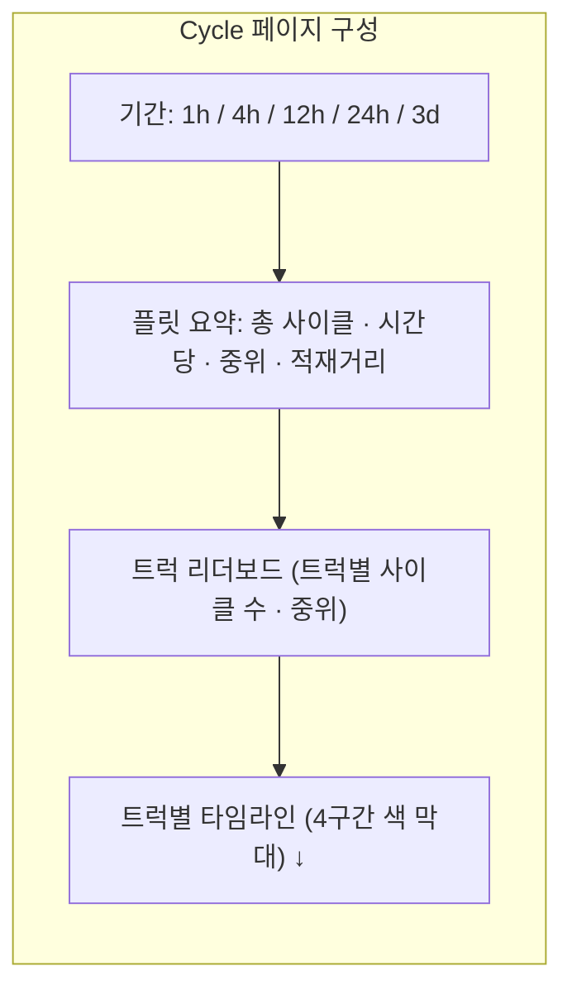
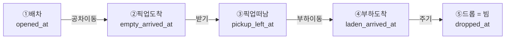
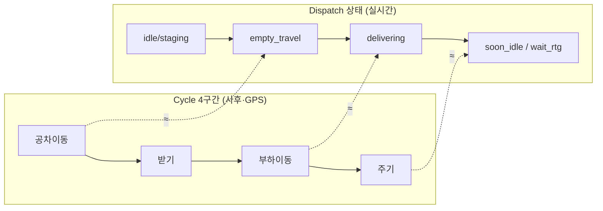

Cycle 페이지는 트럭의 **한 바퀴(사이클)** 가 **어디서 시간을 쓰는지** 를 5단계(사이 4구간)로 쪼개 보여줍니다. 이건 KPI(TOS 기록)와 달리 **websocket GPS 움직임(원천 ②)** 으로 직접 감지한 **실제** 사이클입니다.

트럭별 타임라인 한 줄은 4구간을 시간 길이만큼의 색 막대로 그립니다(긴 구간=주행, 짧은 구간=받기/넘기기):

## 1. 사이클은 어떻게 "감지"되나 (제일 중요한 트릭)

문제: GPS의 `container1`은 "지금 싣고 있는 박스"가 아니라 **"TOS가 배정한 박스"** 입니다. 트럭이 빈 차로 픽업하러 가는 동안에도 채워져 있어요. 그래서 `container1`만 보면 사이클을 못 나눕니다.

해결: **물리적 증거 = 이동(movement)** 으로 판정합니다.

| 조건 | 기준값 | 왜 |
|---|---|---|
| 보유 시간 | 컨테이너를 **30초 이상** 들고 있었나 | 신호 깜빡임 제거 |
| 운반 거리 | 들고 있는 동안 **150m 이상** 달렸나 | 제자리 재배정(가짜)을 걸러냄 |
| GPS 점프 가드 | 연속 점 사이 600m 초과 = 버림 | 텔레포트/오차 스파이크 방지 |

두 조건을 통과하면 **"인도 확정"** = 사이클 1개 완료. (이 동일한 판정을 라이브 KPI의 사이클 중위값도 함께 쓰므로 항상 일치합니다.)

## 2. 5이벤트 · 4구간 분해

한 사이클은 **5개 시점**과 그 사이 **4개 구간**으로 나뉩니다. "어느 쪽에 도착했나"(ARRIVED 신호 또는 목적지 지오펜스)로 픽업/드롭을 가릅니다.

| 구간 | 한국어 | 사이 | 보통 길이 |
|---|---|---|---|
| empty | **공차 이동** | ①배차 → ②픽업 도착 | 김 |
| pickup | **받기** | ②픽업 도착 → ③픽업 떠남 | 짧음 |
| laden | **부하 이동** | ③픽업 떠남 → ④부하 도착 | 김 |
| drop | **주기(넘기기)** | ④부하 도착 → ⑤드롭 | 짧음 |

:::note[옛 4단계·6이벤트 모델은 폐기]
예전엔 v1 4단계와 v2 6이벤트(빈차 출발 포함)를 토글로 보여줬으나 **둘 다 폐기**했습니다. 현행은 위 5이벤트 하나이고, "빈차 출발"은 6이벤트 중 가장 안 잡혀 빼서 **공차 = 배차→픽업 도착 한 구간**입니다. 원리·포착율 상세: [TT 사이클 분해(현행)](/kc/architecture/cycle-decomposition/).
:::

**픽업/드롭 측 규칙** (목적지 `topos1`이 크레인 코드 C/M/Z냐 블록 코드냐로 판정):

| 작업 | 픽업 측 | 드롭 측 |
|---|---|---|
| LD(적하) | 야드 블록(RTG) | 안벽 크레인(QC) |
| DS(양하) | 안벽 크레인(QC) | 야드 블록(RTG) |

## 3. 플릿 요약 값

`/api/tt-cycles/summary?hours=` 가 제공. 출처는 모두 `tt_cycle_log` / `tt_cycle_v2`(GPS 감지 사이클).

| 값 | 뜻 | 계산 | 크기 의미 |
|---|---|---|---|
| **총 사이클** | 이 기간 완료한 바퀴 수 | 인도 확정 건수 | 많을수록 활발 |
| **시간당 사이클** | 1시간에 몇 바퀴 | 총 사이클 ÷ 시간 | 처리 속도 |
| **중위 사이클타임** | 한 바퀴 걸린 시간의 중앙값 | `cycle_median_s` (p25/p75 함께) | 짧을수록 빠른 회전. 중앙값이라 이상치에 강함 |
| **적재거리(중위)** | 짐 싣고 달린 거리 | `laden_leg_m`(≥150m 보장) | OD 거리 감(짧으면 가까운 작업) |
| **Little's law 추정** | 순환 중인 트럭 수 등 흐름 지표 | W=L/λ (인도율 λ로) | 흐름 균형 점검 |

:::note[왜 중위(median)를 쓰나]
평균은 아주 긴 한두 사이클에 휘둘립니다. **중위값(절반은 이보다 빠르고 절반은 느림)** 이 "보통 얼마나 걸리나"를 더 정직하게 보여줍니다. 그래서 p25(빠른 편)·p75(느린 편)도 같이 봅니다.
:::

## 4. 트럭별 타임라인 (세그먼트 막대)

- 트럭을 고르면 그 트럭의 사이클들이 **4색 막대**로 그려집니다(공차/받기/부하/주기).
- 막대 길이 = 각 단계 시간. 어느 단계가 길면 거기서 시간을 쓴다는 뜻(예: "받기"가 길면 크레인 대기, "공차이동"이 길면 먼 픽업).
- 화면에서는 `배차 ≤ 픽업도착 ≤ 픽업떠남 ≤ 부하도착 ≤ 드롭` 순서로 정렬해 단계 합이 항상 사이클 시간과 맞게 그립니다(DB엔 관측값 그대로 저장, 미관측은 빈칸).
- 데이터: `/api/tt-cycles/detail?ytno=&hours=` — 5이벤트 시각(`v2_opened_at`, `v2_empty_arrived_at`, `v2_pickup_left_at`, `v2_laden_arrived_at`, `dropped_at`).

## 5. 정직한 한계 — 일부 단계는 비어 있음(NULL)

단계 시각은 GPS 도착/지오펜스 신호에 의존합니다. 모든 사이클이 5이벤트를 다 갖지는 않습니다.

:::caution[부분 관측]
포착율(7일, 양하/적하): 배차 100/100 · **픽업도착 69/85** · 픽업떠남 96/73 · 부하도착 87/79 · 드롭 100/100. 관측 못 한 시점은 **NULL(추정 안 함)** 로 두고 화면에서는 그 토막을 접습니다. (③픽업떠남은 TOS 크레인 정답지로 추가 보정 — 상세 [사이클 분해 문서](/kc/architecture/cycle-decomposition/).)
:::

기타 처리:
- **150m 미만 초단거리** 야드 이동은 이동필터가 의도적으로 거릅니다(가짜 사이클 방지).
- **트윈 리프트**(컨테이너 2개)는 물리 1트립 = 1 사이클로 기록하고 `twintandem='W'`로 표시(무브 수 분석 시 ×2 보정).
- `container1`↔`container2` **슬롯 스왑**(피드 특성)은 가짜 인도로 오인하지 않게 "비어있지 않은 집합이 그대로면 무시"합니다.

## 6. KPI의 K_CYCLE와 뭐가 다른가요?

| | Cycle 페이지 사이클 | KPI의 K_CYCLE |
|---|---|---|
| 출처 | **GPS 움직임**(원천 ②) | **TOS 이벤트**(원천 ①) |
| 의미 | 실제 트럭이 돈 한 바퀴(이동 기반) | 작업 기록의 첫~마지막 이벤트 간격 |
| 쓰임 | 운영 진단·트럭별 분석·ML 학습 라벨 | 공식 KPI 점수 |

> 라이브 KPI의 사이클 중위값은 같은 인도 엣지를 공유해 일치합니다. 단 **KPI 페이지의 K_CYCLE(TOS)** 는 별개입니다.

:::note[K_CYCLE(TOS) ↔ GPS 사이클 교차검증 (7일)]
GPS 사이클(중앙 ~20분)은 K_CYCLE(중앙 ~60분)의 **33~43%**입니다. K_CYCLE는 배차 큐·재계획 등 *행정 시간*까지 포함하고, GPS는 *실제 주행*만 재기 때문 — **절대값이 다른 게 정상**(둘 다 유효, 측정 대상이 다름). 그래서 GPS로 K_CYCLE의 절대값을 검증할 순 없고, **추세·비율·작업유형 순위**로 교차검증합니다(셋 다 일치 = 건강). 물리적 사이클·ML 라벨엔 **GPS 사이클**을, TOS 스코어카드엔 K_CYCLE를 쓰세요.
:::

## 7. Cycle 4구간 ↔ TT Dispatch 6상태 관계

같은 트럭 여정을 두 방식으로 봅니다 — **Cycle 4구간 = 끝난 사이클의 시간 구간(사후·GPS)**, **Dispatch 6상태 = 지금 이 순간의 분류(실시간·웹소켓 전용)**. 대응:

| Cycle 구간 | 대응 Dispatch 상태 | 비고 |
|---|---|---|
| (사이클 사이) | **idle** / **staging** | 유휴 / 배차받고 대기 — 아직 사이클 전 |
| 공차이동 | **empty_travel** | 빈 차로 픽업지로 |
| 받기 | (짧음) empty_travel→delivering 전환 | 픽업 적재 순간 |
| 부하이동 | **delivering** | 짐 싣고 하역지로 |
| 주기(넘기기) | **soon_idle** (RTG≤50m 근접/QC PLC) · **wait_rtg** (블록 도착·RTG 대기) | 하역지 도착~인계 |

> 한 줄: **idle/staging**(사이클 밖) → **empty_travel**(공차이동) → **delivering**(부하이동) → **soon_idle/wait_rtg**(주기) → 다시 idle.

:::note[실시간 분류는 웹소켓 전용]
Dispatch 상태(곧 유휴 선별)는 TOS DB 없이 **웹소켓 GPS만**으로 판정합니다(배정=latched 미션·부하 도착=ARRIVED 또는 지오펜스). 옛 `approaching`은 `wait_rtg`로 통합됐습니다.
:::

---
**출처 문서:** [TT 사이클 분해 (현행)](/kc/architecture/cycle-decomposition/) · [RTG 작업 사이클](/kc/research/rtg-work-cycle/) · [사이클 v2 실험 이력](/kc/experiments/cycle-v2-shadow/)
**다음 →** [러닝 센터 해설](/kc/dashboard/learning/)
