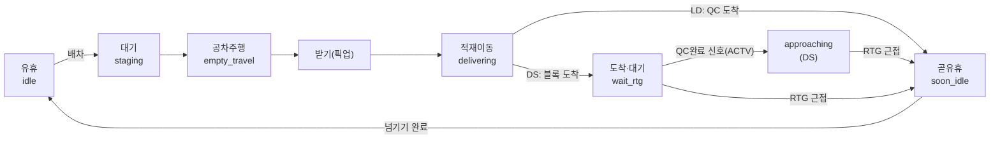

TT Dispatch 페이지는 **"지금 이 순간 트럭들이 어디서 무엇을 하고 있나"** 를 보여줍니다. 거의 전부 **websocket(원천 ②, 실시간 GPS·PLC)** 에서 오고, 작업 풀만 **TOS(원천 ①)** 와 섞습니다.

:::caution[실시간 = 메모리]
이 페이지의 값은 DB에 저장되지 않은 **메모리 스냅샷**입니다. SSH 터널이 끊기면 화면이 즉시 비고 [피드 헬스]가 적색이 됩니다. "과거"가 없으니 시간을 거슬러 볼 수 없습니다.
:::

## 1. 트럭 배차 상태 6종 (제일 중요)

각 트럭은 매 스냅샷마다 6개 상태 중 하나로 분류됩니다(`classify_tt`). 분류는 **GPS 신호만으로** 합니다(작업 풀 배정 여부는 idle/staging 구분에만 사용).

| 상태 | 한국어 | 신호(websocket) | 쉬운 뜻 |
|---|---|---|---|
| **idle** | 유휴 | 공차(`container1` 빔) + 속도<3km/h + **작업풀 미배정** | 진짜 노는 차 → 즉시 배차 가능 |
| **staging** | 대기(배차됨) | 공차 + 정지 + **작업풀에 배정됨** | 일은 받았고 순서를 기다리는 중 (노는 게 아님) |
| **empty_travel** | 공차 주행 | 공차 + 이동 중 | 픽업하러 빈 차로 가는 중 |
| **delivering** | 적재 이동 | 적재(`container1` 있음) + 이동 중 | 짐 싣고 하역지로 가는 중 |
| **wait_rtg** | 도착·RTG 대기 (DS) | 적재 + ARRIVED at 블록 + RTG 미근접 + TOS ACTV 없음 | 블록에 도착했지만 RTG가 아직 안 옴 |
| **approaching** | RTG 대기·QC완료 (DS) | 적재 + ARRIVED at 블록 + **TOS ACTV**(QC 양하 완료) + RTG GPS 미근접 | QC가 트럭에 실어준 건 확인됐고 블록서 RTG 차례 대기(~12분) |
| **soon_idle** | 곧 유휴 | 적재 + ARRIVED + **크레인 관여 중** (LD=QC도착 / DS=RTG≤30m) | 마지막 넘기기 진행 → 곧 빈 차가 됨 |

> **wait_rtg·approaching는 DS(양하) 전용**입니다. 둘의 차이 = RTG 작업 시작을 아는 신호: `approaching`은 TOS의 ACTV(QC가 트럭에 실어준 시각)로 "곧 RTG가 받는다"를 알고, `wait_rtg`는 그 신호조차 없어 더 불확실. (총 상태 = idle·staging·empty_travel·delivering·wait_rtg·approaching·soon_idle = **7개**)

:::note[idle vs staging — 왜 갈랐나]
예전엔 "공차+정지"면 전부 idle로 셌더니, 실제로는 **절반(102대 중 51대)이 이미 배차된 차**였습니다(순서 대기 중). 그래서 작업 풀(TOS)을 교차참조해 **배정된 대기 = staging**, **진짜 미배정 = idle**로 분리했고 idle 수가 102→21로 정상화됐습니다.
:::

### "크레인 관여 중"은 어떻게 아나? (soon_idle의 핵심)

| 작업 | 신호 | 정밀도 |
|---|---|---|
| **LD(적하)** | 안벽 QC의 PLC(`ctab.load`)가 신선함 = QC가 지금 이 베이에서 돈다 | ±1초 (PLC 직접) |
| **DS(양하)** | RTG GPS ↔ 트럭 GPS가 같은 베이(≈30m 이내) | 근접 추정 |

> RTG는 PLC가 없어 직접 못 봅니다 → **GPS 거리**로 추정. 블록 위치는 ARRIVED한 트럭들의 GPS로 **학습한 중심좌표**를 써서, 크레인이 GPS를 안 쏠 때도 거리 계산이 됩니다.

:::note[wait_qc는 왜 없나 — DS/LD 비대칭]
**DS**는 RTG에 PLC가 없어 "도착했지만 크레인이 아직"을 `wait_rtg`/`approaching`으로 따로 둡니다. 반면 **LD**는 트럭이 QC에 ARRIVED하면 곧바로 `soon_idle`로 가고 **별도 wait_qc가 없습니다** — QC는 항상 PLC가 있어 관여 여부가 관측되기 때문(PLC 신선도는 reason 라벨로만 표시). 단, 측정상 LD 트럭은 도착 후에도 QC 큐에서 **~3.2분** 더 대기하므로([러닝센터 ④](/kc/dashboard/learning/)), 그 대기를 굳이 분리하고 싶다면 'LD ARRIVED + QC PLC 미신선'을 조건으로 `wait_qc`를 추가할 수 있습니다(현재는 그 대기가 `soon_idle`에 포함).
:::

## 2. websocket 필드 → 화면 값 (lineage)

`/api/livemap/positions` 가 장비별 최신 GPS를 주고, 화면이 이걸 그립니다.

| 화면 값 | websocket 필드 | 뜻 / 크기 의미 |
|---|---|---|
| 트럭 위치(지도 점) | `lat`, `lon` | 현재 좌표 |
| 속도 | `speed`("8kmh") | <3km/h면 "정지"로 간주(유휴 판정 입력) |
| 적재 여부 | `container1`(+`container2`) | 비어 있으면 공차/유휴, 차 있으면 적재(또는 배정됨) |
| 목적지 | `topos1` | 다음 핸드오버 지점 — 블록 베이(`03U-21`) 또는 크레인(`C39`) |
| 도착 | `arrival`="ARRIVED" | 핸드오버 임박 판정의 핵심 |
| 작업종류 | `jobtype` | DS/LD — 어느 쪽이 픽업/드롭인지 결정 |
| 크레인 작업중 배지 | `ctab.load` ≥ 1.0t (신선) | "이 크레인 지금 돈다"(`PLC live`) |

## 3. "곧 빔 ~N분" (free_in) — 표시 전용 그림자

soon_idle/도착 트럭 옆에 **"곧 빔 ~N분"** 같은 추정이 붙을 수 있습니다. 트럭이 **몇 분 뒤에 빈 차가 될지**의 거친 추정입니다.

| 상태 | 중앙 추정 | 최대 |
|---|---|---|
| 운반 중(아직 운전) | ~17분 | ~40분 |
| 블록 도착 대기 | ~8분 | ~27분 |
| 임박(곧유휴) | ~2분 | ~6분 |

:::note[표시 전용입니다]
이 값(`free_in`)은 **보여주기만** 하고 아직 실제 배차 결정에는 쓰지 않습니다(그림자). 검증된 "몇 분 후 유휴" 정밀 측정은 [러닝 센터 ④·⑤](/kc/dashboard/learning/)에서 다룹니다. (러닝 센터 측정 기준으로 실제로는 LD ~3.2분·DS ~5분 뒤 빔 — free_in 상수는 보정 예정.)
:::

## 4. 작업 풀 융합 — "계획(TOS) + 실측(GPS)"

작업 풀은 **TOS의 "지금 할 일"**(90초마다 갱신)과 **websocket 실측**을 합칩니다.

| 화면 값 | 출처 | 뜻 |
|---|---|---|
| QC별 작업 큐 / 순서 | `JOB_QUEUE_SCHEDULE.JOB_QUE_SEQ` | 크레인이 큐를 처리하는 순서 |
| 잔여(백로그) | `TOTALQTY − COMPQTY` | 그 큐에 남은 작업 수 |
| ETW(크레인 준비 시각) | `JOB_ORDER_LIST.JOB_ODR_ETW_DT` | 크레인이 준비되는 시각. `ETW − 현재` = 시급도 |
| 배정 트럭 | `JOB_ODR_YTNO`(=GPS `device`) | 그 작업을 맡은 트럭 + 옆에 **실시간 상태 점**(유휴/곧유휴/적재이동/RTG대기) |
| 크레인 가동 배지 | `ctab`(PLC 신선) | "이 QC 지금 물리적으로 돈다" = `PLC live` |
| 작업 상태 | `JOB_ODR_JOBSTATUS` | A 활성 · **Q 대기(미배정 백로그)** · P 계획 · C 완료 |

## 5. 라이브맵 오버레이 (레이어 토글)

라이브맵은 위성 지도 위에 장비 + 여러 학습/분석 레이어를 겹쳐 보여줍니다.

| 오버레이 | 보여주는 값 | 출처 | 색/크기 의미 |
|---|---|---|---|
| **장비 아이콘** | TT/RTG/QC 실시간 위치 | GPS | 장비 종류별 아이콘, 상태별 색 |
| **작업지점 좌표(학습)** | 학습된 블록·크레인 중심점 | `/api/learn/topos` | 채움색 = 신뢰도(🟢높음·🟠보통·🔴낮음), 테두리 = 블록/크레인. 클릭 시 표본수·정밀도 팝업 |
| **주행 차선(학습)** | 트럭이 다니는 길 + 방향 | `/api/learn/lanes` | 화살표 = 흐름 방향, 초록=일방·회색=양방. 클릭 시 통과수·평속 |
| **메트릭 격자** | 구역별 평균속도 또는 차량수 | 라이브 위치에서 계산 | 속도: 느림🔴→빠름🟢(정체 구간) / 밀도: 적음🔵→많음🔴(혼잡). 크기 50~200m 조절 |
| **작업 수요·미배정** | 트럭 못 받은 작업이 몰린 곳 | TOS `JOBSTATUS='Q'` | 주황=양하(QC에서 대기)·청록=적하(블록에서 대기), 버블 크기=작업 수 |
| **날씨 칩** | 강수·시정 | Tomorrow.io(`/api/weather`) | 스콜이면 ⛈ 적색(비≥2mm 또는 시정<2km) |
| **GPS 헬스 칩** | 피드 품질 | 자체 통계 | 불가능한 점프율(5분 창)이 높으면 경고 |

:::tip[메트릭 격자는 클라이언트 계산]
메트릭 격자(평균속도/밀도)는 백엔드 없이 **지금 화면의 트럭 위치에서 즉석 계산**합니다 — 셀마다 그 안의 트럭 수와 평균속도를 구해 색칠. 그래서 라이브 위치가 갱신될 때마다 같이 바뀝니다.
:::

## 6. (참고) TtPage의 트럭 칩

- **상태별 트럭 수**: 위 6개 상태의 카운트(idle/staging/…)를 합니다.
- **DS 적재 칩 (`적재 N분`)**: 양하 트럭이 컨테이너를 실은 뒤 경과한 시간 — TOS `ACTV_DT`(QC가 트럭에 실은 시각) 기준. DS 전용(LD는 의미가 달라 제외).

---
**출처 문서:** [websocket 데이터](/kc/architecture/websocket-data/) · [차량·작업 풀 갱신](/kc/architecture/dispatch-pools/) · [TOS DB 레퍼런스](/kc/architecture/tos-db-reference/)
**다음 →** [Cycle 해설](/kc/dashboard/cycle/)
