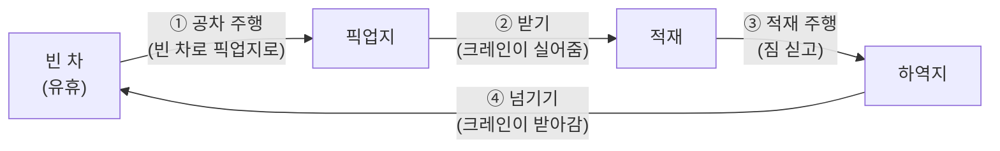
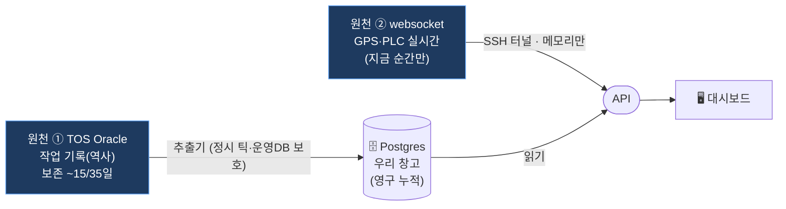

:::tip[이 문서 묶음은 무엇인가요]
대시보드의 **모든 페이지에서 보이는 모든 숫자**가 — 무슨 뜻이고, 어디서 왔고(어떤 TOS 테이블의 어떤 컬럼 / 어떤 GPS 신호), 어떻게 계산했고, 값이 크고 작은 게 무슨 의미인지 — 를 **처음 보는 사람(심지어 12살)도** 이해하도록 풀어 쓴 살아있는 설명서입니다.
이 페이지는 **큰 그림**이고, 페이지별 상세는 옆 목차의 KPI · TT Dispatch · Cycle · 러닝 센터로 이어집니다.
:::

:::caution[유지보수 규칙 — 중요]
이 문서는 **화면(프론트엔드)이 바뀌면 같이 업데이트**합니다. 새 값/카드/칩을 추가하거나 계산을 바꾸면, 해당 페이지 문서의 표에 한 줄을 더하세요. "화면의 숫자 ↔ 설명"이 항상 1:1로 맞아야 신뢰할 수 있는 단일 출처가 됩니다.
:::

## 1. 먼저, 여기는 어떤 곳인가요? (비유로)

항만 터미널을 **아주 거대한 택배 물류센터**라고 생각하세요. 다만 택배 상자 대신 **컨테이너**(쇠로 된 큰 박스)를 다룹니다.

> 방향: **DS(양하)** 는 왼→오른쪽(배→야적장), **LD(적하)** 는 그 반대(야적장→배).

**등장인물(장비):**

| 약자 | 정식 | 쉬운 설명 | 비유 |
|---|---|---|---|
| **TT** | Transfer Truck (야드 트럭) | 컨테이너를 싣고 부두↔야적장을 오가는 트럭. **이 대시보드의 주인공.** ~280대 | 물류센터 안을 도는 지게차/카트 |
| **QC** | Quay Crane (안벽 크레인) | 배와 부두 사이에서 컨테이너를 드는 큰 팔. ID는 `C##`(예 C51). ~28대 | 배에서 짐 꺼내는 큰 집게 |
| **RTG** | 야드 갠트리 크레인 | 야적장에서 컨테이너를 쌓고 내림. ~100대 | 창고 선반에 물건 올리는 크레인 |

**두 가지 일의 방향 (이게 모든 곳에 나옵니다):**

| 약자 | 뜻 | 방향 | 트럭이 하는 일 |
|---|---|---|---|
| **DS** | 양하 (Discharge) | 배 → 야적장 | QC가 배에서 내린 컨테이너를 **트럭이 받아** 야적장으로 가져가 RTG에 넘김 |
| **LD** | 적하 (Load) | 야적장 → 배 | RTG가 야적장에서 꺼낸 컨테이너를 **트럭이 받아** 부두로 가져가 QC에 넘김 |

> 💡 **핵심 한 줄:** DS는 "배에서 야드로", LD는 "야드에서 배로". 트럭은 양쪽 다 **컨테이너를 받아 → 옮겨 → 넘기면 → 빈 차가 됩니다(= 유휴).**

## 2. 트럭의 하루 = "사이클"의 반복

트럭 한 대는 같은 동작을 계속 반복합니다. 이 한 바퀴를 **사이클(cycle)** 이라고 부릅니다.

- **공차(empty)** = 짐이 없는 상태, **적재(laden)** = 짐을 실은 상태.
- **유휴(idle)** = 짐도 없고 다음 일도 안 받아 **놀고 있는** 상태. (놀리면 손해 → 대시보드가 이걸 줄이려 함)
- **trip(트립)** = 한 번의 "쭉 이동"(빈 차 주행 1번 = 1 trip, 적재 주행 1번 = 1 trip). 컨테이너 1개 작업 = 보통 **2 trip**.

## 3. 숫자는 어디서 오나요? — 두 개의 데이터 원천

대시보드의 모든 값은 **딱 두 곳**에서 옵니다. 이 구분이 제일 중요합니다.

| | TOS Oracle (원천 ①) | websocket (원천 ②) |
|---|---|---|
| 성격 | **공식 기록** — 무슨 일이 있었나 | **실시간 관측** — 지금 어디서 뭐 하나 |
| 시간 | 초 단위(완료 이벤트) | GPS ~3초 / PLC ~1초마다 |
| 저장 | Postgres에 영구 누적 | **메모리만**(끊기면 화면이 빔) |
| 깊이 | 최근 며칠치 | **지금 이 순간뿐** |
| 주로 쓰는 곳 | **KPI 숫자**, 학습 라벨 | **라이브맵·배차 상태**, 사이클 감지 |

:::note[한 문장 요약]
**KPI 페이지의 점수는 전부 TOS(원천 ①)**, **TT Dispatch의 실시간 트럭 상태는 전부 websocket(원천 ②)**, **러닝 센터는 둘을 섞어** 만듭니다. Cycle 페이지는 websocket으로 트럭 움직임을 추적해 만든 사이클입니다.
:::

### 두 원천을 잇는 열쇠 — 같은 ID

두 시스템이 같은 일을 가리키는지 어떻게 알까요? **ID가 같기 때문**입니다.

- 트럭: TOS의 `JOB_ODR_YTNO`(예 `TT1153`) = websocket GPS `device`(예 `TT1153`). → 계획과 실위치를 합침.
- 크레인: TOS의 `JOB_QUE_CRANENO`(예 `C51`) = websocket PLC `crane`(C51). → 계획과 "지금 도는 중"을 합침.

## 4. TOS의 주요 "일기장"(테이블) 4권

KPI·사이클·학습의 재료가 되는 핵심 테이블입니다. (자세한 컬럼은 [TOS DB 레퍼런스](/kc/architecture/tos-db-reference/))

| 테이블 | 한 줄 뜻 | 1행 = | 여기서 나오는 것 |
|---|---|---|---|
| `JOB_ORDER_HISTORY` | 컨테이너 작업 이력 | 컨테이너 작업의 한 이벤트 | 공차거리·사이클·핸드오버 대기 |
| `MCH_OPERATION` | 크레인 작업 기록 | 크레인 move 1건 | QC 처리량(MPH)·QC 대기 |
| `MCH_WORKTIME` / `WORKSTOP` | 트럭 근무/정지 시간 | 트럭의 근무 세션 | TT 가동률 |
| `JOB_ORDER_LIST` / `JOB_QUEUE_SCHEDULE` | **라이브** 작업 풀(지금 할 일) | 대기/진행 중인 작업 | TT Dispatch의 작업 큐·미배정 수요 |

## 5. websocket의 두 신호

| zone | 누가 보냄 | 핵심 필드 | 쓰임 |
|---|---|---|---|
| `wpt_gps` | 모든 장비(TT/RTG/QC) | `lat/lon`(위치) · `speed`(속도) · `container1`(배정 컨테이너) · `topos1`(목적지) · `arrival`(도착) · `jobtype`(DS/LD) | 위치 표시 + 트럭 상태 분류 |
| `ctab` | 동적 크레인(C/M/Z만) | `crane`(ID) · `load`(하중 톤) | "크레인이 지금 작업 중" + 핸드오버 순간 포착 |

:::caution[꼭 기억할 함정 2가지]
1. **RTG(야드 크레인)는 PLC 신호가 없습니다.** 그래서 양하(DS) 블록 쪽 "넘기는 순간"은 직접 못 보고, **RTG와 트럭의 GPS 거리(≈30m 이내면 작업 중)**로 추정합니다.
2. **`container1`은 "지금 싣고 있는 박스"가 아니라 "TOS가 배정한 박스"**입니다. 트럭이 빈 차로 픽업하러 가는 동안에도 채워져 있습니다. (그래서 사이클은 GPS의 *이동*으로 판정합니다.)
:::

## 6. 시간대 주의 — MYT vs KST

- 터미널/TOS는 **MYT(말레이시아, UTC+8)**, 우리 서버는 **KST(UTC+9)** 로 1시간 차이.
- **화면/문서에서 사람에게 보이는 시각은 한국 시간(KST)** 으로 변환해 표시합니다.
- 날짜·교대(shift) 경계는 항상 터미널 시간 기준으로 계산합니다(안 그러면 "오늘"이 1시간 어긋나 0이 뜸).

## 7. 페이지 안내 (옆 목차)

| 페이지 | 한 줄 | 주 원천 | 상세 문서 |
|---|---|---|---|
| **KPI** | 터미널이 오늘 얼마나 잘 돌아갔나 (6개 점수) | TOS ① | [KPI 페이지 해설](/kc/dashboard/kpi/) |
| **TT Dispatch** | 지금 트럭들이 어디서 뭐 하나 (실시간 지도·상태) | websocket ② | [TT Dispatch 해설](/kc/dashboard/dispatch/) |
| **Cycle** | 트럭 한 바퀴(사이클)가 어떻게 쪼개지나 | websocket ② | [Cycle 해설](/kc/dashboard/cycle/) |
| **러닝 센터** | AI가 무엇을·어떤 데이터로 학습하고 얼마나 잘 맞히나 (예측 모델 / 데이터 수집 2탭) | ①+② | [러닝 센터 해설](/kc/dashboard/learning/) |

> 다음 → **[KPI 페이지 해설](/kc/dashboard/kpi/)** 부터 한 값씩 뜯어봅니다.
