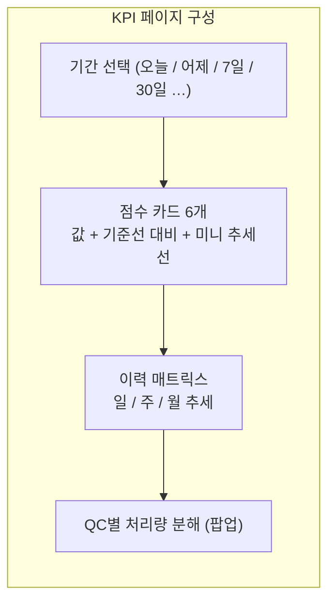
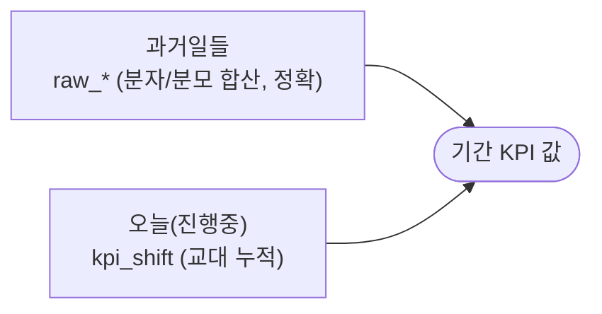

KPI 페이지는 **"터미널이 (오늘/이 기간) 얼마나 잘 돌아갔나"** 를 6개 점수로 보여줍니다. 성적표라고 보면 됩니다. 모든 KPI는 **TOS Oracle(원천 ①)** 에서 나옵니다 — websocket(실시간 GPS) 아님.

## 1. 점수 카드 읽는 법 (공통)

각 카드에는 세 가지가 같이 있습니다:

| 요소 | 뜻 | 어떻게 |
|---|---|---|
| **큰 숫자** | 이 기간의 KPI 값 | 아래 §2의 계산식 |
| **기준선 대비** | 평소보다 좋아졌나/나빠졌나 | **최근 4주 롤링 평균(baseline)** 과 비교 + Welch t-검정으로 "통계적으로 의미 있는 차이인지"까지 판단 |
| **미니 추세선(스파크라인)** | 최근 흐름 | 일자별 KPI 값을 선으로 |

:::note[방향이 다릅니다]
어떤 KPI는 **낮을수록 좋고**(공차거리·사이클·대기), 어떤 건 **높을수록 좋습니다**(가동률·처리량). 카드는 "좋아짐/나빠짐"을 방향에 맞춰 색으로 표시합니다.
:::

## 2. 6개 KPI 하나씩 (+ 숨은 2개: K_RTG_Q · K_QC_NOMOVE)

아래 표의 **출처**는 `TOS테이블.컬럼`, **계산**은 공식, **크기 의미**는 값이 크고 작을 때의 해석입니다.

### ① K_EMPTY — 공차거리 (km/Job) · 낮을수록 좋음
| 항목 | 내용 |
|---|---|
| 쉬운 뜻 | 컨테이너 1개를 나르려고 트럭이 **빈 차로 달린 거리** (낭비 주행) |
| 출처 | `JOB_ORDER_HISTORY.UN_LNDN_TRV_RNG`(공차거리 m) · 작업 수 |
| 계산 | `Σ(공차거리 m) ÷ Σ(작업 수) ÷ 1000` |
| 크기 의미 | 작을수록 효율적 배차(빈 차 주행 적음). 크면 동선이 꼬여 헛걸음이 많다는 뜻 |

### ② K_EMPTY_R — 공차비율 (%) · 낮을수록 좋음
| 항목 | 내용 |
|---|---|
| 쉬운 뜻 | 트럭이 달린 전체 거리 중 **빈 차로 달린 비율** |
| 출처 | `JOB_ORDER_HISTORY.UN_LNDN_TRV_RNG`(공차) / `LNDN_TRV_RNG`(적재) |
| 계산 | `Σ공차m ÷ Σ(공차m + 적재m)` |
| 크기 의미 | 0%면 모든 주행이 짐 싣고 한 이상적 상태(현실엔 없음). 높을수록 빈 주행 낭비 ↑ |

### ③ K_CYCLE — 사이클타임 (초) · 낮을수록 좋음
| 항목 | 내용 |
|---|---|
| 쉬운 뜻 | 컨테이너 1개 작업이 **처음부터 끝까지 걸린 시간** (한 바퀴) |
| 출처 | `JOB_ORDER_HISTORY` — 한 작업(CONTNO·POINT·SEQNO)의 첫 이벤트 ~ 마지막 이벤트 간격 |
| 계산 | `작업별 (마지막−첫) 시각`의 **작업 수 가중 평균** |
| 크기 의미 | 짧을수록 빠른 회전. 보통 **~13분** 수준. 길어지면 어딘가에서 대기/정체 |

:::note[KPI의 K_CYCLE vs Cycle 페이지의 사이클 — 교차검증 결과]
이름은 같지만 **측정 대상이 다릅니다.** **K_CYCLE(TOS) = 작업의 첫~마지막 이벤트 간격** — 배차 큐·재계획 등 *행정 시간*까지 포함(중앙 ~60분). **Cycle 페이지(GPS) = 실제 주행 한 바퀴**(중앙 ~20분). 7일 비교: GPS가 K_CYCLE의 **33~43%** — 둘은 잰 게 달라 **절대값이 일치하지 않는 게 정상**(버그 아님). 결론: K_CYCLE는 "TOS가 기록한 시간"으로 **KPI/추세엔 신뢰할 만**하나, *물리적* 사이클 시간이나 ML 라벨로는 GPS 사이클을 써야 합니다. 교차검증은 **추세·비율·순위로**(절대값 매칭 ❌). — [Cycle 해설](/kc/dashboard/cycle/)
:::

### ④ K_UTIL — TT 가동률 (%) · 높을수록 좋음
| 항목 | 내용 |
|---|---|
| 쉬운 뜻 | 트럭들이 근무 시간 중 **실제로 일한 비율** (놀지 않은 정도) |
| 출처 | `MCH_WORKTIME`(근무 세션) − `MCH_WORKSTOP`(정지/휴식) |
| 계산 | **트럭별** `min(1, 가동분 ÷ 경과분)` 을 구해 **평균**(×100). 단순 합산이 아니라 "비율들의 평균(avg-of-ratios)" |
| 크기 의미 | 높을수록 트럭을 잘 활용. 낮으면 트럭이 놀거나(유휴) 대기가 많음 |

:::caution[K_UTIL은 특수]
"비율들의 평균"이라 주/월 점수는 단순 평균으로 합치면 틀립니다 → 일 단위 원자료에서 다시 계산합니다. 오늘분은 교대 누적 테이블(`util_tt_shift`)에서 정확히 재조합.
:::

### ⑤ K_QC_TT_WAIT — QC 트럭 대기 (초) · 낮을수록 좋음 · 보조 K_QC_TT_WAIT_GPS
이 카드는 **메인 + 보조** 두 수치입니다.
| 항목 | 내용 |
|---|---|
| 메인 쉬운 뜻 | 안벽 크레인(QC)이 **트럭을 기다린 시간** — *같은 베이*에서 move 사이의 빈 갭(≈진짜 트럭 대기). 베이 이동/해치는 제외 |
| 메인 출처 | `MCH_OPERATION`(QC C##, LD/DS) — 갭 앞뒤 `MCH_OPER_QUEUENAME`(베이) **불변**인 갭만 |
| 메인 계산 | 같은-베이 갭(≤30분)을 `same_bay_periods` 가중 평균 (raw_k_qc_q → kpi_daily K_QC_TT_WAIT) |
| **보조** (⚡라이브) | **K_QC_TT_WAIT_GPS** — *지금* 굶고 있는 QC 수 · 평균 대기. QC PLC가 idle인데 그 크레인 밑에 트럭 GPS가 없음 = 진짜 starvation (websocket `/api/livemap/positions` qc_starving·qc_wait_live_s, GPS+PLC 검증) |
| 크기 의미 | 작을수록 트럭 공급 원활. 메인=TOS 기록(과거~오늘), 보조=지금 실측(GPS) |

:::note[왜 '같은 베이'만 세나 — '트럭 대기'를 정직하게 (TOS 실측 5일)]
QC엔 **LD/DS move만 기록**되고 해치커버·베이이동·기어교체는 move 행 자체가 없어, *모든* 무브 갭을 합치면(= 숨김 지표 **K_QC_NOMOVE**) 트럭 대기를 **~1.8배 과대평가**합니다. 5일 조사: 갭을 `MCH_OPER_QUEUENAME`(베이) 변경으로 나누니 **베이 변경 ≈45%**(QC가 다른 베이로 이동=갠트리/해치, 트럭 대기 아님)·**같은 베이 ≈55%**(≈진짜 트럭 대기). 그래서 **메인 K_QC_TT_WAIT는 베이 불변 갭만** 세어 진짜 대기에 가깝게, **보조 K_QC_TT_WAIT_GPS는 GPS로 '트럭 없음'까지 확인**(QC PLC idle + 트럭 미존재 = 확실한 starvation). 갭 크기만으론 안 갈라져(완만) **베이 변경 플래그가 분류기**. (>30분·선박 간 갭은 이미 제외.)
:::

### ⑥ K_MPH — QC 처리량 (move/시간) · 높을수록 좋음
| 항목 | 내용 |
|---|---|
| 쉬운 뜻 | 크레인이 **1시간에 컨테이너를 몇 번 옮겼나** (생산성의 핵심 지표) |
| 출처 | `MCH_OPERATION` (move 수 / 가동 시간) |
| 계산 | `QC move 수 ÷ 가동 시간(hr)` 을 **가동시간 가중 평균** |
| 크기 의미 | 높을수록 생산성↑. 떨어지면 크레인이 자주 멈췄거나 트럭 공급 부족 |

### (숨김) K_RTG_Q — 야드 핸드오버 대기 (초)
| 항목 | 내용 |
|---|---|
| 쉬운 뜻 | 트럭이 야적장에 짐을 내려놓고 **RTG가 받아갈 때까지 기다린 시간** |
| 출처 | `JOB_ORDER_HISTORY`: `JOB_HIST_ACTV_DT − YT_DIS_DT` |
| 계산 | `(ACTV_DT − YT_DIS_DT) × 86400` 초 |
| 왜 숨김 | 데이터가 오래된 날엔 희소 + 자주 오해됨(아래 함정) |

:::caution[이름 오해 주의 — K_RTG_Q ≠ "QC 대기"]
K_RTG_Q는 안벽 QC가 아니라 **야드(RTG) 쪽 핸드오버 대기**입니다(기록의 크레인 ID가 RTG/ES). "QC가 트럭을 기다림"은 위의 **K_QC_TT_WAIT**입니다. 둘은 다릅니다.
:::

### (숨김) K_QC_NOMOVE — QC 무브 공백 (초)
| 항목 | 내용 |
|---|---|
| 쉬운 뜻 | QC가 **컨테이너 move를 안 한 모든 갭**(≤30분) — 트럭 대기 + 베이이동/해치 다 포함 |
| 출처·계산 | `MCH_OPERATION`(QC, LD/DS) 병합구간 사이 갭. `raw_k_qc_q` idle_periods 가중 평균 |
| 왜 숨김 | 트럭 대기를 ~1.8배 과대평가(위 §⑤ 함정) → 표시는 K_QC_TT_WAIT로. 백엔드 수집은 유지(대조용) |

## 3. "오늘"부터 "30일"까지 — 기간은 어떻게 합쳐지나

- **과거 날들**: 추출기가 매일 밤 만들어 둔 **일 단위 원자료(`raw_*`)** 의 분자/분모를 그대로 합칩니다 → 정확.
- **오늘(진행 중)**: 교대마다 누적되는 라이브 테이블(`kpi_shift`)에서 폴드 → Oracle을 다시 안 긁어도 "오늘"이 채워집니다.
- 6개는 합/비율로 정확히 결합, **K_UTIL만** 원자료에서 재계산(위 특수 사항).

## 4. 기준선(baseline)과 "의미 있는 변화"

- **기준선** = 최근 **4주 롤링 평균**. "평소 수준".
- 카드는 이번 값이 기준선보다 좋아졌나/나빠졌나를 보여주고, **Welch t-검정**으로 "이게 우연이 아니라 진짜 달라진 것인지"까지 표시합니다 → 노이즈에 속지 않게.

## 5. 이력 매트릭스 · QC별 분해

- **이력 매트릭스**: 일/주/월 단위로 KPI들이 어떻게 변해왔는지 격자+선그래프로.
- **QC별 처리량 분해**: 처리량(K_MPH)을 **크레인(C##)별로** 쪼개 어느 크레인이 빠르고 느린지 봅니다. (`/api/breakdown/qc`)

## 6. (참고) 페이지 상단의 라이브 QC 요약

KPI 카드와 별개로, 페이지에는 **지금 도는 QC**를 요약하는 줄이 있을 수 있습니다 — 예 "QC 평균 처리량(PLC 사이클)", "QC 수·평균 대기". 이건 TOS 점수가 아니라 **websocket PLC(실시간)** 기반의 현재 상황 참고용입니다. (실시간 상세는 [TT Dispatch 해설](/kc/dashboard/dispatch/))

---
**출처 문서:** [TOS DB 레퍼런스](/kc/architecture/tos-db-reference/) · [KPI 계산](/kc/architecture/kpi-computation/) · [KPI 정확도](/kc/architecture/kpi-accuracy/)
**다음 →** [TT Dispatch 해설](/kc/dashboard/dispatch/)
