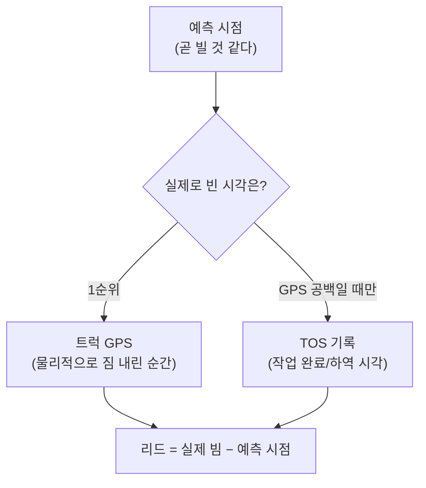

러닝 센터는 **AI가 현장 데이터로 스스로 배운 것**과 **그 배움의 재료(데이터)** 를 보여주는 페이지입니다. 화면 위쪽의 두 탭으로 나뉩니다.

| 탭 | 무엇을 보여주나 |
|---|---|
| 🧠 **예측 모델** | 우리가 쓰는 예측 모델 6개. 카드마다 **입력 → 출력 → 담당(배차의 어느 부분)** + 자기채점(검증) + 학습 추이 |
| 🗄️ **데이터 수집** | 우리가 실시간으로 모으는 데이터 15종. 카드마다 **설명 · 출처 · 쓰임 · 수집량** + 펼치면 **최근 수집 내역(실제 행)** |

:::tip[먼저 큰 그림 — 4가지만 알면 됩니다]
1. **학습(배우기)** = 같은 일을 **많이 보면 보통값(중앙값)** 을 알게 됨. 데이터가 쌓일수록 똑똑해짐.
2. **예측** = 한 숫자가 아니라 **범위(분포)**. "보통 5분, 빠르면 1분, 늦으면 14분" 처럼.
3. **정답(ground truth)** = 실제로 일어난 일. 우리는 **트럭 GPS**를 1순위 정답으로 씀(아래 §정답).
4. **테스트** = 예측 vs 정답을 비교해 "얼마나 틀렸나"를 점수로. (MAPE·±30% 적중·재현율 등)
:::

---

# 🧠 예측 모델 탭

## 0. 공통 개념 (모든 모델 카드에 나옵니다)

### 카드 맨 위 — 입력 → 출력 → 담당
모든 모델 카드 맨 위에 **이 모델이 무엇을 받아(입력) 무엇을 내고(출력) 배차의 어느 부분을 맡는지(담당)** 한 줄씩 적혀 있습니다. "이 모델이 왜 있나"를 3초 만에 알 수 있게 한 칸입니다.

### 카드 본문은 두 부분 — 📈 학습 추이 / 🧪 최신 테스트
| 부분 | 무엇 | 비유 |
|---|---|---|
| **📈 학습 추이** | 시간이 갈수록 모델이 좋아지는지(쌓인 양·품질의 흐름) | 공부 시간이 쌓이는 그래프 |
| **🧪 최신 테스트** | 예측이 실제와 얼마나 맞나(채점 결과) | 모의고사 점수 |

### 추세 배지 (↑ 개선 / → 안정 / ↓ 악화)
처음값과 최근값을 비교해 좋아지는 방향이면 🟢개선, 거의 그대로면 → 안정, 나빠지면 🔴악화.

### 테스트 점수 용어 (쉽게)
| 용어 | 쉬운 뜻 | 좋은 방향 |
|---|---|---|
| **MAPE** | 예측이 실제와 **평균 몇 % 빗나갔나** | 낮을수록 ↑ |
| **±30% 적중률** | 예측의 ±30% 안에 실제가 들어온 비율 | 높을수록 ↑ |
| **재현율(recall)** | 실제로 일어난 일 중 **우리가 미리 맞춘 비율** | 높을수록 ↑ |
| **정밀도(precision)** | 우리가 "일어난다"고 한 것 중 **진짜 일어난 비율** | 높을수록 ↑ |
| **리드(lead)** | 예측 시점에서 실제까지 **남은 시간** | 클수록 일찍 알려줌 |
| **p10 ~ p90** | 빠른 편(하위 10%) ~ 늦은 편(상위 10%) 범위 | 분포의 폭 |

### 정답(ground truth)은 무엇으로 보나 — **GPS 우선**
"트럭이 실제로 언제 비었나"를 알아야 채점할 수 있습니다. 우리는 **트럭 자신의 GPS 사이클**(짐을 내린 순간)을 1순위 정답으로 씁니다. GPS가 빈 곳만 TOS 기록으로 보충합니다.

:::note[왜 GPS가 1순위가 됐나 — 실화]
처음엔 TOS의 "작업 완료" 시각을 정답으로 썼는데, 적하(LD)에서 트럭이 비고 **~8분 뒤에** 찍히는 행정 기록이었습니다(완료=컨테이너가 배에 실린 시각). 그래서 "곧유휴 후 12분 뒤 빔"처럼 부풀려졌죠. 트럭 GPS로 교차검증하니 **진짜 빈 시각과 0.5분 차이**로 일치 → GPS를 1순위 정답으로 바꿨습니다. (양하 DS는 TOS 완료가 마침 GPS와 거의 같아 그대로 사용.)
:::

---

## 카드 ① — TT 이동시간 (한 trip이 몇 초 걸리나)

| 항목 | 내용 |
|---|---|
| **입력** | 출발지→도착지(존) + 경로거리·혼잡밀도·시간대·날씨 |
| **출력** | 그 구간 공차 이동시간(초)의 **분포**(중앙·p10/p50/p90) |
| **담당** | **2단계 배차 비용행렬의 '공차 도착시간'** — 어느 트럭을 보내야 가장 적게 비어 달리나의 핵심 입력. **실측(벽시계)이라 길 위 정체를 그대로 담습니다.** |
| **어떻게 학습?** | 완료된 GPS 사이클에서 trip을 5분마다 수확해 누적(거리·밀도·날씨 피처 자동 결합) |
| **테스트/결과** | 최근 trip 실제 시간 vs 그 OD 중앙값 → 예시 **MAPE ~33% · ±30% 적중 ~46% · 중앙오차 ~3.8분** |

:::caution[왜 더 못 맞히나 — 분포로 써야 함]
같은 출발→도착이라도 실제 시간은 **±50% 흩어집니다**(같은 길도 56초~37분). 그 순간 교통·양보·크레인 줄 때문이라 **결정 시점엔 알 수 없는 미래**입니다. 그래서 점 하나로 못 맞히고 **분포(보통+범위)** 로 씁니다.
:::

---

:::note[참고 — '순수 주행시간' 별도 모델은 폐기됨]
한때 멈춤을 뺀 '순수 주행시간'을 별도 모델로 두고 비용행렬에 썼지만, 그 값은 실제 도착시간을 **경로별로 다르게** 과소평가(짧은 구간 ~10배, 긴 구간 ~2배)해서 가까운/먼 트럭의 순위를 왜곡했습니다. 그래서 폐기하고, 비용행렬을 **정체를 그대로 담는 실측(카드 ①)** 으로 일원화했습니다. (GPS 도로망 *그래프* 추론은 이와 별개라 그대로 유지됩니다.)
:::

---

## 카드 ② — 작업지점 좌표 (블록·크레인이 정확히 어디?)

| 항목 | 내용 |
|---|---|
| **입력** | 트럭이 작업점에 도착(ARRIVED)한 순간의 GPS |
| **출력** | 각 블록·크레인의 **중심 좌표(위경도)** + 신뢰도 |
| **담당** | **존 정의·거리/비용 계산의 위치 앵커** (이동 크레인은 ID가 없어 GPS로 위치를 푼다) |
| **어떻게 학습?** | 도착 GPS를 계속 모아 평균(중심점). 많이 모일수록 점이 또렷 |
| **테스트/결과** | 새 GPS가 학습 좌표에서 얼마나 떨어졌나(**잔차 = 위치 오차 ±m**). 작을수록 정확. 라이브맵에서 신뢰도 색(🟢🟠🔴) |

> 비유: 친구가 매번 "여기서 만나"라고 한 자리들을 점으로 찍다 보면, 점들이 모여 **진짜 약속 장소**가 또렷해지는 것과 같아요.

---

## 카드 ③ — 주행 차선·방향 (트럭이 어느 길로, 어느 방향으로 다니나)

| 항목 | 내용 |
|---|---|
| **입력** | 움직이는 트럭의 GPS 자취(22m 격자에 모음) |
| **출력** | 도로 셀 · 통행 방향 · 평균 속도 |
| **담당** | **방향성 도로 그래프 → 경로 거리**(직선격자 맨해튼보다 정확) |
| **어떻게 학습?** | 셀마다 통과 수·방향·평속을 누적. 통과가 충분한 셀(≥20)=도로, 방향이 한쪽이면 일방통행 |
| **테스트/결과** | 📈 도로 셀 수↑ = 지도 완성. 🧪 일방 비율↑ = 방향이 또렷. 라이브맵에서 **화살표**로 표시 |

---

## 카드 ④ — Soon-idle 예측 (트럭이 곧 비나? 몇 분 뒤에?)

| 항목 | 내용 |
|---|---|
| **입력** | 트럭 상태 · RTG까지 거리 · 발화 신호(GPS/PLC/TOS) |
| **출력** | **곧 빔(예/아니오)** + **몇 분 뒤에 빌지(리드)** |
| **담당** | **배차 공급 예측** — 곧 빌 트럭을 미리 2단계 후보 풀에 넣어 둔다 |
| **어떻게 학습?** | 매 30초 예측을 기록 → 나중에 실제 빈 시각(**GPS 정답**)과 맞춰봄 |
| **테스트/결과(예시)** | 리드 **DS ~5분 / LD ~3.2분**. 정밀도 DS 92~93% / LD 72%. 재현율 DS ~46% / LD ~66% |

- 📈 학습 추이 = DS·LD 재현율 흐름.
- 🧪 리드타임 카드 = 큰 숫자(예측 N분 후 유휴·중앙), 막대(p10~p90), 🎯 분 예측 MAPE·±30% 적중.
- 재현율 옆 `(GPS …→+Δ%p)` = GPS 신호만으론 놓쳤을 것을 **TOS 보정 신호가 얼마나 더 잡았나**(순이득).

:::note[정밀도가 LD에서 더 정직해진 이유]
TOS 라벨만 쓸 땐 LD 정밀도가 40%로 낮게 나왔는데, 이는 TOS가 놓친 실제 빔을 "헛발화"로 잘못 센 탓이었습니다. **GPS-우선 정답**으로 바꾸니 72%로 — 진짜 정밀도가 드러났습니다.
:::

---

## 카드 ⑤ — 유휴 분 예측: 피처로 더 맞출 수 있나 (DS·LD)

⑤의 "몇 분 후 유휴"를 **추가 정보(피처)로 더 정밀하게** 맞춰보려는 시도입니다.

| | DS (양하) | LD (적하) |
|---|---|---|
| **입력(단서)** | RTG까지 거리 × 발화 신호 | 없음(안벽이라 거리=없음·신호 고정) |
| **출력** | 거리 구간별 중앙(≤30m 4분 → >150m 6.7분) | 학습 중앙값(~3.2분) |
| **테스트(MAPE)** | ~57% (평균 58% 대비) | ~66% |

### 어떻게 테스트했나 — 홀드아웃(공정 채점)
같은 데이터로 배우고 같은 데이터로 채점하면 "컨닝"입니다. 그래서 **반은 학습, 반은 시험**으로 나눠 공정하게 채점했습니다.

### 결과 해석 — 정직한 결론
- **DS**: 거리는 *중앙 예측*을 밀어주지만(가까우면 빨리 빔), **per-건 오차는 거의 안 줄어듦**(58→57%).
- **LD**: QC·시간대·큐를 다 시험했지만 전부 그냥 평균과 같음(~65%) → **쓸 만한 피처 없음**.
- 공통 원인: **크레인 줄(큐)이 언제 내 차례가 될지는 미리 알 수 없는 확률**이라 천장이 있습니다.

:::tip[그래서 결론]
유휴 분 예측도 **점 하나가 아니라 분포(p10~p90)** 로 쓰는 게 맞습니다. 더 정밀히 하려면 거리·신호가 아니라 **RTG 큐 깊이/작업률 같은 동적 정보**가 필요합니다(현재 미보유).
:::

---

## 카드 ⑥ — 배차 작업시점 예측 (1단계 마감 산정)

| 항목 | 내용 |
|---|---|
| **입력** | 배 출항(estdep) 역산 + 학습한 크레인 작업속도 + 베이별 작업 큐 |
| **출력** | **크레인이 각 컨테이너를 작업할 시각** → 그 작업의 **배차 마감시각** |
| **담당** | **배차 1단계 — 긴급도·마감 산정**(위치 무관). "언제까지 트럭을 붙여야 배가 안 늦나"를 정한다 |
| **어떻게 학습?** | 운영을 바꾸지 않고 예측만 옆에서 기록 → 실제 작업된 시각과 대조(그림자 검증) |
| **테스트/결과** | 근거리(20분 내) 예측 vs 실제: 예시 **양하 ±10분 적중률**·중앙오차. 양하는 정답이 정확, 적하는 ~수분 지연 |

> 평균은 잘 맞으나 컨테이너 개별 정밀도는 작업순서 데이터 한계로 거칩니다 — **크레인 단위 신호**로 유효합니다.

---

## 한눈 정리표 (예측 모델 6개)

| 카드 | 입력 | 출력 | 담당(배차의 어느 부분) | 정답(채점 기준) |
|---|---|---|---|---|
| ① 이동시간 | OD존+거리/날씨 | 이동시간 분포(실측·정체 포함) | 2단계 비용행렬의 공차 도착시간 | 실제 trip 시간 |
| ② 작업점 좌표 | 도착 GPS | 블록·크레인 좌표 | 존·거리 계산의 위치 앵커 | 새 GPS 잔차 |
| ③ 주행 차선 | 이동 GPS(격자) | 도로셀·방향·속도 | 방향 도로그래프→경로거리 | 실제 트럭 흐름 |
| ④ 곧유휴 | 상태·RTG거리·신호 | 곧빔+리드 | 공급 예측(후보 풀 선편입) | GPS 빔 |
| ⑤ 유휴 분(피처) | DS=거리×신호 / LD=없음 | 셀별 분 예측 | 곧유휴 분 예측 정밀화 | GPS 빔 |
| ⑥ 배차 작업시점 | 출항역산+크레인속도+큐 | 작업시각→마감 | 1단계 긴급도·마감 산정 | 실제 작업시각 |

---

# 🗄️ 데이터 수집 탭

이 탭은 **우리가 실시간으로 모으고 쌓는 데이터**를 종류별 카드로 보여줍니다. 모델은 결국 데이터로 배우므로, "무엇을 어디서 얼마나 모으나"가 모든 학습의 토대입니다.

### 카드 한 장이 보여주는 것
| 칸 | 뜻 |
|---|---|
| **설명** | 이 데이터가 무엇인지 한 줄 |
| **출처(source)** | 어디서 들어오나 (GPS 웹소켓 · TOS Oracle · 사이클에서 수확 · 매시간 cron 등) |
| **쓰임(used by)** | 이 데이터를 먹는 모델/로직 |
| **총 수집 / 24h / 1h / 최근** | 누적 건수 · 최근 하루 · 최근 1시간 · 마지막 수집 시각 |
| **▼ 최근 수집 데이터 보기** | 누르면 **실제 최근 50행**을 표로 펼쳐 직접 확인 |

> "총 수집"은 빠른 추정치(통계 카탈로그)라 쌓는 속도가 빠른 표는 최근 24h 수치보다 작게 보일 수 있어, 화면에서는 **둘 중 큰 값**으로 보정해 보여줍니다.

## 수집 데이터 15종 (5개 묶음)

### 원시 GPS · 위치
| 데이터 | 출처 | 쓰임 | 설명 |
|---|---|---|---|
| 3초 고빈도 GPS | GPS 웹소켓(이동 트럭만) | 도로망 그래프 추론 | 이동 트럭 위치를 3초마다. 도로 중심선·방향 그래프 추론의 원재료. 5일 보존 |
| 30초 위치 이력 | GPS 웹소켓(전체 트럭) | 이력·리플레이·배차 비교 | 모든 트럭 위치를 30초마다. 라이브맵 리플레이·배차 비교의 위치 기준 |

### 사이클 · 이동시간
| 데이터 | 출처 | 쓰임 | 설명 |
|---|---|---|---|
| TT 작업 사이클(6단계) | GPS+TOS 결합 추론 | 모든 학습의 백본·정답 | 한 사이클을 6개 시점으로. 이동시간 학습·'곧 빔' 정답의 출처 |
| 이동시간 표본(OD) | 사이클에서 수확(5분) | TT 이동시간 모델(①)·비용행렬 | 출발존→도착존 leg의 실제(정체 포함) 시간·거리·피처 |

### 예측 · 검증 (그림자)
| 데이터 | 출처 | 쓰임 | 설명 |
|---|---|---|---|
| 곧 빔 예측 로그 | 라이브 예측기(30초) | Soon-idle 정확도 검증 | '곧 빈다'고 부른 매 예측 → 실제 빔과 대조 |
| 1단계 작업시점 예측 | 1단계 예측기(2분) | 배차 마감 예측 검증 | 작업 예정시각 예측 + 실제 작업시각 backfill(그림자) |
| 잔여시간 학습셋 | 바쁜 트럭 스냅샷(60초) | free_in 모델(예정) | 바쁜 트럭 피처+우리 예측, 실제 잔여초 backfill=라벨 |
| 2단계 매칭 그림자 | 라이브 2단계 매처(60초) | 배차 권고 기록·비교 | 미배차 작업에 실제로 낸 트럭 권고(도착초·여유·비용티어) |
| TOS vs 우리 배차 | 배차 비교기(60초) | 일치/우열 비교 | 같은 작업에 TOS 트럭 vs 우리 트럭의 도착시간 차이 |
| 공정 1:1 비교 상세 | 공정 비교기(5분) | 가치 입증(절감 분해) | TOS 실현 풀을 사후 최적 재매칭한 페어별 공차초 |

### 환경 · 외부
| 데이터 | 출처 | 쓰임 | 설명 |
|---|---|---|---|
| 도로 엣지 혼잡 | 매시간 cron map-match | 혼잡 신호·시뮬 | 추론 도로 엣지별 이번 시간 중위 통과속도 |
| 시간별 날씨 | 외부 기상 API | 이동시간 피처·진단 | 강수·바람·시정(비 올 때 ±5% 신호) |
| QC 굶주림 스냅샷 | 30초 샘플러 | QC 대기 KPI(GPS) | 트럭 부족으로 굶는 크레인을 topos·GPS로 측정 |

### TOS 정답 · KPI 입력
| 데이터 | 출처 | 쓰임 | 설명 |
|---|---|---|---|
| TOS 권위 완료 라벨 | TOS Oracle(추출기) | 곧빔·작업시점 정답 | 하역/완료 시각의 권위 기록. 예측 채점의 기준 |
| 크레인 작업속도 학습 | 사이클에서 학습(주야) | 1단계 작업시점 입력 | 크레인별 한 무브 중위 소요초. 마감 역산의 속도 |

:::note[엔지니어용 — API]
- `GET /api/learn/data-catalog` → 스트림별 총/24h/1h/최근(한 쿼리 UNION ALL, 총량은 `pg_class.reltuples` 추정).
- `GET /api/learn/data-sample?key=…` → 화이트리스트 키만, `json_agg`로 **컬럼 순서 보존**해 최근 50행 원본 JSON. (키·테이블·시각컬럼·샘플SQL은 서버 상수라 주입 위험 없음.)
:::

---

:::caution[숫자는 "현재 예시"입니다]
위 점수·건수는 데이터가 쌓이며 바뀝니다. **방법(어떻게 배우고 채점하나)·구조** 는 고정이고, **숫자**는 페이지에서 실시간으로 갱신됩니다. 화면 값이 이 문서와 다르면 화면이 최신입니다(그리고 이 문서를 업데이트하세요).
:::

---
**출처 문서:** [이동시간 모델](/kc/research/travel-time-model/) · [곧 유휴 감지](/kc/research/soon-idle-tos/) · [TT 예측 연구](/kc/research/tt-prediction/) · [2단계 설계](/kc/dispatch/stage2-design/)
**처음으로 →** [대시보드 큰 그림](/kc/dashboard/)
