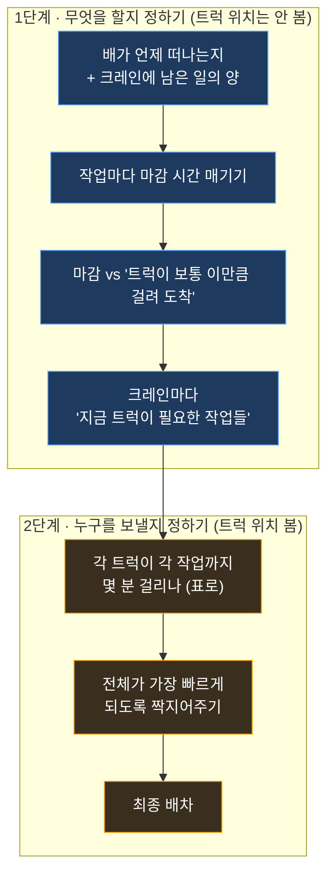

이 섹션은 **트럭을 어느 안벽크레인(부두에서 배에 컨테이너를 싣고 내리는 큰 기계)에 보낼지 정하는 새 방법**을 설명하고, 그 구현을 위해 알아본 내용을 계속 적어두는 곳입니다. 설계는 이 글에, 알아본 과정은 [조사 기록](/kc/dispatch/research-log/)에 쌓습니다.

:::note[지금 상태]
**설계 중 (2026-06-18 시작).** 아직 안 만들었습니다. 먼저 "배가 언제 떠나는지"(출항 시각) 정보를 찾아야 합니다. 처음에는 **실제로 트럭을 보내지 않고, 추천만 화면에 띄워** 맞는지 확인한 뒤에 실제 적용합니다.
:::

## 1. 무엇을 하려는 걸까

부두에는 여러 안벽크레인이 동시에 배 작업을 합니다. 각 크레인은 컨테이너를 트럭에 실어 보내거나(양하), 트럭이 가져온 컨테이너를 배에 싣습니다(적하). 트럭이 모자라면 크레인이 멈추고, 너무 몰리면 낭비입니다.

그래서 **두 가지 시간**을 같이 보고 트럭을 알맞게 나눠 주려 합니다.

1. **마감 시간** — 이 컨테이너 작업이 *늦어도 언제까지* 끝나야 배가 제때 떠날 수 있나.
2. **도착 시간** — 트럭을 보내면 *언제쯤* 크레인에 도착해서 주고받기가 끝나나.

## 2. 왜 두 단계로 나눌까

이 부두는 모든 게 자동으로 돌아가는 곳이 아니라서, 모을 수 있는 데이터가 깔끔하지 않고 **"트럭이 몇 분 뒤 도착할지" 예측도 잘 안 맞습니다.**

그래서 잘 안 맞는 예측 때문에 *마감 판단*까지 흔들리지 않도록, **"무엇을 해야 하나"(작업)** 정하는 일과 **"누구를 보낼까"(트럭)** 정하는 일을 **따로** 풉니다.

> 핵심: **1단계에서는 어떤 트럭이 어디 있는지 보지 않습니다.** "보통 트럭이 이만큼 걸린다"는 평균만 쓰니까 판단이 흔들리지 않습니다. 잘 안 맞는 위치 예측은 2단계에서 **"누가 더 가깝나" 비교에만** 쓰여서, 조금 틀려도 결과에 영향이 작습니다.

## 3. 1단계 — 무엇을 할지 정하기 (트럭 위치는 안 봄)

**무엇을 보고:**
- **배가 떠나는 시간** (출항 예정 시각).
- 그 배를 맡은 각 **크레인에 남은 일의 양**(앞으로 처리할 컨테이너 목록과 순서).
- 트럭이 **보통 도착하는 데 걸리는 시간**(특정 트럭이 아니라 평균값).

**어떻게:**
1. "배가 떠날 때까지 남은 시간"을 그 배의 남은 작업들에 나눠 → **작업마다 마감 시간**.
2. `마감 − 트럭이 보통 걸리는 시간 ≤ 지금` 이면 → **이 작업은 지금 트럭을 붙여야 함.**

**결과:** 크레인마다 *"지금 트럭이 필요한 작업들"* 목록(또는 "몇 대 더 필요").

## 4. 2단계 — 누구를 보낼지 정하기 (트럭 위치 봄)

**무엇을 보고:**
- 1단계가 고른 **지금 처리할 작업들**.
- 보낼 수 있는 **트럭들**(지금 노는 트럭 + 곧 비는 트럭).
- 트럭과 크레인의 **현재 위치**, 그리고 그동안 **쌓아온 이동시간 기록**(출발지→도착지별로 보통 얼마 걸리는지 학습해 둔 것).

**어떻게:**
1. *각 트럭 × 각 작업* 에 대해 "그 트럭이 그 작업 자리까지 가는 데 걸리는 예측 시간"을 표로 만듭니다.
2. 그 표에서 **전체 이동시간이 가장 짧게** 되도록 트럭과 작업을 짝지어줍니다(마감은 1단계가 이미 챙겼으니, 여기선 빠르게 가는 게 목표).

**결과:** 최종 **트럭 → 작업** 배차.

## 5. 필요한 재료가 준비됐나

| 필요한 것 | 상태 | 설명 |
|---|---|---|
| 트럭이 크레인까지 가는 **이동시간 예측** | ✅ 있음 | 출발지→도착지별로 보통 얼마 걸리는지 쌓아둔 기록 |
| 크레인에 **남은 일 목록**(순서·진행률)·컨테이너·작업 예정시각 | ✅ 있음 | 실시간으로 받아오는 작업 목록 |
| 크레인·트럭의 **위치** | ✅ 있음 | 학습된 크레인 위치 + 실시간 GPS |
| **배가 떠나는 시간**(출항 시각) | ❌ 아직 없음 | 작업량·작업시간 같은 숫자는 있는데 "언제 떠나는지"가 안 들어옴 → 어디 있는지 먼저 찾아야 함 |

## 6. 아직 안 정한 것들

1. **마감의 기준** — "배 출항 시각"으로 할까, "부두에 머무는 시간 끝"이나 "화물 마감"으로 할까?
2. **1단계의 '보통 걸리는 시간'** — 고정값(예: 평소 N분)으로 할까, 학습된 평균으로 할까?
3. **1단계 결과 형태** — "몇 대 더 필요"라는 숫자로 줄까, "이 작업들"이라는 목록으로 줄까?
4. **2단계 목표·대상** — 전체 이동시간을 가장 짧게 하면 될까? 대상 트럭은 "노는 트럭 + 곧 비는 트럭"이면 될까?

## 7. 지킬 원칙

- **먼저 추천만**: 실제 배차에 바로 연결하지 않고, 추천만 화면에 띄워 맞는지 확인한 뒤 적용.
- **관측 못 한 값은 비워둠**(억지로 추정하지 않음).
- 사람이 보는 시간은 **한국 시간**으로.

---
**알아본 과정 →** [차량 배차 — 조사 기록](/kc/dispatch/research-log/)
