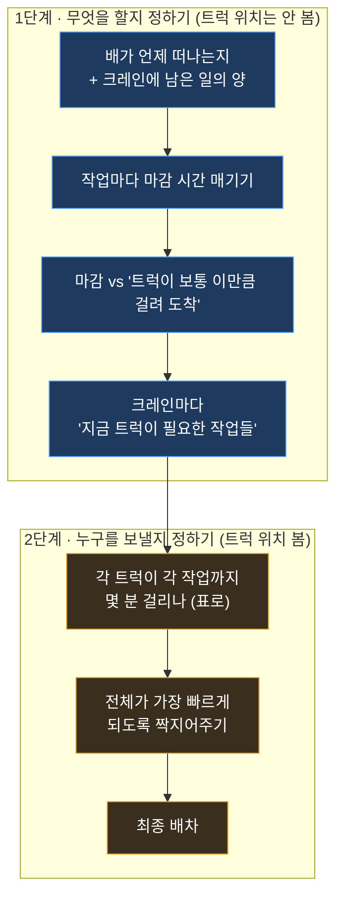

이 섹션은 **트럭을 어느 안벽크레인(부두에서 배에 컨테이너를 싣고 내리는 큰 기계)에 보낼지 정하는 새 방법**을 설명하고, 그 구현을 위해 알아본 내용을 계속 적어두는 곳입니다. 설계는 이 글에, 알아본 과정은 [조사 기록](/kc/dispatch/research-log/)에 쌓습니다.

:::note[지금 상태]
**1단계(마감 정하기)를 만들어 다듬었고, 지금은 "정말 맞는지" 검증하는 단계 (2026-06).** 배가 언제 떠나는지를 가져와, 각 크레인이 컨테이너를 **언제 작업할지·여유가 얼마나 있는지·트럭을 언제까지 보내야 하는지**를 계산해 **화면에 보여줍니다**(아직 진짜로 트럭을 보내진 않음 = 그림자). 크레인마다 다른 작업 속도·트윈(한 번에 2개 집기) 같은 걸 반영해 정확도를 높였고, 지금은 **이 계산이 실제와 맞는지** 확인하는 중입니다. 그다음이 2단계(어느 트럭을 보낼지 짝짓기).
:::

## 1. 무엇을 하려는 걸까

부두에는 여러 안벽크레인이 동시에 배 작업을 합니다. 각 크레인은 컨테이너를 트럭에 실어 보내거나(양하), 트럭이 가져온 컨테이너를 배에 싣습니다(적하). 트럭이 모자라면 크레인이 멈추고, 너무 몰리면 낭비입니다.

그래서 **두 가지 시간**을 같이 보고 트럭을 알맞게 나눠 주려 합니다.

1. **마감 시간** — 이 컨테이너 작업이 *늦어도 언제까지* 끝나야 배가 제때 떠날 수 있나.
2. **도착 시간** — 트럭을 보내면 *언제쯤* 크레인에 도착해서 주고받기가 끝나나.

## 2. 왜 두 단계로 나눌까

이 부두는 모든 게 자동으로 돌아가는 곳이 아니라서, 모을 수 있는 데이터가 깔끔하지 않고 **"트럭이 몇 분 뒤 도착할지" 예측도 잘 안 맞습니다.**

그래서 잘 안 맞는 예측 때문에 *마감 판단*까지 흔들리지 않도록, **"무엇을 해야 하나"(작업)** 정하는 일과 **"누구를 보낼까"(트럭)** 정하는 일을 **따로** 풉니다.

> 핵심: **1단계에서는 어떤 트럭이 어디 있는지 보지 않습니다.** "보통 트럭이 이만큼 걸린다"는 평균만 쓰니까 판단이 흔들리지 않습니다. 잘 안 맞는 위치 예측은 2단계에서 **"누가 더 가깝나" 비교에만** 쓰여서, 조금 틀려도 결과에 영향이 작습니다.

## 3. 1단계 — 무엇을 할지 정하기 (트럭 위치는 안 봄)

**무엇을 보고:**
- **배가 작업 끝내야 하는 시각**(선박 항차 표의 *작업완료 예정*, 그리고 *출항 예정*).
- 그 배를 맡은 각 **크레인에 남은 일의 양**(앞으로 처리할 컨테이너 목록과 순서).
- 트럭이 **보통 도착해서 핸드오버까지 끝내는 시간** — 특정 트럭이 아니라 **양하/적하 각각의 최근 평균**:
  - 양하(내림): 약 **5분** (빈 트럭이 크레인으로 와서 받아가면 끝).
  - 적하(실음): 약 **20분** (트럭이 야적장 블록에서 그 컨테이너를 먼저 집어와야 해서 김).

**어떻게:**
1. "배가 작업 끝내야 할 시각까지 남은 시간"을 그 배의 남은 작업들에 나눠 → **작업마다 마감 시간**. 이때 나누는 기준은 **그 크레인이 양하/적하를 요즘 얼마나 빨리 처리하는지**(아래) — 크레인마다, 작업종류마다 속도가 달라서 그걸 반영해 역산.
2. `마감 − 트럭이 보통 걸리는 시간(양하 5분/적하 20분) ≤ 지금` 이면 → **이 작업은 지금 트럭을 붙여야 함.**

> **크레인 처리속도는 크레인별·양적하별로 다릅니다.** 최근 데이터: 양하는 컨테이너 1개당 약 90초(시간당 39개), 적하는 약 110초(시간당 32개)로 적하가 더 느리고, 같은 작업이라도 크레인마다 차이가 큽니다(양하 79~115초). 그래서 데드라인 역산에는 **각 크레인의 최근 양하/적하 처리속도**를 씁니다.

> **트윈과 베이 이동도 반영합니다.**
> - **트윈**(한 번 집을 때 컨테이너 2개): 무브(집는 동작) 1번으로 2개가 처리됩니다. 그래서 시간은 "남은 컨테이너 개수"가 아니라 **"남은 무브 수"** 로 계산합니다(지금 남은 작업의 약 25%가 트윈).
> - **베이 이동**: 크레인이 한 베이를 끝내고 옆 베이로 옮겨갈 때 **갠트리 이동시간(중앙 약 3분)** 이 더 듭니다. 남은 작업이 여러 베이에 걸치면 **베이가 바뀌는 횟수만큼** 그 시간을 더해 역산합니다.
> - **해치커버**: 배의 컨테이너는 갑판 위(덱)와 갑판 아래(홀드)에 나뉘어 있고, 그 사이에 덮개(해치커버)가 있습니다. **양하**는 덱을 다 내린 뒤 홀드로 들어가려면 **커버를 엽니다(중앙 약 7분)**, **적하**는 홀드를 다 실은 뒤 덱을 실으려면 **커버를 덮습니다(중앙 약 8분)**. 한 베이에 덱·홀드 작업이 다 남아 있으면 그 사이에 이 시간을 **한 번** 더해 역산합니다. (정상 무브는 90~115초라, 해치커버 전환은 확연히 깁니다.)

**결과:** **"지금 배차해야 할 작업 목록"** — 이게 그대로 2단계의 후보 작업이 됨.

## 4. 2단계 — 누구를 보낼지 정하기 (트럭 위치 봄)

**무엇을 보고:**
- 1단계가 고른 **지금 처리할 작업들**.
- 보낼 수 있는 **트럭들**(지금 노는 트럭 + 곧 비는 트럭).
- 트럭과 크레인의 **현재 위치**, 그리고 그동안 **쌓아온 이동시간 기록**(출발지→도착지별로 보통 얼마 걸리는지 학습해 둔 것).

**어떻게:**
1. *각 트럭 × 각 작업* 에 대해 "**지금부터** 그 트럭이 그 작업 자리에 도착하기까지 걸리는 시간"을 표로 만듭니다.
   - 지금 **노는 트럭**: 작업 자리까지 **가는 시간**만.
   - **곧 비는 트럭**: **빌 때까지 남은 시간 + 작업 자리까지 가는 시간**.
2. 그 표에서 **모든 트럭의 도착시간을 더한 값이 가장 작아지도록** 트럭과 작업을 짝지어줍니다(마감은 1단계가 이미 챙겼으니, 여기선 전체가 가장 빨리 자리 잡게).

**결과:** 최종 **트럭 → 작업** 배차.

## 5. 필요한 재료가 준비됐나

| 필요한 것 | 상태 | 설명 |
|---|---|---|
| 트럭이 크레인까지 가는 **이동시간 예측** | ✅ 있음 | 출발지→도착지별로 보통 얼마 걸리는지 쌓아둔 기록 |
| 크레인에 **남은 일 목록**(순서·진행률)·컨테이너·작업 예정시각 | ✅ 있음 | 실시간으로 받아오는 작업 목록 |
| 크레인별 **양하/적하 처리속도**(데드라인 역산용) | ✅ 있음 | 크레인 작업 기록에서 최근 처리속도를 크레인·작업종류별로 계산 |
| 크레인·트럭의 **위치** | ✅ 있음 | 학습된 크레인 위치 + 실시간 GPS |
| **배가 떠나는 시간**(출항·작업완료 예정) | ✅ 찾음 (적재 예정) | 선박 항차 표(시스템 이름 `VSB_VOYAGE`)에 출항·작업완료·접안·화물마감 예정시각이 다 있음. 우리 데이터로 주기 적재만 하면 됨 |

## 6. 정한 것들 (2026-06-18)

1. **마감의 기준** = **배 출항 예정 시각**. 단 크레인 일은 그 전에 끝나야 하므로 더 직접적인 **작업완료 예정 시각**도 함께 사용(둘 다 선박 항차 표에 있음).
2. **1단계 '보통 걸리는 시간'** = **양하/적하 각각, 최근 기록의 중앙값**(고정값 아님). 1차 측정: 양하 ≈5분, 적하 ≈20분.
3. **1단계 결과 형태** = **"지금 배차해야 할 작업 목록"**(= 2단계 후보 작업).
4. **2단계 목표** = **지금부터 모든 트럭이 첫 작업지점 도착까지 걸리는 시간의 합 최소화**(노는 트럭=가는 시간, 곧 비는 트럭=빌 때까지+가는 시간). **대상 = 노는 트럭 + 곧 비는 트럭.**

남은 조사·설계는 [조사 기록](/kc/dispatch/research-log/)에 이어 적습니다.

## 7. 1단계가 화면에 어떻게 보이나

지금 'TT 배차 현황' 화면에서 1단계 계산이 이렇게 보입니다(아직 추천만, 진짜로 트럭을 보내진 않음).

- **선박마다**: 언제 떠나는지(출항 예정 시각)와 지금부터 **얼마나 남았는지**.
- **크레인마다**: 신호등으로 **여유** 표시 — 🟢 충분 / 🟡 빠듯 / 🔴 못 끝낼 위험. ('여유' = 출항 전에 남은 일을 다 끝내고도 남는 시간.)
- **컨테이너마다**: 그 컨테이너의 트럭을 **언제까지 보내야 하는지**(배차 마감)를 시계 카운트다운으로. **빨강이면 지금 보내야 함.** 옆엔 그 컨테이너를 크레인이 **언제 작업할 예정**인지도 표시.
- 크레인을 **클릭하면** 그 크레인의 자세한 작업 순서로 바로 내려갑니다.

> 즉 한눈에 "어느 배가 급한지(🔴)·어느 크레인이 트럭을 지금 필요로 하는지"를 보고, 눌러서 자세히 볼 수 있습니다.

## 8. 잘 되는지 어떻게 확인하나 (검증)

지금은 추천만 하고 진짜 배차엔 안 쓰니, **이 계산이 맞는지·도움이 되는지**를 따로 재야 합니다. 두 가지를 봅니다.

1. **예측이 맞나 (정확도).** "이 컨테이너는 X분 뒤 작업된다"고 한 예측을, 그 컨테이너가 **실제로 작업된 시각**과 비교합니다. 그래서 예측을 계속 기록해 두고 나중에 실제와 맞춰 **얼마나 빗나갔는지**(평균 오차)를 봅니다.
2. **도움이 되나 (효과).** "지금 트럭을 보내야 한다"고 한 컨테이너인데 트럭이 안 갔을 때, 실제로 그 크레인이 **트럭이 없어 멈췄는지**(우리가 이미 모으고 있는 신호)를 확인합니다. 잘 맞히면 = 진짜로 필요한 신호라는 뜻.

두 가지는 **같은 기록**(예측을 적어 두는 표)에서 함께 잴 수 있어, **며칠 모은 뒤 한 번에** 결과를 냅니다. 빠른 사전 점검으로는, 우리 예측을 **시스템이 이미 쓰는 작업 예정 시각과 맞대어** 말이 되는지부터 봅니다.

## 9. 지킬 원칙

- **먼저 추천만**: 실제 배차에 바로 연결하지 않고, 추천만 화면에 띄워 맞는지 확인한 뒤 적용.
- **관측 못 한 값은 비워둠**(억지로 추정하지 않음).
- 사람이 보는 시간은 **한국 시간**으로.

---
**알아본 과정 →** [차량 배차 — 조사 기록](/kc/dispatch/research-log/)
