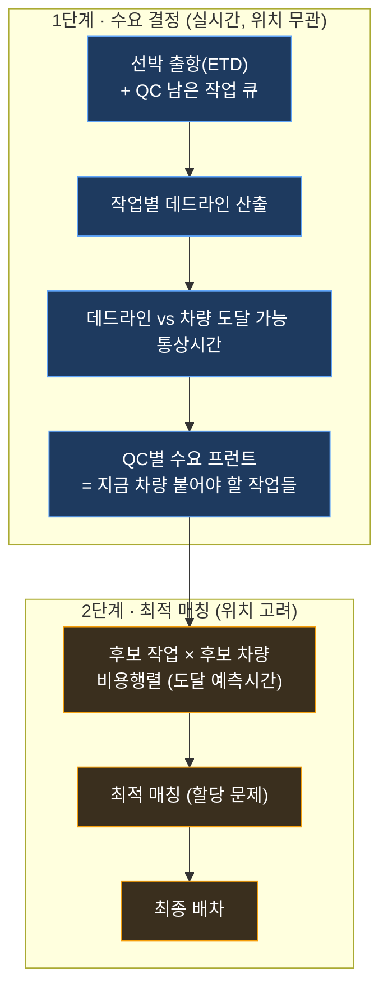

이 섹션은 **새 차량(TT) 배차 로직**의 설계와 구현을 위한 **살아있는 문서**입니다. 설계는 이 페이지에, 조사 과정·결과는 [조사 로그](/kc/dispatch/research-log/)에 계속 기록합니다.

:::note[상태]
**설계 단계 (2026-06-18 착수).** 아직 구현 전. 선행 과제 = 선박 출항시각(ETD) 데이터 확보. 그림자(추천 표시)로 먼저 만들고 검증 후 라이브 연결.
:::

## 1. 목표

차량을 QC별로 **적절히** 배차한다 — 두 가지 시간을 함께 고려:

1. **데드라인** — 각 작업(컨테이너)이 언제까지 끝나야 선박이 정시 출항하나.
2. **도달 시간** — 차량이 그 작업지점(QC)에 도착해 핸드오버를 끝내는 예측 시각.

## 2. 왜 2단계인가

여기는 **완전 자동화 터미널이 아니라** 얻을 수 있는 데이터 품질이 낮고, 차량별 도달시간 **예측 정확도도 낮습니다.** 그래서 부정확한 예측에 *데드라인 결정*까지 휘둘리지 않도록 **수요(무엇을)** 와 **공급(누구를)** 을 분리합니다.

> 핵심: **1단계는 후보 차량의 위치를 보지 않습니다.** 데드라인 결정은 통상치만 쓰므로 견고합니다. 위치 예측(부정확)은 2단계에서 **상대 비교(누가 더 가깝나)** 에만 쓰여 오차 영향이 작습니다.

## 3. 1단계 — 수요 결정 (위치 무관)

**입력**
- 선박 **출항(ETD)** 시각 (또는 berth window 종료 / cargo cut-off — *결정 필요*).
- 각 QC의 **남은 작업 큐** (`live_workqueue` 의 seq·total·comp + `live_workpool` 컨테이너).
- 차량이 **도달 가능한 통상 시간** (특정 차량 아님 — 고정 버퍼 / OD 통상치 / 사이클 간격 중 *결정 필요*).

**처리**
1. 선박 출항까지 남은 시간을 그 선박의 남은 작업에 분배 → **작업별 데드라인**.
2. `데드라인 − 차량 도달 통상시간 ≤ 지금` 인 작업 = **지금 차량이 붙어야 함**.

**출력**
- QC별 **수요 프런트** = 지금 차량이 할당되어야 하는 작업 집합(또는 "추가 K대 필요").

## 4. 2단계 — 비용행렬 최적 매칭 (위치 고려)

**입력**
- 1단계가 뽑은 **후보 작업** 들.
- **후보 차량** 풀 (idle + soon-idle(곧 빔) — *결정 필요*).
- 차량 위치 · QC 위치 · **OD 이동시간 모델**(`learn_travel_*`).

**처리**
1. `비용[차량][작업]` = 그 차량이 그 작업지점에 도달하는 **예측 시간**.
2. **최적 매칭**(할당 문제, 예: 헝가리안/최소비용 매칭) → 총 이동시간 최소화(데드라인은 1단계가 이미 보장) — *목적함수 결정 필요*.

**출력**
- 최종 **차량 → 작업** 배차.

## 5. 빌딩블록 현황

| 필요한 것 | 상태 | 위치 |
|---|---|---|
| 차량→QC **이동시간 예측** | ✅ | OD 모델 `learn_travel_sample`/`learn_travel_metric` |
| QC **남은 작업 큐** + 컨테이너·ETW | ✅ | `live_workqueue` · `live_workpool` |
| QC 위치 / 차량 위치·상태 | ✅ | 학습 centroid·크레인 GPS / `wpt_gps` |
| **선박 출항(ETD)/마감 시각** | ❌ **미적재** | `VSS_STATISTICS`엔 통계·berth_min만, 출항 타임스탬프 없음 → TOS 선박 스케줄 테이블 조사 필요 |

## 6. 미결 결정 사항

1. **데드라인 기준** — 출항(ETD) vs berth window 종료 vs cargo cut-off. TOS 원천 컬럼?
2. **1단계 도달 통상시간** — 고정 버퍼 / OD 통상치 / 사이클 간격?
3. **1단계 출력 형태** — 대수("K대 더") vs 작업 집합.
4. **2단계 목적함수·후보 풀** — 총 이동시간 최소화? 후보 = idle+soon-idle?

## 7. 원칙

- **그림자 우선**: 라이브 배차 핫패스 변경 전, 추천만 표시하는 그림자로 병렬 검증 후 승격.
- **관측 못 한 값은 NULL** (추정 금지).
- 사용자 표시 시각은 **KST**.

---
**조사 기록 →** [배차 로직 조사 로그](/kc/dispatch/research-log/)
