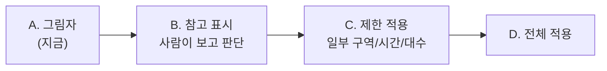

> 이 문서는 2단계 최적 배차를 **실제로 켜기 전에** 무엇을 어떤 순서로 확인하고, 어떤 안전장치를
> 두는지를 정리한 계획입니다. 기술 용어 없이 읽을 수 있게 썼습니다.

## 지금 어디에 있나

지금은 **그림자(연습) 모드**입니다. 컴퓨터가 "이 트럭을 이 작업에 보내면 좋겠다"를 계속
계산하고 기록하지만, **실제 배차는 전혀 건드리지 않습니다.** 옆에서 채점만 하는 단계죠. 여기서
이미 확인된 것:

- 최적 배정이 단순 방식보다 **전체 도착시간을 줄이고**, **급한 작업의 마감 누락도 줄였습니다.**
- 추천이 **흔들리지 않고**(안정적), **트럭 위치가 도로망 노드에 정확히** 얹힙니다.

다음은 이걸 "기록만" 하는 단계에서 "실제로 따르는" 단계로 **천천히, 되돌릴 수 있게** 옮기는
길입니다.

## 4단계로 켠다

**A. 그림자 (지금)** — 추천을 기록·검증만. 실제 운영 무간섭.

**B. 참고 표시** — 추천을 **현장(또는 관제)에 보여주되, 따를지는 사람이 결정**합니다. 컴퓨터의
추천과 실제 결정을 나란히 비교해, 추천이 현장 상식과 어긋나지 않는지 충분히 봅니다.

**C. 제한 적용** — **아주 좁은 범위**에서만 실제로 따릅니다. 예: 한 블록 묶음, 한 교대 시간대,
혹은 정해진 소수의 트럭. 나머지는 그대로 두고, **언제든 끌 수 있는 스위치**와 함께.

**D. 전체 적용** — 위 단계들이 충분히 안정적이라고 확인된 뒤에만.

각 단계는 **다음으로 넘어가기 전에 정해둔 기준을 통과**해야 합니다(아래).

## 넘어가기 전 통과 기준 (Go / No-Go)

각 단계로 넘어가려면 **충분한 기간 동안** 아래가 모두 성립해야 합니다.

- **효율이 실제로 더 낫다** — 추천을 따랐을 때 트럭 도착·대기가 기존보다 나빠지지 않음.
- **마감을 더 놓치지 않는다** — 급한 작업의 마감 누락이 늘지 않음.
- **크레인을 굶기지 않는다** — "트럭이 없어 크레인이 멈추는" 일이 늘지 않음(오히려 줄어야 함).
- **추천이 안정적이다** — 트럭이 작업을 들락날락하지 않음.
- **현장 거부가 적다** — 사람이 추천을 뒤집는 비율이 낮음.

하나라도 어긋나면 **넘어가지 않고 이전 단계로** 돌아갑니다.

## 안전장치

:::caution[가장 중요 — 끄기 스위치]
**언제든 한 번에 기존 방식(현행 운영)으로 되돌릴 수 있어야** 합니다. 이상이 보이면 즉시 끄고,
원인을 본 뒤 다시 켭니다.
:::

- **좁은 범위부터** — 한 번에 전체가 아니라, 정해진 구역·시간·대수로 한정. 문제가 나도 영향이 작게.
- **바닥 안전선** — 어떤 경우에도 *크레인을 멈추게 두지 않습니다.* 추천이 이상하면 **가장 가까운
  가용 트럭을 보내는 기본 동작**으로 자동 전환.
- **사람이 항상 우선** — 현장/관제가 언제든 추천을 무시·수정할 수 있습니다.
- **그림자는 계속** — 실제 적용 중에도 "안 따랐다면 어땠을까"를 같이 기록해, 실제와 비교.
- **상시 감시 + 경보** — 마감 누락·크레인 멈춤·흔들림이 기준을 넘으면 자동 경보, 필요시 자동으로 끄기.

## 아직 모델이 모르는 것 (위험)

추천이 좋아도, 컴퓨터가 **아직 보지 못하는 현장 규칙**이 있습니다. 실제 적용 전에 이걸 반드시
반영하거나, 적용 범위에서 **빼야** 합니다.

- **특별 취급** — 위험물·냉동·초과중량·특정 우선 화물 등, 일반 규칙과 다르게 다뤄야 하는 작업.
- **장비·통행 제약** — 특정 트럭만 갈 수 있는 곳, 일방통행·통제 구역, 정비 중 장비.
- **운영자의 의도** — 사람이 알고 있는 단기 계획(곧 들어올 배, 장비 이동 예정 등).

> 원칙: **모르는 건 건드리지 않는다.** 모델이 다루지 못하는 작업·구역은 적용 범위에서 빼고, 거기는
> 기존 방식 그대로 둡니다.

## 되돌리기 계획

- 이상 징후(마감 누락 급증·크레인 멈춤·흔들림)가 보이면 **즉시 끄기** → 기존 방식으로 자동 복귀.
- 끈 뒤 **무엇이 어긋났는지** 그림자 기록으로 분석.
- 원인을 고치고 **이전 단계부터** 다시 시작.

## 한마디로

**천천히 · 좁게 · 되돌릴 수 있게.** 그림자에서 충분히 확인하고 → 사람이 보며 판단하고 → 아주
좁은 범위에서 실제로 따라보고 → 기준을 통과할 때만 넓힙니다. 그리고 **언제든 끌 수 있고, 크레인은
절대 멈추지 않게** 합니다. 자세한 화면은 [MATCH 페이지 해설](/kc/dashboard/stage2-match/),
만들어 온 과정은 [2단계 여정](/kc/dispatch/stage2-journey/)을 보세요.
