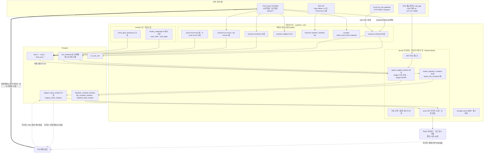

# 02. Service 2 아키텍처와 런타임

## 1. 문서 정보

| 항목 | 값 |
|---|---|
| 대상 | Westports "Service 2 — TT Assignment" 사전조사 |
| 저장소 | `/home/tkadmin/projects/tt-aiops-platform` (단일 Git 저장소) |
| 브랜치 | `scengen-collector` (주 브랜치 `main`) |
| HEAD | `10cc8c0` — 이하 모든 저장소 근거는 이 커밋 기준이며 개별 근거에 커밋을 반복 표기하지 않는다 |
| 조사일 | 2026-07-22 |
| 워킹트리 | 미커밋 변경 5건(`crates/api/src/cycles.rs`, `scripts/populate_tt_cycle_recon.sql`, `web/public/livemap-roadgraph.geojson`, `web/src/CyclesPage.tsx`, `web/src/api.ts`). 조사는 파일을 수정하지 않았다 |

### 근거 유형 범례

| 표기 | 의미 |
|---|---|
| (표기 없음) | **저장소 근거** — `파일경로:줄범위` 형식으로 저장소 파일에서 직접 확인 |
| **[호스트]** | 2026-07-22 조사용 호스트에서 읽기 전용 `systemctl --user` / `crontab -l` 관찰. 저장소 밖 근거이므로 재확인 권장 |
| **[문서]** | `kc/` 또는 `docs/`의 문서 주장. 코드 확인과 구분해서 읽어야 한다 |

### 상태 표기

**확인** = 근거로 직접 검증됨 / **추정** = 정황상 추론 / **미확인** = 근거 없음, 확인 필요 / **상충** = 근거끼리 어긋남.

> 본 문서는 **코드에 존재하는 것**과 **운영에서 실제 활성화된 것**을 항상 구분해 기술한다. 최적화 로직의 개선안·재설계는 다루지 않는다.

---

## 2. 한눈 요약

- Service 2의 배차 계산은 별도 서비스가 아니라 **대시보드 API 프로세스(`wp-api`) 안의 백그라운드 태스크 1개**(`spawn_stage2_shadow`, 60초 주기)로 돌아간다. 즉 조회 서버와 배차 엔진이 같은 프로세스에 결합돼 있다(확인 — `crates/api/src/main.rs:115-139`).
- 실행 형태는 Rust 워크스페이스 4크레이트(`core`/`extractor`/`api`/`scengen`), 바이너리 3개(`extractor`·`api`·`scengen`)이며, 배포는 **단일 호스트의 systemd `--user` 유닛 + 수동 `cargo build --release` + 파일 복사**다. CI/CD·컨테이너 이미지·IaC 산출물은 저장소에 0건이다(확인).
- **계산 결과는 TOS로 돌아가지 않는다.** 결과는 Postgres 그림자 테이블(`stage2_match_shadow`)과 사내 대시보드 표시까지만 간다. TOS 전달·Ack·완료 확인 구간은 **코드에 존재하지 않는다**(확인).
- 따라서 구현 상태는 **상시 Shadow 운영 + 사내 Recommendation 표시**로 판정한다. 실배차 연동에 필요한 출력 채널(A1)·TOS 소비 계약(A2)·운영자 UI(D2)는 **[문서]** 기준 전부 미착수다.
- 배차를 켜고 끄는 기능 플래그는 **없다**. `wp-api`가 뜨면 그림자 로직이 무조건 돈다. 저장소에서 확인되는 유일한 런타임 스위치는 시나리오 수집용 `scenario.config.enabled`뿐이다(확인).
- 저장소 유닛과 호스트 실제 활성 상태가 **일치하지 않는다**: 호스트 enabled 타이머 16개, 저장소에 있으나 미설치 2개(`wp-tick-t1`/`t2`), 호스트에만 존재하고 저장소에 없는 유닛 2개(`wp-api.service`, `wp-etw-bridge.service`) + crontab 2건 **[호스트]**.
- 장애 대응은 pull 방식 헬스 엔드포인트 3개뿐이며 push 알림·재시도·중복실행 방지·백업 절차가 모두 없다. 특히 Stage-2는 GPS 연결만 게이트하고 **Oracle 미러 신선도는 검사하지 않는다**(확인).

---

## 3. 모듈과 실행 구조

### 3.1 크레이트/디렉터리

| 구성요소 | 역할 | 바이너리 | 진입점 / 근거 | 상태 |
|---|---|---|---|---|
| `crates/core` | 공용 라이브러리(모델·유틸) | 없음(lib) | `Cargo.toml:1-3` | 확인 |
| `crates/extractor` | TOS Oracle 폴링 추출·변환·집계, 날씨·ETW 수집 | `extractor` | `crates/extractor/src/main.rs:22-92` | 확인 |
| `crates/api` | axum HTTP 서버 + GPS 웹소켓 수집 + **배차 그림자 엔진** + 학습 지속화 | `api` | `crates/api/src/main.rs:44-145` | 확인 |
| `crates/scengen` | 시나리오/에뮬레이터 생성기(별 바이너리·별 포트·별 스키마로 격리) | `scengen` | `crates/scengen/src/main.rs:24-66` | 확인 |
| `web/` | React + Vite 대시보드 SPA(수동 `npm run build`) | — | `crates/api/src/main.rs:88-101`(WEB_DIST 서빙) | 확인 |
| `kc/` | 정적 HTML 지식센터(빌드 단계 없음), `/kc`로 서빙 | — | `crates/api/src/main.rs:88-101` | 확인 |
| `db/migrations/` | Postgres 마이그레이션 104개 | — | `db/apply.sh:1-20` | 확인 |
| `deploy/systemd/` | systemd `--user` 유닛 `.service` 20 + `.timer` 18 + README | — | `deploy/systemd/` | 확인 |

- 마이그레이션 **적용기 없음**(`sqlx::migrate!` 호출 0건), 적용 이력 테이블 없음, **`0098` 번호가 두 파일에 중복**(`0098_scenario_yard_block.sql`, `0098_tt_cycle_recon.sql`) — 확인.
- `utoipa` 의존성은 `Cargo.toml:32`에 선언만 되어 있고 코드 사용 0건 → **OpenAPI/AsyncAPI/JSON Schema 산출물 0건**. API 계약은 Rust 구조체와 `web/src` 타입에만 존재(확인).

### 3.2 extractor CLI 서브커맨드 (10개)

근거: `crates/extractor/src/main.rs:22-92`, 분기 `110-200`. 상태: 확인.

| 서브커맨드 | 역할 | Oracle 접촉 |
|---|---|---|
| `run` | 기본 실행 경로 | O |
| `tick --tier t1\|t2\|all` | 주기 KPI 틱 | O |
| `backfill` | 과거 구간 채우기 | O |
| `transform` | 적재분 변환 | X(Postgres) |
| `workpool` | 작업풀 미러 갱신(`live_*` 5테이블) + ETW HTTP 호출 | O + HTTP |
| `handover` | 핸드오버 로그 증분 수집 | O |
| `rtg-moves` | RTG 이동 로그 증분 | O |
| `qc-moves` | QC 이동 로그 증분 | O |
| `weather` | Open-Meteo 시간별 | X(외부 HTTP) |
| `weather-live` | Tomorrow.io 3분 | X(외부 HTTP) |

### 3.3 scengen CLI 서브커맨드 (8개)

근거: `crates/scengen/src/main.rs:24-66`, 스텁 `78-84`. 상태: 확인.

| 서브커맨드 | 역할 | 비고 |
|---|---|---|
| `collect` | 이동이력 증분 수집 | Oracle |
| `snapshot` | 야드 컨테이너 스냅샷 | Oracle |
| `enrich` | 선박/적하계획 보강 | Oracle |
| `yard-moves` | RTG 이동 수집 | Oracle |
| `yard-build` | 야드 스택모델 재구성 | Postgres |
| `assemble` | 시나리오 조립 | Postgres |
| `serve --port` | 자체 웹 UI/제어면(기본 8899) | 상주 |
| `backfill` | — | **미구현 스텁**(로그만 출력) |

### 3.4 `wp-api` 프로세스 안의 백그라운드 태스크 24개

**결론: `wp-api`는 조회 서버가 아니라 배차 엔진의 호스트 프로세스다.** GPS 수집, 학습 지속화, 그림자 로깅, 그리고 Stage-2 매칭이 모두 이 한 프로세스 안의 tokio 태스크로 돈다. 프로세스가 죽으면 배차 계산·GPS 수집·이력 프루닝이 동시에 멈춘다.

근거: `crates/api/src/main.rs:115-139`(spawn 호출 24건, 조건 없는 무조건 spawn). 상태: 확인.

대표 태스크(주기순):

| 태스크 | 주기 | 성격 | 산출 대상 |
|---|---|---|---|
| `spawn_wp_arrival_logger` | 5초 | 그림자 검증 | `tt_wp_arrival` |
| `spawn_mapmatch_shadow` | 5초 | 그림자(라이브 미반영) | `mm_arrival_shadow` |
| `spawn_pos_hist_hifreq` | 3초 | 위치 이력(도로망 추론용) | `truck_pos_hifreq` |
| `spawn_rtg_pos_hist` | 3초 | 위치 이력 | `rtg_pos_hist` |
| `spawn_qc_handover_logger` | 10초 | 그림자 검증 | 핸드오버 엣지 |
| `spawn_pos_hist` | 30초 | 위치·상태 이력 스냅샷 | `truck_pos_hist` |
| `spawn_assignment_refresh` | 30초 | 작업풀 배차 캐시 | 메모리 |
| `spawn_cycle_flusher` | 30초 | 사이클 영속화 | 사이클 테이블 |
| `spawn_soon_idle_logger` | 30초 | 예측 그림자 | 곧-유휴 정확도 |
| `spawn_qc_wait_logger` | 30초 | QC 기아 적재 | `qc_wait_sample` |
| **`spawn_stage2_shadow`** | **60초** | **배차 매칭 그림자(Service 2 본체)** | **`stage2_match_shadow`, `stage2_solver_shadow`** |
| **`spawn_dispatch_compare`** | **60초** | TOS 배차 vs 우리 배차 비교 | `dispatch_compare_shadow` |
| `spawn_util_sampler` | 60초 | TT 가동률 샘플 | KPI |
| `spawn_free_in_logger` | 60초 | 자유시점 학습/검증셋 | `free_in_sample` |
| `spawn_density_sampler` | 60초 | 셀별 밀도 | 격자 통계 |
| `spawn_dispatch_pred_logger` | 2분 | 1단계 예측 검증 | `dispatch_pred_sample` |
| `spawn_learn_persist` | 5분 | 학습 좌표·차선 지속화 | `learn_topos_point` 등 |
| `spawn_travel_aggregator` | 5분 | 이동시간 라벨 수확 | `learn_travel_sample` |
| `spawn_qc_wait_kpi` | 5분 | KPI 영속 | `kpi_daily`/`kpi_shift` |
| `spawn_cycle_pickup_correct` | 5분 | TOS 정답지 보정 | `pickup_done_at` |
| **`spawn_fair_compare`** | **5분** | 공정 1:1 최적매칭 vs TOS | `fair_compare_shadow`, `fair_compare_detail` |
| `spawn_roadgraph_eval` | 10분 | 도로망 경로 vs 실측 평가 | `road_route_eval` |
| `spawn_selfcal_refresh` | 15분 | 곧빔·유휴 자가보정 MV 갱신 | 자가보정 MV |
| `livemap::spawn` | 상시 | **GPS 웹소켓 수집**(로컬 SSH 터널 `ws://127.0.0.1:9986`) | 메모리 + 이력 |

읽는 방법: 24개 중 **배차 계산과 직접 관련된 것은 3개**(`spawn_stage2_shadow` 60초 / `spawn_dispatch_compare` 60초 / `spawn_fair_compare` 5분)이고 나머지는 입력 수집·학습·그림자 검증이다. 이 3개는 모두 그림자다(확인).

---

## 4. 배포 환경과 활성 설정

### 4.1 배포 방식

- **단일 호스트, systemd `--user`**(root 아님, `loginctl enable-linger` 필요). 유닛은 `%h/projects/tt-aiops-platform/target/release/` 아래 바이너리를 직접 실행한다(확인 — `deploy/systemd/README.md:19-38`, `deploy/systemd/wp-nightly.service:1-11`).
- 배포 절차 = 수동 `cargo build --release` → 유닛 파일 `~/.config/systemd/user/` 복사 → `systemctl --user enable --now`. 프런트는 별도로 `cd web && npm run build`(확인 — `deploy/systemd/README.md:19-38`, `README.md:69`).
- **롤백 절차 문서 없음**, 릴리스 태깅 없음 → 운영 바이너리가 어느 커밋에서 빌드됐는지 **추적 수단이 없다**(미확인, 확인 필요).
- **CI/CD·컨테이너·IaC 부재(확인)**: `.github/`, `Jenkinsfile`, `Dockerfile`, `docker-compose`, k8s 매니페스트, helm, terraform, ansible 산출물이 `git ls-files` 전수 검색 결과 **0건**. 유일한 컨테이너 사용처는 로컬 개발 DB용 `deploy/dev-db.sh`(rootless podman, `postgres:17`)뿐이다.
- SQL 파일 기반 유닛(`wp-tt-move-log`, `wp-tt-cycle-recon`)은 `psql`로 `scripts/populate_*.sql`을 **경로 그대로** 실행한다 → 빌드 없이 파일 변경이 즉시 운영 반영된다. 현재 `scripts/populate_tt_cycle_recon.sql`이 **미커밋 상태**이므로 형상과 운영이 어긋나 있을 수 있다(확인 — `deploy/systemd/wp-tt-cycle-recon.service:10-12` + 워킹트리 상태).

### 4.2 저장소 유닛 vs 호스트 실제 활성 상태 대조

**결론: 저장소가 배포 자산의 전부가 아니다.** 세 방향의 불일치가 동시에 존재한다.

#### (a) 호스트에서 enabled 상태인 타이머 16개 **[호스트]** — 상태: 확인(호스트 관찰)

| 유닛 | 주기 | Oracle 접촉 | 저장소 유닛 존재 |
|---|---|---|---|
| `wp-handover` | 60초 | O (`JOB_ORDER_HISTORY` 증분, cap 3000) | O |
| `wp-workpool` | 90초 | O (`JOB_ORDER_LIST`·`JOB_QUEUE_SCHEDULE`·`VSB_VOYAGE`, **행수 캡 없음**) + ETW HTTP | O |
| `wp-shift-t1` | 3분 | O | O |
| `wp-weather-live` | 3분 | X (Tomorrow.io) | O |
| `wp-qc-moves` | 5분 | O (`MCH_OPERATION` 증분, cap 5000) | O |
| `wp-rtg-moves` | 5분(90초 오프셋) | O (cap 5000) | O |
| `wp-tt-move-log` | 5분 | X (`psql`, Postgres 전용) | O |
| `wp-scenario-yard` | 5분 | O (cap 8000) | O |
| `wp-tt-cycle-recon` | 10분 | X (`psql`) | O |
| `wp-scenario-collect` | 10분 | O (cap 5000) | O |
| `wp-scenario-yard-build` | 10분 | X | O |
| `wp-shift-t2` | 15분 | O | O |
| `wp-scenario-enrich` | 15분 | O (cap 20000) | O |
| `wp-weather` | 1시간 | X (Open-Meteo) | O |
| `wp-scenario-snapshot` | 4시간 | O (`CYY_CONTAINER`) | O |
| `wp-nightly` | 매일 01:30 | O (전체 추출) | O |

상주 서비스(타이머 없음): `wp-scenario-web`(scengen serve, 8899), `wp-ws-bridge`(GPS SSH 터널) — 저장소에 유닛 존재(확인).

#### (b) 저장소에 있으나 호스트에 미설치 — 상태: 확인(호스트 관찰)

| 유닛 | 저장소 정의 주기 | 호스트 상태 |
|---|---|---|
| `wp-tick-t1` | 5분 (`deploy/systemd/wp-tick-t1.timer:6`) | **미설치** |
| `wp-tick-t2` | 20분 (`deploy/systemd/wp-tick-t2.timer:6`) | **미설치** |

문제의 성격: `deploy/systemd/README.md`가 `enable --now` 대상으로 안내하는 타이머는 5개(`wp-nightly`, `wp-tick-t1`, `wp-tick-t2`, `wp-shift-t1`, `wp-shift-t2`)뿐인데, **그중 2개가 호스트에 없고**, 반대로 실제 가동 중인 16개 중 다수는 README에 안내가 없다. 즉 **문서가 안내하는 세트와 실제 가동 세트가 다르다**(상충).

#### (c) 호스트에만 존재하고 저장소에 없음 — 상태: 확인(호스트 관찰) / 상충(문서 대비)

| 항목 | 내용 | 왜 중요한가 |
|---|---|---|
| `wp-api.service` | 대시보드 API + **배차 그림자 엔진 24개 태스크**를 돌리는 상주 프로세스. `Restart=always`, `RestartSec=3`, enabled + active | **Service 2의 계산 주체 자체가 형상관리 밖.** 재시작 정책·환경변수·의존관계를 저장소로 확인할 수 없다 |
| `wp-etw-bridge.service` | Azure `tos_etw_gateway`로 가는 SSH 터널. `Restart=always`, `RestartSec=5` | ETW(작업완료예정) 입력 경로의 정의가 형상관리 밖 |

저장소 근거로 이 불일치가 드러나는 지점: `crates/extractor/src/workpool.rs:111-170`이 "`wp-etw-bridge` SSH 터널 경유"를 전제하지만 `deploy/systemd/`에 해당 유닛이 없다. **[문서]** `kc/reference/references.html:32`는 `systemctl --user restart wp-api.service`를 안내하지만 그 유닛 파일도 저장소에 없다.

추가로 **crontab 2건 [호스트]** — 저장소에 스케줄 정의가 없다:

| 스케줄 | 실행 대상 | 성격 |
|---|---|---|
| 매시 11분 | `scripts/reinfer_roadgraph.sh` | **도로망 재추론 = 배차 비용 계산의 본체**(`road_node`/`road_edge` 갱신) |
| 15분마다 | `scripts/travel_gbm_shadow.py` | 이동시간 GBM 그림자 |

두 crontab 라인 모두 **평문 DB 비밀번호(`PGPASSWORD`)를 포함**한다(값은 본 문서에 옮기지 않음). 확인.

### 4.3 환경변수 (키만, 값 금지)

| 키 | 용도 | `.env.example` 기재 | 근거 |
|---|---|---|---|
| `DATABASE_URL` | Postgres 접속 | O | `.env.example:1-10` |
| `SKILL_DIR` | 외부 Oracle 게이트웨이 스크립트 경로 | O | `.env.example:1-10`, `crates/extractor/src/runner.rs:21-27` |
| `API_ADDR` | API 바인드 주소(기본 `127.0.0.1:8080`) | O | `crates/api/src/main.rs:142-145` |
| `ETW_GATEWAY_URL` | Azure ETW 게이트웨이 | **누락** | `crates/extractor/src/workpool.rs:111-170` |
| `TOMORROW_API_KEY` | Tomorrow.io 3분 날씨 | **누락** | `crates/extractor/src/weather.rs:73-99` |
| `KC_DIR` | 지식센터 정적 디렉터리(선택) | 없음 | `crates/api/src/main.rs:88-101` |
| `WEB_DIST` | SPA 빌드 산출물 경로(선택) | 없음 | `crates/api/src/main.rs:88-101` |

- 값은 전부 `<redacted>`로 취급한다. 비밀은 `.env` 단일 파일 + systemd `EnvironmentFile`로만 관리되고 **시크릿 매니저는 없다**(확인).
- **`.env` 권한 0644** — 동일 호스트의 다른 계정이 읽을 수 있다(확인, **[호스트]**).
- `.env.example` 누락의 실질 영향: 신규 환경을 이 파일 기준으로 구축하면 **ETW 수집과 실시간 날씨가 조용히 기본값/실패로 떨어진다**(ETW 실패는 warn 로그만 남기고 스킵 — `crates/extractor/src/workpool.rs:111-170`).
- `scripts/reinfer_roadgraph.sh`, `scripts/estimate_equipment_specs.sh`, `scripts/travel_gbm_shadow.py`, `db/grants.sql`에 **평문 DB 비밀번호가 커밋되어 있다**는 사실을 기록한다(값 미기재, 확인).

### 4.4 기능 플래그

| 사실 | 상태 | 근거 |
|---|---|---|
| **배차 계산을 켜고 끄는 환경변수·피처 플래그가 없다.** `wp-api`가 뜨면 24개 spawn이 조건 없이 실행된다 | 확인 | `crates/api/src/main.rs:115-139` |
| 그림자 계산 부하를 끄는 유일한 방법은 `wp-api` 프로세스 전체를 내리는 것 | 확인 | 위 동일 |
| 저장소에서 확인되는 유일한 런타임 스위치는 **`scenario.config.enabled`**(시나리오 수집 소프트 킬스위치, 기본 `true`). `POST /api/scenario/config`(포트 8899)로 토글 | 확인 | `crates/scengen/src/serve.rs:117-128`, `db/migrations/0093_scenario.sql:11-23` |
| 그 제어면(8899)에 인증 미들웨어가 코드상 없고 바인드가 `0.0.0.0` | 확인 | `crates/scengen/src/serve.rs:34-38` |
| Live 단계에 요구되는 "즉시 끄기 스위치"는 아직 코드에 없다(요구사항으로만 기술) | 확인/**[문서]** | `kc/dispatch/stage2-rollout.html` 안전장치 절 |

---

## 5. Match → Assignment → (TOS Ack) → Completion 흐름

**결론 먼저: 이 4단계 중 실제로 존재하는 것은 Match와 그 결과의 기록·표시까지다. Assignment 전달·Ack·완료 확인 구간은 코드에 존재하지 않는다.**

### 5.1 단계별 현황

| 단계 | 존재 여부 | 실제로 일어나는 일 | 근거 | 상태 |
|---|---|---|---|---|
| **0. 입력 수집** | 존재 | `extractor workpool`이 90초마다 Oracle을 폴링해 `live_workpool`/`live_candidate`/`live_workqueue`/`live_vessel_schedule`/`live_assigned_tt` 5테이블을 **매 tick DELETE 후 전량 재삽입**. 같은 tick에 ETW 게이트웨이 HTTP 호출 | `crates/extractor/src/workpool.rs:109-170` | 확인 |
| **0'. 위치 입력** | 존재 | `wp-api` 내부 GPS 웹소켓 수집 태스크가 TT 좌표·상태를 메모리에 유지. TT 좌표의 유일한 소스 | `crates/api/src/main.rs:115` | 확인 |
| **1. Match(계산)** | 존재 | 60초마다 Stage-1(수요·마감 산정) → Stage-2(자체 SPFA min-cost max-flow 매칭). GPS 미연결 tick은 **스킵** | `crates/api/src/livemap.rs:4173-4182`, `3855-3966` | 확인 |
| **2. 결과 기록** | 존재 | `stage2_match_shadow` INSERT(`livemap.rs:4466`) + 21일 초과분 DELETE(`4486`), 솔버 지표는 `stage2_solver_shadow` INSERT(`4478`) | 위 동일 | 확인 |
| **3. 표시** | 존재 | `GET /api/stage2/advisory` 등으로 대시보드가 조회해 화면에 권고 오버레이 표시. 코드 주석 "display only, never drives dispatch" | `crates/api/src/workpool.rs:935-936`, `crates/api/src/main.rs:44-75` | 확인 |
| **4. Assignment(TOS 전달)** | **없음** | TOSADM 대상 INSERT/UPDATE/DELETE/MERGE·PL/SQL 호출 **0건**. 배차 지시용 커맨드 ID·전송 채널 개념 자체가 없다 | 전 저장소 검색 무히트 | 확인 |
| **5. TOS Ack** | **없음** | Ack·재전송·멱등성 키 개념 없음(멱등성은 Postgres upsert 수준뿐) | 전 저장소 검색 무히트 | 확인 |
| **6. Completion 확인** | **부분** | 권고에 대한 완료 확인 경로는 없다. 다만 **TOS의 실제 배차·완료 이력**은 `wp-handover`(60초)·`wp-qc-moves`/`wp-rtg-moves`(5분)로 사후 수집되어 사이클 계측·비교의 근거가 된다 | `crates/extractor` 각 모듈 | 확인 |
| **7. 운영자 채택/거부 수집** | **없음** | 운영자 Override/Swap 채택·거부를 기록하는 코드·테이블이 없다 → 롤아웃 게이트 기준인 "현장 거부율"을 현재 데이터로 측정 불가 | 전 저장소 검색 무히트 | 확인 |

### 5.2 결정적 제약 — 권고를 "지시"로 바꿀 수 없는 이유

`stage2_match_shadow` 스키마에 **컨테이너번호도 작업지시 ID(MSNSEQ)도 없다.** 행 단위가 `(ts, ytno, qc, vessel, queuename, jobtype, src_block, …)`라는 **버킷**이고, 매칭 입력인 `stage2_work_candidates`도 `(qc, vessel, queuename, jobtype, src_block, n)` 수량 버킷만 반환한다.

→ **현재 산출물로는 TOS에 "어느 작업지시를 어느 TT에"인지 지목할 수 없다.** 실배차 연동은 스키마 변경과 개별 작업 단위 재설계를 수반한다.

근거: `db/migrations/0052_stage2_match_shadow.sql:5-22`, `crates/api/src/workpool.rs:796-822`. 상태: 확인.

### 5.3 결과 피드백 경로 (현재 존재하는 유일한 "루프")

TOS로의 되먹임은 없지만, **우리 계산이 얼마나 좋았는지를 사후 측정하는 그림자 경로 3개**가 존재한다. 모두 Postgres 안에서 끝난다.

| 경로 | 주기 | 산출 테이블 | 무엇을 비교하나 | 근거 | 상태 |
|---|---|---|---|---|---|
| `spawn_dispatch_compare` | 60초 | `dispatch_compare_shadow` | 같은 시점의 TOS 실제 배차 vs 우리 권고 | `crates/api/src/livemap.rs:4608` | 확인 |
| `spawn_fair_compare` | 5분 | `fair_compare_shadow`, `fair_compare_detail` | 공정 1:1 조건으로 맞춘 최적매칭 vs TOS (`MAX_N=120` 제한) | `crates/api/src/livemap.rs:4983`, `4996` | 확인 |
| `spawn_dispatch_pred_logger` | 2분 | `dispatch_pred_sample` | 1단계(수요·마감) 예측의 사후 검증 로그 | `crates/api/src/main.rs:128` | 확인 |
| (동일 tick 내) greedy 베이스라인 | 60초 | `stage2_solver_shadow` | 최적해 vs 단순 greedy의 gap 기록(베이스라인 용도로만 계산) | `crates/api/src/livemap.rs:4476-4478` | 확인 |

**주의(상충):** 이 경로들이 산출하는 "이득" 지표의 정의가 코드 안에서도 둘이다 — `gap_pct=(greedy−opt)/opt`(`livemap.rs:4476`) vs `savings_pct=(greedy−opt)/greedy`(`workpool.rs:921-928`). **[문서]** 쪽 수치도 "총 도착시간 약 40% 감소"(`kc/dispatch/stage2-journey.html:40`)와 "최적 매칭 이득 −5.1%"(`kc/start/launch-plan.html:32`)로 갈린다. 외부 인용 전 정의·측정창을 하나로 확정해야 한다(Service 2 담당 PM 확인 필요).

---

## 6. Shadow / Recommendation / Live 경계

### 6.1 코드가 스스로 "그림자"임을 밝히는 지점

| # | 인용 | 근거 | 상태 |
|---|---|---|---|
| 1 | "recommend vehicle→work matches and log them (SHADOW; never drives live dispatch)" | `crates/api/src/livemap.rs:3968-3972` | 확인 |
| 2 | "display/validation only, never drives live dispatch" | `db/migrations/0052_stage2_match_shadow.sql:1-2` | 확인 |
| 3 | "display only, never drives dispatch" | `crates/api/src/workpool.rs:935-936` | 확인 |
| 4 | "This crate has NO Oracle/SSH access — it cannot reach production Oracle." | `crates/api/src/main.rs:1-3` | 확인 |

구조적 뒷받침: 대시보드 API 라우트 **31개가 전부 GET**이고(`crates/api/src/main.rs:45-75`), `web/src`에 POST/PUT/DELETE fetch가 0건이며, TOSADM 대상 DML이 0건이다(확인).

### 6.2 운영 활성 근거 (그림자가 "돌고 있음")

| 사실 | 근거 | 상태 |
|---|---|---|
| `wp-api.service`가 enabled + **active**(Restart=always, RestartSec=3) → 60초 그림자 매칭이 상시 가동 중 | **[호스트]** | 확인 |
| `spawn_stage2_shadow`는 systemd 타이머가 아니라 **wp-api 프로세스 수명**에 묶여 있다 | `crates/api/src/main.rs:132` | 확인 |
| 단, 매 tick `lm.connected`(GPS 웹소켓 연결)가 false면 그 tick은 건너뛴다 → **피드 장애 구간에는 해가 산출되지 않는다** | `crates/api/src/livemap.rs:4180-4182` | 확인 |
| 입력 갱신(`live_*`)은 `wp-workpool` 90초 타이머가 담당 | **[호스트]** + `deploy/systemd/wp-workpool.timer:6` | 확인 |

### 6.3 실배차(Live)로 가기 위해 없는 것

**[문서]** `kc/start/launch-plan.html` 기준으로 아래 항목은 **전부 미착수**이며, 저장소 코드 검색으로도 대응 구현이 확인되지 않는다.

| 항목 | 내용 | 저장소 확인 결과 | 상태 |
|---|---|---|---|
| **A1** | 권고 출력 채널(우리 → 외부로 내보내는 경로) | webhook/kafka/mqtt/S3/CSV export 코드 0건 | 확인(부재) |
| **A2** | TOS 소비 계약(스키마·식별자·인증·주기) | 계약 문서·OpenAPI 산출물 0건, 산출물이 버킷 단위라 지시 지목 불가 | 확인(부재) |
| **D2** | 운영자 UI(채택/거부·Override) | 채택·거부 수집 테이블·라우트 0건 | 확인(부재) |
| **C1** | 자동 강등/폴백 로직 | 코드 레벨 폴백 없음 | 확인(부재) |

### 6.4 구현 상태 등급 판정

> **판정: Shadow 운영 + 사내 Recommendation 표시.** (Live 아님, 단순 PoC도 아님)

판정 이유:

1. **Live가 아닌 이유** — TOS 쓰기 경로가 코드에 존재하지 않고(§5.1 4~6단계), 산출물에 작업지시 식별자가 없어 구조적으로 지시를 내릴 수 없다(§5.2).
2. **단순 실험/PoC가 아닌 이유** — 60초 주기 계산이 `Restart=always` 상주 프로세스로 **상시 가동**되고, 결과가 21일 보존 테이블에 누적되며, 대시보드가 이를 조회해 화면에 표시하고, 별도 헬스 엔드포인트(`/api/health/dispatch`)까지 갖췄다(확인).
3. **"Recommendation"에 단서가 붙는 이유** — 화면에 권고가 표시되는 것은 확인되지만, **실제 배차 담당자가 이를 참고하는 절차가 존재하는지는 저장소로 확인할 수 없다**(미확인, P0). 채택/거부를 기록하는 코드가 없어 채택 여부를 데이터로도 알 수 없다. 이 절차가 없다면 실질은 "미사용 Shadow"에 가깝다 — **Service 2 담당 PM 확인 필요**.

---

## 7. 장애와 Fallback

### 7.1 헬스 엔드포인트 3종 (전부 pull 방식)

| 엔드포인트 | 신호 | 용도·주의 | 근거 | 상태 |
|---|---|---|---|---|
| `/api/health` | `data_freshness` 롤업 | **일 단위 ETL 신호** — 라이브 장애 판정에 쓰면 안 된다(코드 주석 명시) | `crates/api/src/main.rs:45-75` | 확인 |
| `/api/livemap/health` | `connected`, `last_msg_age_s` | GPS 피드 장애의 유일한 신호. 프론트 전역 OutageBanner의 입력 | `crates/api/src/livemap.rs`(health 핸들러) | 확인 |
| `/api/health/dispatch` | 마지막 매칭 tick age < 120초면 up + thrash/feasible/savings | 배차 그림자 자체의 생존 신호 | `crates/api/src/workpool.rs:1008-1023` | 확인 |

readiness/liveness 구분 없음(확인).

### 7.2 없는 것 (전부 확인 — 검색 결과 0건)

| 없는 것 | 검색 근거 | 영향 |
|---|---|---|
| **push 알림** | Prometheus·Grafana·OpenTelemetry·Sentry·PagerDuty·Alertmanager·webhook·SMTP 0건, systemd `OnFailure=` 0건 | 장애 감지가 **사람이 화면을 봐야 하는 pull 방식**뿐 |
| **재시도·백오프** | oneshot 유닛에 `Restart=`/`OnFailure=` 없음, 코드에도 재시도 로직 없음 | 추출 실패 시 다음 주기까지 대기, 조용히 결측 |
| **중복 실행 방지** | DB advisory lock·파일 락·leader election 전무 | 프로세스 내 tokio Mutex와 oneshot 유닛 특성에만 의존 |
| **백업/복구 절차** | `pg_dump` 히트 0건 | 호스트 손실 시 복구 절차 없음. 학습 산출물 `data/travel_gbm.pkl`은 `.gitignore` 제외 → 수개월 학습분 소멸 위험 |
| **요청 상관관계 ID** | TraceLayer 미적용 | 장애 원인 추적이 로그 grep 수준 |
| **캡 도달 경보(extractor)** | scengen만 `gen_event` 기록 | handover/qc/rtg가 행수 캡에 닿아도 알리지 않음 |

재시작 정책이 있는 상주 서비스: `wp-api`(always/3s, **[호스트]**), `wp-ws-bridge`(always/5s), `wp-etw-bridge`(always/5s, **[호스트]**), `wp-scenario-web`(on-failure/5s). 확인.

감사 로그로 남는 것: `etl_run_log`(run_id·kpi_key·상태·rows_written·error_text), `data_freshness`, scengen `gen_run`/`gen_event`(append-only). `etl_run_log`에 보존정책이 없어 무한 증가한다(확인).

### 7.3 신선도 게이트 결손 — Oracle 미러

**결론: Stage-2는 GPS 연결만 확인하고 Oracle 미러(`live_workpool`)의 신선도는 검사하지 않는다.**

| 사실 | 근거 | 상태 |
|---|---|---|
| Stage-2 tick의 유일한 게이트는 `if !lm.connected { continue }` | `crates/api/src/livemap.rs:4173-4183` | 확인 |
| 작업풀 조회는 `max(as_of_ts)`를 앵커로만 쓰고 임계 거부가 없다 | `crates/api/src/workpool.rs:183-187` | 확인 |
| 300초 FROZEN 판정은 **프론트엔드 전용** 표시 로직 | `web/src/TtPage.tsx:583` | 확인 |

→ **`wp-workpool` 타이머가 죽어도 매칭은 낡은 작업목록으로 계속 산출·기록된다.** 현재는 그림자이므로 결과는 "지표 오염"에 그치지만, 실배차로 승격하면 이 구멍이 곧바로 오배차 경로가 된다.

관련해 "라이브"의 정의가 층마다 다르다는 점도 기록한다: 코드 `FRESH_UNDER_S=15` / `STALE_AFTER_S=120` / `LOST_AFTER_S=600` vs 프론트 배너 60초·맵 stale 120초·작업풀 FROZEN 300초·PLC stale 30초(확인).

### 7.4 시스템 정지 시 무슨 일이 일어나는가

#### 현재 (Shadow 단계)

| 정지 대상 | 즉시 영향 | 배차에 미치는 영향 |
|---|---|---|
| `wp-api` 정지 | 대시보드 조회 불가, GPS 수집 중단, 24개 태스크 전부 중단(**이력 프루닝 DELETE도 멈춤**) | **없음 — TOS가 그대로 자기 방식으로 배차한다** |
| GPS 웹소켓/`wp-ws-bridge` 단절 | `lm.connected=false` → Stage-2 tick 스킵, 화면 stale/정지 오버레이 | 없음(권고가 산출되지 않을 뿐) |
| `wp-workpool` 타이머 정지 | `live_*` 미러가 낡음 | **매칭은 계속 돌아 낡은 데이터로 결과를 기록한다**(§7.3) |
| Oracle 게이트웨이 장애 | 추출 실패, 알림 없음 | 미러 노후화(위와 동일) |
| ETW 게이트웨이 장애 | warn 로그만 남기고 스킵 | 마감 산정 피처 열화, **감지 수단 없음** |
| 호스트 정지(linger 해제 포함) | 모든 타이머가 조용히 멈춤 | 없음(단, 자정을 넘겨 정지하면 워터마크 특성상 **전날 미수집분은 영구 복구 불가**) |

즉 **현재 단계의 Fallback은 "우리가 없어도 TOS가 원래대로 돈다"는 구조적 사실에 전적으로 의존**하며, 코드 레벨 자동 강등/폴백 로직은 없다(확인).

#### 실배차 승격 이후 (아직 존재하지 않음 — 위험 식별용)

- 자동 강등(우리 권고 → TOS 기본 배차)을 **코드가 수행하지 않는다.** 강등이 TOS 측 동작으로 보장되는지는 저장소로 확인 불가(**미확인, Service 2 담당 PM 확인 필요**).
- 신선도 게이트 결손(§7.3)이 그대로면, 미러가 죽은 상태에서 낡은 지시가 계속 나간다.
- 즉시 끄기 스위치가 코드에 없다(§4.4) → 중단 수단이 프로세스 kill뿐이다.
- 재시도·Ack·멱등성 키 개념이 없어 전달 실패가 조용히 유실된다.

---

## 8. 현행 아키텍처 다이어그램

점선 화살표 3개는 **현재 코드에 존재하지 않는 구간**이다(전달 A1, Ack, 완료 확인). 굵은 실선은 실제 배차가 여전히 TOS에서만 일어나며 우리는 그 결과를 사후 수집만 한다는 뜻이다.

---

## 9. 운영 위험 요약표

| # | 위험 | 근거 | 영향 | 상태 |
|---|---|---|---|---|
| R-01 | 배차 엔진 호스트 프로세스(`wp-api.service`)와 ETW 터널(`wp-etw-bridge.service`) 유닛이 저장소에 없다 | **[호스트]** + `deploy/systemd/` 목록 + **[문서]** `kc/reference/references.html:32` | 이관·재해복구 시 재현 불가. 실행 인자·환경·의존관계를 코드로 확인할 수 없다 | 상충 |
| R-02 | 배차 비용의 본체인 도로망 재추론이 버전관리 밖 crontab에 의존 | **[호스트]** crontab 매시 11분 `scripts/reinfer_roadgraph.sh` | 이관 시 누락되면 도로망이 낡은 채 고정되어 비용 곡선이 서서히 왜곡 | 확인 |
| R-03 | Oracle 미러 신선도 게이트 부재 | `crates/api/src/livemap.rs:4173-4183`, `crates/api/src/workpool.rs:183-187` | 워크풀 타이머가 죽어도 낡은 작업목록으로 매칭이 계속 산출·기록. 실배차 승격 시 즉시 오배차 경로 | 확인 |
| R-04 | 산출물에 작업지시 ID·컨테이너번호가 없어 TOS에 지시를 지목할 수 없다 | `db/migrations/0052_stage2_match_shadow.sql:5-22`, `crates/api/src/workpool.rs:796-822` | 실배차 연동이 스키마 변경 + 매칭 입력 단위 재설계를 수반. A2 범위를 좌우 | 확인 |
| R-05 | push 알림·`OnFailure`·재시도 전무 | 검색 결과 0건, oneshot 유닛에 `Restart=` 없음 | 추출·터널 실패가 조용히 누적. ETW 실패는 warn 로그만 남음 | 확인 |
| R-06 | 배차를 끄는 기능 플래그가 없다 | `crates/api/src/main.rs:115-139` | 그림자 부하 차단·긴급 중단 수단이 프로세스 종료뿐. Live 승격 시 필수 안전장치 미비 | 확인 |
| R-07 | 백업·복구 절차 부재, 학습 자산이 gitignore된 단일 호스트에만 존재 | `pg_dump` 히트 0건, `.gitignore:1-8` | 호스트 손실 시 수개월 학습분(도로망·작업지점·free_in·GBM) 소멸 | 확인 |
| R-08 | 워터마크 증분이 롤백 불가(`GREATEST`로만 전진) + 캡 도달 무경보 | canon §4 기준 각 수집기 cap(3000/5000/8000/20000) | 자정 넘겨 정지 시 전날 미수집분 영구 복구 불가. 미래 날짜 이상치 1건이면 이후 정상 데이터가 영구 누락 | 확인 |
| R-09 | 저장소 문서(`deploy/systemd/README.md`)가 안내하는 타이머 세트와 실제 가동 세트가 다르다 | **[호스트]** 미설치 `wp-tick-t1`/`t2` vs README `enable --now` 5개 안내 | 신규 환경 구축이 README대로 하면 실제 운영과 다른 상태가 된다 | 상충 |
| R-10 | `.env.example`이 운영 필수 키 2개(`ETW_GATEWAY_URL`, `TOMORROW_API_KEY`)를 누락 | `.env.example:1-10` vs `crates/extractor/src/workpool.rs:111-170`, `weather.rs:73-99` | 신규 환경에서 ETW·실시간 날씨가 조용히 기본값/실패로 떨어짐 | 확인 |
| R-11 | 비밀 관리 취약 — `.env` 권한 0644, 스크립트·crontab에 평문 DB 비밀번호 | **[호스트]** + `scripts/reinfer_roadgraph.sh`, `scripts/estimate_equipment_specs.sh`, `scripts/travel_gbm_shadow.py`, `db/grants.sql` (값 미기재) | 저장소가 사실상 자격증명 저장소. 외부 인수 시 비밀 회전 절차 필요 | 확인 |
| R-12 | API·제어면 인증 부재 — 라우트 31개 무인증 + `CorsLayer::permissive()`, scengen 8899는 `0.0.0.0` 무인증 POST | `crates/api/src/main.rs:45-82`, `crates/scengen/src/serve.rs:34-38` | 내부망 확장 시 킬스위치 토글·데이터 다운로드가 무인증 노출 | 확인 |
| R-13 | 마이그레이션 적용기·이력 테이블 없음 + `0098` 번호 중복 | `sqlx::migrate!` 호출 0건, `db/migrations/0098_*.sql` 2개 | 환경 간 스키마 드리프트를 확인할 수 없고, 자동화 도입 시 즉시 충돌 | 확인 |
| R-14 | CI/CD·릴리스 추적 부재 + 미커밋 SQL이 타이머에서 실행 중일 수 있음 | `.github/` 등 0건, `deploy/systemd/wp-tt-cycle-recon.service:10-12` + 워킹트리 | 운영 바이너리와 커밋 대응 불가 → 장애 원인 분석 시 무슨 코드가 도는지 확정 불가 | 확인/추정 |
| R-15 | 매칭 로직 회귀 테스트 0건 | `crates/api/src/livemap.rs:3855-3966`에 대응 테스트 없음, API 크레이트 유일 테스트 모듈은 `periods.rs` | 배차 로직 변경 시 자동 안전망 없음. 실배차 승격 시 검증 체계 구축 비용 별도 발생 | 확인 |
| R-16 | 조회 서버·GPS 수집·배차 엔진·학습이 단일 프로세스에 결합 | `crates/api/src/main.rs:115-139` | `wp-api` 재시작 한 번에 GPS 수집·학습 상태·이력 프루닝·배차 계산이 동시 중단 | 확인 |
| R-17 | 개인정보 — GPS 피드 `userid`(운전자 ID + 전화번호)가 마스킹 없이 API 응답·화면에 노출 | canon §5(코드 확인 기반). DB 영속 저장은 마이그레이션에서 확인되지 않음 | 개인정보 처리 정책 확인 필요 | 확인(노출) / 미확인(영속 저장) |
| R-18 | Oracle 읽기전용이 **구조적 보장이 아니다** — `run_sql`이 임의 SQL을 외부 스크립트에 그대로 전달, SELECT 강제·DML 거부 가드 없음 | `crates/extractor/src/runner.rs:41-72`, `crates/scengen/src/toolbox.rs:44-74` | 현재 실린 SQL이 전부 SELECT라는 스냅샷 사실일 뿐. 실제 강제는 저장소 밖 `remote-toolbox-sql`과 Oracle 계정 권한에 달림 | 확인(가드 부재) / 미확인(실제 강제 여부) |
| R-19 | 외부 인터넷 API 의존(Open-Meteo·Tomorrow.io) | `crates/extractor/src/weather.rs:1-33`, `73-99` | 폐쇄망 전환·쿼터 소진 시 이동시간 모델 피처 결측 | 확인 |

---

## 10. 본 문서 범위에서 확인이 필요한 항목

아래는 저장소·호스트 관찰로 답이 나오지 않아 **Service 2 담당 PM / 운영 담당자 확인이 필요한** 항목이다. (전체 P0 목록은 별도 문서 참조)

| # | 항목 | 확인 주체 |
|---|---|---|
| Q-1 | Stage-2 권고를 실제 배차 담당자가 참고하는 절차가 존재하는가 (= Recommendation 운영인가, 미사용 Shadow인가) | Service 2 담당 PM |
| Q-2 | `wp-api.service`·`wp-etw-bridge.service` 유닛과 crontab 2건을 저장소로 형상관리할 수 있는가 | 개발·운영 담당자 |
| Q-3 | 현재 운영 배포본(`target/release` 바이너리)이 어느 커밋에서 빌드된 것인가 | 개발·운영 담당자 |
| Q-4 | 우리 시스템 정지 시 TOS 기본 배차로 자동 복귀됨이 TOS 측에서 보장되는가(부분 적용 시 폴백 계약) | Service 2 담당 PM |
| Q-5 | `remote-toolbox-sql`(저장소 밖)의 접속 계정 권한이 읽기 전용으로 강제되는가, 이관 범위에 포함되는가 | 개발·보안 |
| Q-6 | Azure `tos_etw_gateway`의 운영 주체·인증·SLA·버전 정책. 발주서의 '공통 게이트웨이'와 동일 대상인가 | Service 2 담당 PM |
| Q-7 | 마이그레이션 적용 절차와 이력 관리 방식(`0098` 중복 포함) | 개발·운영 담당자 |
| Q-8 | Postgres 백업·복구 정책, DB 일 증가율(특히 `truck_pos_hifreq`) | 개발·운영 담당자 |
| Q-9 | `scenario.config.enabled`의 현재 운영 DB 값(true/false) | 개발·운영 담당자 |

일정·범위·비용은 본 문서에서 확정하지 않는다 — **Service 2 담당 PM 확인 필요**.
